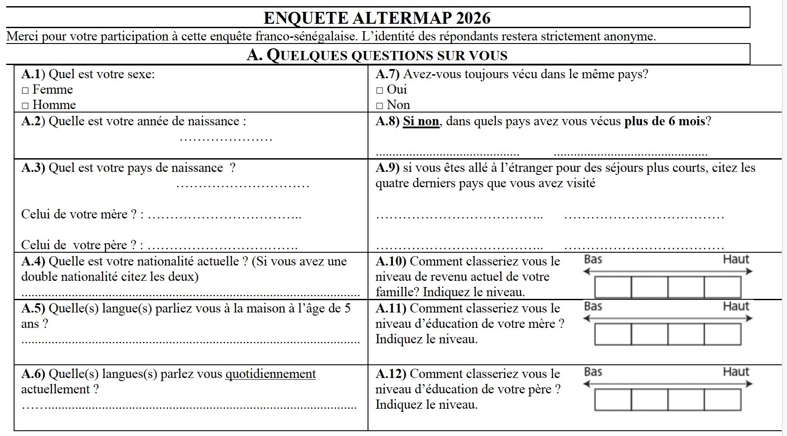
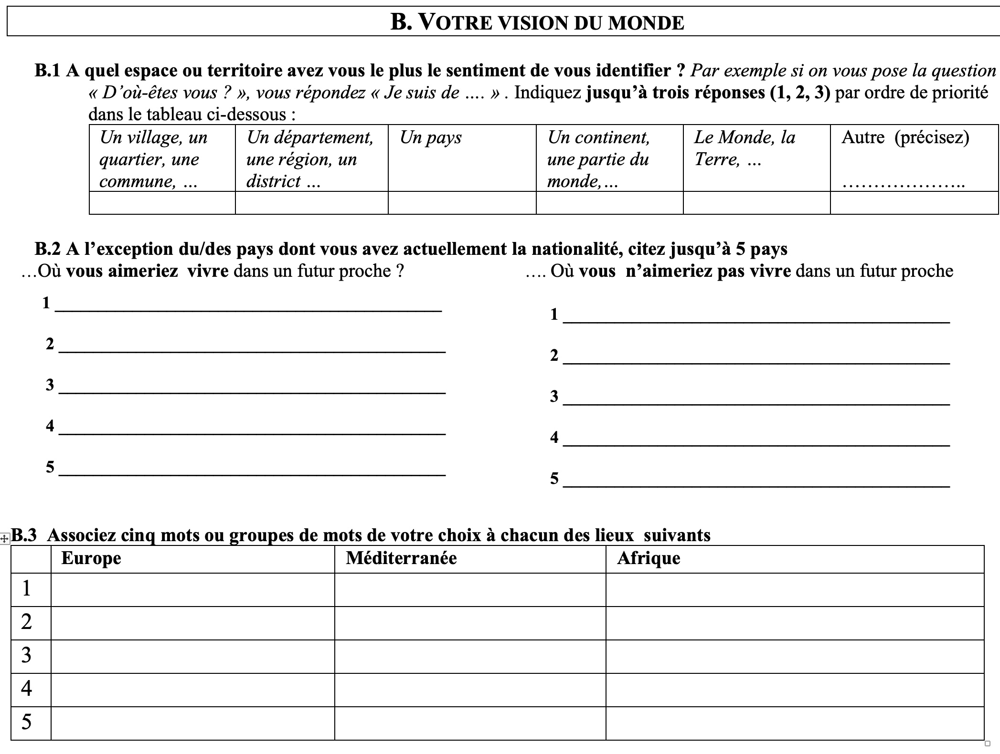
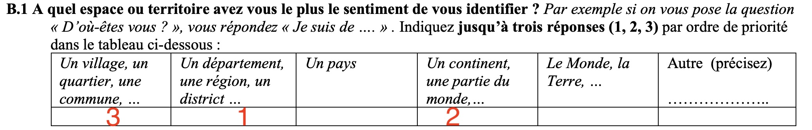
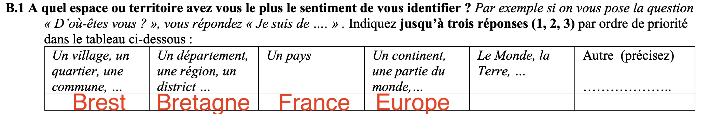
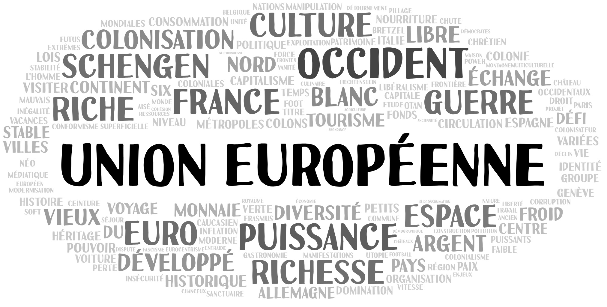
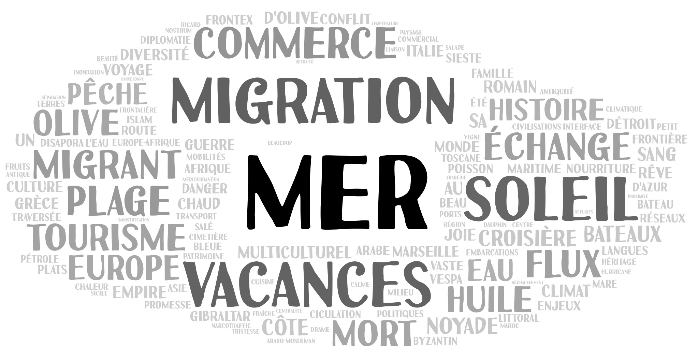
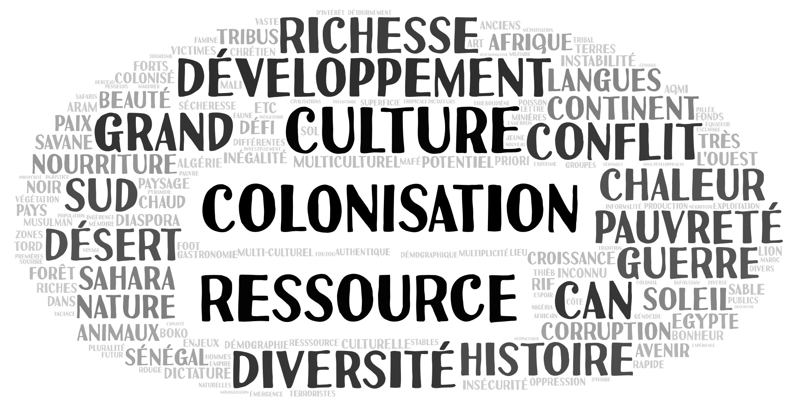

```{r}
library(knitr)
library(dplyr)
library(tidyr)
library(ggplot2)
library(ggrepel)
library(labelled)
library(readxl)
library(questionr)
library(sf)
library(mapsf)
library(readxl)

```


## Introduction 


# A. QUELQUES QUESTIONS SUR VOUS

La première partie du questionnaire apportait des données de cadrage sur les individus (âge, sexe), sur la perception du niveau de revenu de la famille et les études des parents, ainsi que l'expérience international de la mobilité.


{width=800}


::: {.callout-tip}
## Télécharger le jeu de données issues de Kobo Toolbox
-  [Données d'enquête issus de kobo au format label .xlsx ](https://github.com/worldregio/altermap/raw/refs/heads/main/data/axe1/ALTERMAP_2026_Vision_du_Monde_SMA_labels.xlsx)
-  [Données d'enquêteissus de kobo  au format code .xlsx ](https://github.com/worldregio/altermap/raw/refs/heads/maindata/axe1/ALTERMAP_2026_Vision_du_Monde_SMA_labels.xlsx)

:::


On commence par charger les questionnaires issus de Kobo Toolbox en format "label" (texte complet) ou en format "codes" (codes) pour constituer notre tableau de données. Selon le cas on utilisera l'un ou l'autre tableau pour nos analyses. On va ensuite construire à partir de ces deux fichiers notre tableau de donnée de référence

```{r}
donlab <- read_xlsx("data/axe1/ALTERMAP_2026_Vision_du_Monde_SMA_labels.xlsx",na = "NA")
doncod <- read_xlsx("data/axe1/ALTERMAP_2026_Vision_du_Monde_SMA_codes.xlsx", na = "NA")
don<-data.frame(id=paste(doncod$Unit_d_enseignement_concern,doncod$N_de_questionnaire))
```


On se propose dans cette première analyse d'étudier les réponses de 61 étudiants de licence 3 de géographie de l'Université Paris Cité qui ont été interrogés dans le cadre des groupes de TD de Structure du Monde Actuel par Felipe Barientos et Heloïse Chauvel


##  A.1 Echantillonage

### Nombre de réponses par groupe de TD

```{r}
don$grp <-doncod$Unit_d_enseignement_concern
tab<-table(don$grp)
freq(tab,valid = F, total = T)
```

Il y a eu 61 réponses, réparties de façon à peu près équivalentes dans les quatre groupes de TD

### Domaines d'étude

Les étudiants ont tous été déclarés comme relevant des Sciences Humaines et Sociales.


### Sexe

```{r}
par(mfrow=c(1,1))
don$sex <-as.factor(donlab$`A.1 : Sexe`)
tab<-table(don$sex)
freq(tab,valid = F, total = T)

```

L'échantillon est parfaitement équilibré avec 31 homme et 31 femmes.


### Âge


```{r}
don$age<-2026 - doncod$A2_Year
hist(don$age, main="Âge approximatif des étudiants", xlab = "2026 - année de naissance", ylab = "Effectif")

```


La majorité des étudiants sont âgés de 20 ou 21 ans ce qui correspond à leur niveau de Licence 3 sans redoublement. 

## A.2 Variables de cadrage

### Niveau économique familial

L'autoévaluation du niveau économique a été faite sur une échelle graphique comportant quatre cases. Mais les étudiants ont souvent coché des cases situées sur les lignes séparant les cases, ce qui aboutissait à 8 ou 9 réponses possibles que l'on a ramené aux 4 prévues initialement.

```{r}
don$rich <- as.factor(donlab$`A.10 Revenu familial`)
#table(don$rev)
don$rich<-as.factor(don$rich)
levels(don$rich)<-c("1 très bas","1 très bas","2.bas","2.bas","3.haut","3.haut","4.très haut","4.très haut")
tab<-table(don$grp,don$rich)
lprop(tab)
mypal=rainbow(10)
mosaicplot(tab,,col =mypal,main = "Autoévaluation de la richesse familiale", sub = "Source : Enquête Altermap 2026, UPC" ,las = 1)
```

En croisant les réponses à cette question avec les groupes de TD, on remarque une originalité du groupe de TD3 qui déclare des niveaux sensiblement plus élevés. Cela pourrait peut-être s'expliquer par le fait qu'il correspond à des étudiants suivant une double licence écononomie-géographie alors que les trois autres groupes sont des étudiants en licence unique de géographie


### Niveau d'éducation des parents

On analyse ensuite le niveau d'éducation des parents : 

```{r}
don$edu_mere <- as.factor(donlab$`A.11 Niveau d'étude de votre mère`)
levels(don$edu_mere)
don$edu_mere<-as.factor(don$edu_mere)
levels(don$edu_mere)<-c("1 très bas","1 très bas","2.bas","2.bas","3.haut","3.haut","4.très haut","4.très haut")
tab<-table(don$grp,don$edu_mere)
lprop(tab)
mypal=rainbow(10)
mosaicplot(tab,col =mypal,main = "Niveau d'éducation de la mère (déclaré)", sub = "Source : Enquête Altermap 2026, UPC" ,las = 1)
```

```{r}
don$edu_pere <- as.factor(donlab$`A.12 Niveau d'étude de lvotre père`)
don$edu_pere<-as.factor(don$edu_pere)
levels(don$edu_pere)<-c("1 très bas","1 très bas","2.bas","2.bas","3.haut","3.haut","4.très haut","4.très haut")
tab<-table(don$grp,don$edu_pere)
lprop(tab)
mypal=rainbow(10)
mosaicplot(tab,col =mypal,main = "Niveau d'éducation du père (déclaré)", sub = "Source : Enquête Altermap 2026, UPC" ,las = 1)
```

On en retrouve pas cette fois-ci d'originalité particulière du groupe de TD 3


## A.3 Expérience internationale 

L'expérience du Monde des étudiants a pu être évaluée par deux questions, l'une portant sur les pays où ils ont séjourné plus de mois (migrations) et l'autre sur les six derniers pays qu'ils ont visité même si ce n'est que pour quelques jours à l'occasion de vacances ou voyages d'étude (mobilités). 

### Séjours de plus de 6 mois 


```{r}
don$mig<-as.factor(doncod$A6_migration)

tab<-table(don$grp, don$mig)
lprop(tab)
mypal=rainbow(2)
mosaicplot(tab,col =mypal,main = "A toujours vécu dans le même pays ?", sub = "Source : Enquête Altermap 2026, UPC" ,las = 1)
```

Il n'existe pas de différences significatives entre les étudiants des différents groupes. Seuls 20% des étudiants ont effectué des séjours de durée supérieur à 6 mois (= migration) dans un autre pays

### Mobilités de courte durée

On examine le nombre de pays visités quels que soit la durée du séjour, le maximum de réponse étant limité à 4.

```{r}
don$mob<-paste(doncod$A9_mob1, doncod$A9_mob2, doncod$A9_mob3, doncod$A9_mob4)
don$mob <- gsub(" NA "," ", don$mob)
don$mob <- gsub(" NA "," ", don$mob)
don$mob <- gsub(" NA "," ", don$mob)
don$mob <- gsub(" NA","", don$mob)
don$mob <- gsub("NA","", don$mob)

don$nbmob <- round(as.numeric(lapply(don$mob, nchar))/4)

tab<-table(don$grp, don$nbmob)
lprop(tab)
mypal=rainbow(15)
mosaicplot(tab,col =mypal,main = "Mobilités internationales", sub = "Source : Enquête Altermap 2026, UPC" ,las = 1, ylab ="Nb. pays visités (max. 4)")
```

La plupart des étudiants interrogés ont fourni 4 réponses et seul un petit nombre d'entre eux déclarent n'avoir visité aucun pays étranger ou un seul. Ceci s'explique assez logiquement par la facilité de se rendre dans un pays étranger voisin en France à l'occasion de vacances ou de stages. 


```{r}
x <- c(doncod$A9_mob1, doncod$A9_mob2, doncod$A9_mob3, doncod$A9_mob4)
tab <-table(x)
sta <- data.frame(iso3=names(tab), nbvis = as.numeric(tab)) %>% arrange(-nbvis)
map<-readRDS("data/ebm/geom/ebm_states.RDS")
map <- left_join(map, sta)

mf_map(map, type="base", col="lightyellow")
mf_map(map, type="prop", var="nbvis",col="red", inches=0.1, 
       leg_pos = "topleft",
       leg_title = "nb. réponses")
mf_graticule(map,add = T, lty=2, lwd=0.5)
mf_layout("Pays visités : étudiants de Paris, SMA, 2026", frame=T, arrow=F, scale = F, credits="Source : Enquête Altermap 2026, UPC")

```


La carte des pays visités par les étudiants du cours de SMA est très clairement centrée sur les pays voisins de la France,les plus cités étant l'Italie (24) et l'Espagne (20), suivis de la Belgique (12) , l'Allemagne et les Pays-bas (10), le Royaume-Uni et le Portugal (9) ou la Grèce (7) Les USA sont le premier pays extra-européen cité (9), suivi du Maroc (6) et du Vietnam (5). Les autres pays cités le sont par moins de 5 étudiants (Japon, Togo, Taïwan, Emirats, Suisse, Irlande, Tunisie, Turquie, ...). Une partie des pays cités correspondent aux pays d'origine d'étudiants étrangers inscrits en géographie à Paris Cité. 


# B. VOTRE VISION DU MONDE

La seconde partie du questionnaire visait à analyser certains éléments de la vision du Monde des étudiants en utilisant trois entrées différentes : les échelles d'appartenance, les pays attractifs et répulsifs, les mots associés à certains espaces. 

{width=800}


## B.1 Echelles d'appartenance 

La questions n'a sans doute pas été formulée de façon satisfaisante car beaucoup d'étudiants ont répondu d'une façon différente de celle qui avait été anticipée par les enquêteurs.

On attendait en effet des étudiants qu'ils choisissent parmi les niveaux proposés les trois échelle territoriale auxquelles ils s'identifient le plus en les ordonnant. Soit une réponse du type suivant qui a été donnée par 47 des 61 étudiants :  

{width=800}

Mais 14 étudiant sur 61 ont compris la question différemment et ont plutôt indiqué les lieux correspondant à leurs échelles d'appartenance territoriale, sans les hiérarchiser, aboutissant à des réponses du type suivant : 


{width=800}

Il est donc clair que la question doit être construite différemment dans les enquêtes futures et relève peut-être d'ailleurs plus d'un entretiens qualitatif où l'on poserait la question *"D'où êtes-vous ?"* sans préjuger du résultat mais en relançant la personne interrogée pour détecter l'existence de niveaux multiples. Il n'est d'ailleurs pas certain que l'idée d'ordonner les échelles soit pertinente. La réponse à la question peut en effet varier selon le contexte où elle est posée. Un français interrogé sur ses orignes dans un pays très éloigné pourra répondre qu'il vient de France ou d'Europe. Le même individu interrogé par un habitant de son pays répondra plutôt qu'il vient de Bretagne ou de Brest ... 

Peut-on néanmoins tirer quelques enseignements des réponses obtenues ?


### Echelles multiples

On peut tout d'abord examiner quelles échelles ont été les plus mobilisées par les étudiants, que ce soit pour les ordonner ou leur attribuer un exemple.

```{r}
tab<-doncod[,42:47]
n<-apply(tab,2,sum, na.rm=T)
pct <- 100*n/61
niveau <- c("Local","Infranational","National","Supranational","Global","Autre")
tab<-data.frame(niveau,n, pct)
kable(tab, row.names=F, digits=c(0,0,1))
table(donlab$`B1 : Sentiment d'appartenance :  autre`)

```


Cette analyse met en évidence une très forte concentration des réponses vers les échelle locale (54%), infranationale (59%) ou nationale (62%). Le niveau suprantionale correspondant à l'Europe ou l'Union Européeen n'apparait que dans 21% des réponses et le niveau global de la Terre ou du Monde dans 8% des réponses.  Quant aux réponse "Autre" elles renvoient souvent à la religion ou à des situations spécifiques comme "*Outre-Mer*" ou "*Métissage*". 


### Echelle principale


Si on se limite aux 47 étudiants sur 61 qui ont fourni un classement des échelles, on peut construire un tableau donnant l'échelle principale d'appartenance i.e. celle qui a été classée en première place :


```{r}
don$lev<-doncod$A13a_level
sel <- don %>% filter(is.na(lev)==F)
sel$lev2<-as.factor(sel$lev)
levels(sel$lev2)<-c("Local","Infranational","National","Autre")
#sel$lev2<-as.factor(as.character(sel$lev2))
tab<-table(sel$grp, sel$lev2)

kable(addmargins(tab))

```


Ce résultat confirme la prédominance des échelles locales et infranationales mais ne permet pas d'aller plusloin vu la faiblesse des effectifs et le problème de formulation de la question. Il sera toutefois intéressant de comparer les réponses obtenues ici avec celle des étudiants sénégalais en 2026 (ont-ils plus tendance à déclare le niveau supranational de l'Afrique ?) où celle des géographes parisiens interrogés en 2009 (étaient-ils autant concentrés sur les échelles locales ?)


## B.2 Pays attractifs et répulsifs


Une manière efficace de mettre à jour les représentations du Monde des étudiants a consisté à leur demander les pays où ils souhaiteraient vivre ou ne pas vivre dans un futur proche. Cela suppose une petite préparation des données pour créer un tableau ou chaque ligne correspond à une réponse sur les pays attractifs ou répulsifs. En d'autres termes les réponses de chaque étudiant correspondront à 10 lignes, 5 pour les pays cités positivement et 5 pour les pays cités négativement.On accompagnera ces réponses des informations que l'on juge utile sur les étudiants afin de pouvoir ensuite faire des regroupements. 

A titre d'exemple, voici la forme que prendront les réponses d'une personnes enquêtée dont on a conservé comme variables explicaives le sexe, l'âge,le niveau de richesse et les pays visités : 

```{r}
pos <-doncod[,50:54]
names(pos)<-c("pos1","pos2","pos3","pos4","pos5")
donpos <- cbind(don,pos) %>% pivot_longer(cols = 12:16)
neg <-doncod[,55:59]
names(neg)<-c("neg1","neg2","neg3","neg4","neg5")
donneg <- cbind(don,neg) %>% pivot_longer(cols = 12:16)
donpol <-rbind(donpos, donneg) 
donpol$opi<-substr(donpol$name,1,3)
donpol$rnk <-substr(donpol$name,4,4)
donpol$iso3<-donpol$value
donpol<-donpol[,-c(12:13)] %>% arrange(id,opi,rnk)

codgeo <- map %>% st_drop_geometry() %>% select(iso3,nom=name) 
codgeo$nom[codgeo$iso3=="GBR"] <- "U.K"
codgeo$nom[codgeo$iso3=="USA"] <- "U.S.A."
codgeo$nom[codgeo$iso3=="RUS"] <- "Russia"
codgeo$nom[codgeo$iso3=="ARE"] <- "Emirates"
codgeo$nom[codgeo$iso3=="PRK"] <- "North Korea"
codgeo$nom[codgeo$iso3=="LIB"] <- "Libya"
codgeo$nom[codgeo$iso3=="IRN"] <- "Iran"
donpol <- donpol %>% left_join(codgeo)


kable(donpol[1:10,c(3:5,9,12:15)])
```

On pourra remarquer que deux des pays cités positivement (Pays-Bas et Italie) sont des pays que l'étudiante a cité dans les quatre derniers pays qu'elle a visité. 


### Pays attractifs

Si on ne tient pas compte du rang des pays cités positivement, on peut établir un tableau de fréquence indiquant le nombre de fois ou un pays a été cité positivement par l'un des 61 étudiants de notre réchantillon.


```{r}
nbetud<-61
topfra <- donpol %>% filter(opi=="pos",is.na(iso3)==F) %>% 
  group_by(iso3, nom) %>%
  count() %>%
  ungroup() %>% 
  mutate ( nb=n, rnk = rank(-n), sal=100*n/nbetud) %>%
  select(rnk, iso3, nom,nb, sal) %>%
  arrange(rnk)


kable(topfra[1:15,],caption ="Pays les plus attractifs pour 61 étudiants de L3 géographie à UPC en mars 2026", col.names = c("Rang","Code","Nom", "Nb. réponses", "% étudiants"), digits=c(0,0,0,0,1,1))

```

- **Commentaire** : Le pays le plus attractif est clairement l'Italie qui a été mentionnée positivement par 34 étudiants (56%) suivie de l'Espagne (39%), le Canada (28%), le Japon (26%), la Suisse et le Royaume-Uni (23%) et l'Allamgne (16%). La Chine et les USA n'ont été cités chacun que par 9 étudiants (15%) et le Brésil par 8 étudiants(13%).  Ce qui frappe le plus dans ces réponses est l'absence presque totale de réponses mentionnant une attraction pour les pays d'Afrique et d'Amérique latine. 

```{r}
map2 <- left_join(map,topfra)
mf_map(map2, type="base", col="lightyellow")
mf_map(map2, type="prop", var="sal",col="red", inches=0.1, 
       leg_pos = "topleft",
       leg_title = "% étudiants")
mf_graticule(map,add = T, lty=2, lwd=0.5)
mf_layout("Pays attractifs : étudiants Paris Mars 2026", frame=T, arrow=F, scale = F, credits="Source : Enquête Altermap réalisée les 23-24 Mars 2026, Cours L3 SMA - UPC")
```

- **Commentaire** : La carte des pays attractifs pour les étudiants géographes de Paris Cité en 2026 est assez proche de la carte des pays qu'ils ont visités. Ce qui frappe le plus dans ces réponses est l'absence presque totale de réponses mentionnant une attraction pour les pays d'Afrique, d'Europe de l'Est, d'Asie du Sud et de l'Ouest. 


### Pays répulsifs


```{r}
nbetud<-61
topfra <- donpol %>% filter(opi=="neg",is.na(iso3)==F) %>% 
  group_by(iso3, nom) %>%
  count() %>%
  ungroup() %>% 
  mutate ( nb=n, rnk = rank(-n), sal=100*n/nbetud) %>%
  select(rnk, iso3, nom,nb, sal) %>%
  arrange(rnk)


kable(topfra[1:15,],caption ="Pays les plus répulsifs pour 61 étudiants de L3 géographie à UPC en mars 2026", col.names = c("Rang","Code","Nom", "Nb. réponses", "% étudiants"), digits=c(0,0,0,0,1,1))

```

- **Commentaire** : Un trio de pays les plus répulsifs se dégage nettement, constitué d'Israël (46%), de la Russie (43%) et des USA (41%). On trouve ensuite à égalité l'Afghanistan et l'Iran (34%) suivis de la Corée du Nord (21%), les Emirats Arabes Unis et l'Inde (20%), la Chine (15%), le Qatar (13%) et le Soudan, les territoires palestiniens (12%). Ces résultats sont naturellement fortement influencés par l'actualité immédiate ou récente, l'enquête ayant eu lieu les 23 et 24 mars 2026 au moment où se déroule la guerre opposant les USA et Israël à l'Iran, avec en retour le blocage du détroit d'Ormuz et le bombardement d'infrastructures et d'immeubles à Dubï et dans les Emirats Arabes Unis.  Mais les réponses témoignent aussi de phénomènes de plus longue durée comme la guerre d'agression de la Russie en Ukraine, le régime taliban en Afghanistan, la guerre civile au Soudan, la situation tragique des territoires palestiniens, etc... 


```{r}
map2 <- left_join(map,topfra)
mf_map(map2, type="base", col="lightyellow")
mf_map(map2, type="prop", var="sal",col="blue", inches=0.1, 
       leg_pos = "topleft",
       leg_title = "% étudiants")
mf_graticule(map,add = T, lty=2, lwd=0.5)
mf_layout("Pays répulsifs : étudiants Paris, 2026", frame=T, arrow=F, scale = F, credits="Source : Enquête Altermap réalisée les 23-24 Mars 2026, Cours L3 SMA - UPC")
```

- **Commentaire** : La carte des pays répulsifs n'est pas exactement le négatif de celle des pays attractifs. Elle montre une forte concentration sur le Proche et le Moyenorient ainsi que sur les grandes puissances considérées comme hostile à la France et l'Union Européenne, en particulier la Russie de V. Poutine et l'Amérique de D. Trump. Les guerres civiles, les pays en crise et les dictatures sont cités prioritairement par les étudiants. Mais on rerouve aussi un certain nombre de pays qui ont été cités positivement par d'autres étudiants comme la Chine, le Royaume-Uni ou l'Allemagne et même les USA. 


### Synthèse

Ce que montrent bien les analyses précédentes est le fait que l'appréciation que les étudiants donnent d'un pays doit être envisagé selon deux dimensions complémentaires, la saillance et l'opinion

- **la saillance** (en anglais *salience*) est le fait qu'un pays se présente à l'esprit dun étudiant lorsqu'on lui demande de porter un jugement. Peu importe  que le jugement soit positif ou négatif, si un pays est cité par l'étudiant c'est qu'il possède des informations sur lui, qu'il en a reçu et à choisi de les retenir. Bref, la saillance manifeste une reconnaissance de l'exsitence d'un pays et signale sa présence dans la carte mentale de la personne. On la définira donc comme le % des étudiants qui ont cité un pays positivement ou négativement et on la mesurera sur une échelle de 0 à 100

$Saillance_i = 100\times \frac{Pos_i + Neg_i}{n}$

- **la polarisation** est le positionnement d'un individu et par la suite d'un groupe d'individu sur une échelle de jugement allant du négatif au positif. Elle ne peut exister que si le pays est déjà connu par l'individu et - dans le cas d'un groupe - possède une saillance suffisante. On mesure classiquement la polarisation sur un intervalle allant de -1 (tous les avis sont positifs) à +1 (tous les avis sont négatifs).

$Polarisation_i = \frac{Pos_i-Neg_i}{Pos_i+Neg_i}$


On ne retient que les pays ayant été cités par au moins 6 étudiants français (10%) pour calculer les indicateurs de saillance et de polarisation.

```{r}

syntfra <- donpol %>% filter(is.na(iso3)==F) %>%
                     group_by(iso3,nom,opi) %>% 
                      count() %>%
                      pivot_wider(names_from = opi,
                                  values_from = n,
                                  values_fill = 0) %>%
                       mutate(tot=neg+pos,
                              saillance = 100*tot/nbetud,
                              polarisation=(pos-neg)/(pos+neg)) %>%
                      arrange(-saillance) %>%
                      filter(tot>=7)

kable(syntfra[1:20,],caption ="Synthèse des perceptions des pays du monde des étudiants parisiens en 2008", col.names = c("Code","Nom", "Négatif", "Positif", "Total", "Saillance (%)","Polarisation"), digits=c(0,0,0,0,0,1,2))

```

- **Commentaire :** Le pays qui a la plus forte saillance pour les étudiants français demeure l'Italie qui a été cité par 59% des étudiants. Elle a reçu 34 avis positif et 2 avis négatifs ce qui lui donne une polarisation très favorable (+0.89). Les USA ont un niveau de saillance assez voisin (56%) mais avec une polarisation majoritairement mais pas exclusivement négative (-0.47) composée de 25 avis négatfs et 9 avis positifs. Dans les études antérieures, les USA étaient toujours cxaractérisés par un mélange d'avis positifs et négatifs, mais la balance était nettement plus équilibré et souvent positive. Ce qui frappe dans les pays suivants est l'absence de pays caractérisés par des polarisations faibles, à l'exception notable de la Chine qui a reçu exactement autant d'avis positifs que négatifs (polarisation = 0). Le Royaume-Uni (+0.40) et de l'Allemagne (+0.54) reçoivent majoritairement des avis positifs mais avec tout de même une ninorité d'avis négatifs. Dans tous les autres cas, l'opinion des étudiants est preque unanimement positive ou négative. Ce résultat s'explique en partie par la faiblesse de l'échantillon. Mais il semble constituer une nouveauté par rapport aux enquêtes réalisées en 2009 dans le projet EuroBroadMap.
```{r}
ggplot(syntfra, aes(x=saillance, y = polarisation)) + 
        geom_point() + 
        geom_text_repel(aes(label = nom))+
        scale_x_log10()+
        ggtitle(label = "Attraction-Répulsion de 61 étudiants parisiens en 2026" ,
                subtitle = "Source : Enquête Altermap, Cours L3 SMA - UPC") +
         theme_light()
       
```

- **Commentaire** : Grâce à la normalisation des indices de polarisation et de saillance, il est possible de comparer les positions des pays dans les deux graphiques de synthèse des étudiants français et sénégalais. On peut ainsi voir que la situation la plus favorable (forte saillance et polarisation positive) ne se limite pas aux USA et au Canda comme dans le cas sénégalais mais inclue aussi des pays européens comme l'Italie, l'Espagne et le Royaume-Uni. On remrarque aussi l'absence frappante des pays africains sur le graphique puisque seules l'Afrique du Sud et l'Algérie atteignent un niveau de saillance de 5% et y figurent. La carte mentale des étudiants français oppose fondamentalement des pays européens ou nord-américains (appréciés positivement ) à des pays asiatiques auxquels s'ajoute la Russie (appréciés négativement) 

## B.3 Europe-Méditerranée-Afrique

Quels sont les mots associés par les étudiants de géographie à ces trois territoires qui forment une région verticale reliant pays du Nord et du Sud ? Il est utile ici de préciser que l'enquête intervenait après trois séances de cours d'Adrien Doron sur la lecture transnationale du Monde par les flux et les circulations commerciales ou migratoires. Et que la dernière séance portait plus précisément sur les espaces d'interface que constituent les Méditerranées situées en tre les deux Amériques, entre l'Europe et l'Afrique ou entre l'Asie et l'Océanie. Plus généralement, les étudiants de licence de géographie de l'Université Paris Cité ont normalement été formés aux questions de développement, de pouvoir, de mobilité ... et suivi des cours sur la "géographie des Nords" et la "géographie des Suds". 

Le choix des mots est donc fortement biaisé par le domaine de spécialisation de ces étudiants et il sera ultérieurement intéressant de comparer les résultats avec ceux d'étudiants d'autres disciplines que la géographie n'ayant pas eu de cours sur le sujet.

### Quelles méthodes d'analyse ?

Sur le plan méthodologique, l'exploitation des résultats peut se faire selon au moins trois types de méthodes dont une seule, la plus simple, sera présentée ici : 

1. **Comptage des mots les plus fréquents et visualisation sous la forme de nuages de mots**. Cette technique rapide - mais imparfaite - est bien adaptée à une première exploration du corpus. Elle peut être facilement réalisée avec des outils en ligne comme [wordart](https://wordart.com)

2. **Analyse textuelle à l'aide d'outils de lemmatisation ou racinisation**. Cette technique plus exigeante implique l'emploi de logiciels spécialisés disponibles à travers des packages comme Iramuteq, Spacyr, Quanteda,  Udpipe, ... qui suppose une maîtrise des langages R ou Python. Ou bien d'interfaces en ligne, plus simples d'utilisation, mais qui implique en tout état de cause une formation aux concepts et méthodes de l'analyse textuelle.

3. **Codage manuel de catégories en fonction d'une problématique**. Cette méthode relève davantage des approches qualitatives utilisées par exemple dans les études du contenu des journaux. Pour être menée de façon rigoureuse, elle suppose l'établissement d'une grille de codage (e.g. on va chercher les mots relevant du thème de la violence) puis d'un test de comparaison des résultats de deux codeurs appliquant la grille afin de vérifier si leurs résultats sont convergents (test du Kappa de Cohen).

En se limitant ici à la première méthode, voyons rapidement les résultats obtenus.

### Les mots de l'Europe

{width=800}

- **Commentaire : ** Les mots relatifs à l’Europe renvoient à plusieurs dimensions sémantiques. La plus centrale concerne l’intégration européenne avec les mentions ‘UE’ en premier, puis ‘euro’ ou encore ‘Schengen’. Cela témoigne d’une tendance à assimiler l’entité régionale européenne à l’entité politique et économique de l’Union européenne.
Trois autres registres ressortent : celui du **développement**, avec les termes de ‘puissance’, ‘richesse’, ‘développé’, ‘riche’, ‘argent’ ; le registre de la **domination**, avec les termes de ‘puissance’ également, de colonisation, de guerre ; enfin un registre **culturel** large autour de représentations occidentales, de vieux continent, avec les termes d’’occident’, ‘blanc’, ‘culture’, ‘vieux’. 


### Les mots de la Méditerranée

{width=800}

- **Commentaire** : Les mots relatifs à la Méditerranée renvoient en premier lieu à la **dimension maritime**, avec les mentions de ‘mer’, ‘pêche’, ‘eau’, ‘bateau’, ‘côte’. Trois autres registres ressortent : le registre du **tourisme** et du ludique avec les termes de ‘tourisme’, ‘vacances’, ‘croisières’, ‘soleil’ ; le registre **commercia**l avec les termes de ‘commerce’, ‘échange’, ‘flux’ ; et enfin le registre des **migrations** avec les termes de ‘migration’, ‘migrant’, ‘flux’, ‘mort’, noyade’.  On note une opposition frontale entre la dimension touristique et la dimension migratoire.
On observe peu de mentions terrestres (excepté olive), avec une appréhension essentiellement maritime de cet espace, et finalement peu de mise en lien de l’Europe et de l’Afrique comme entités régionales (la notion étant pourtant intercalée entre les deux), même si cet espace est appréhendé comme une interface via le commerce et les migrations


### Les mots de l'Afrique

{width=800}

- **Commentaire** : La première dimension qui apparait dans les mots relatifs à l’Afrique renvoie au registre de **domination**, avec les termes de ‘colonisation’, ‘conflit’, ‘guerre’, voire ‘pauvreté’. Trois autres registres ressortent : celui du **développement** avec les mentions de ‘richesse’, ‘pauvreté’, ‘développement’, ‘ressource’, ‘Sud’ ; le registre de l**environnement** et du **climat** avec les mentions de ‘soleil’, ‘chaleur’, ‘ressource’, ‘nature’, ‘désert’, ‘Sahara’ ; et enfin un registre **culture** au sein duquel on peut intégrer les manifestations sportives, avec les mentions de ‘culture’, ‘diversité’, ‘richesse’, ‘CAN’, ‘histoire’, ‘langues’.

