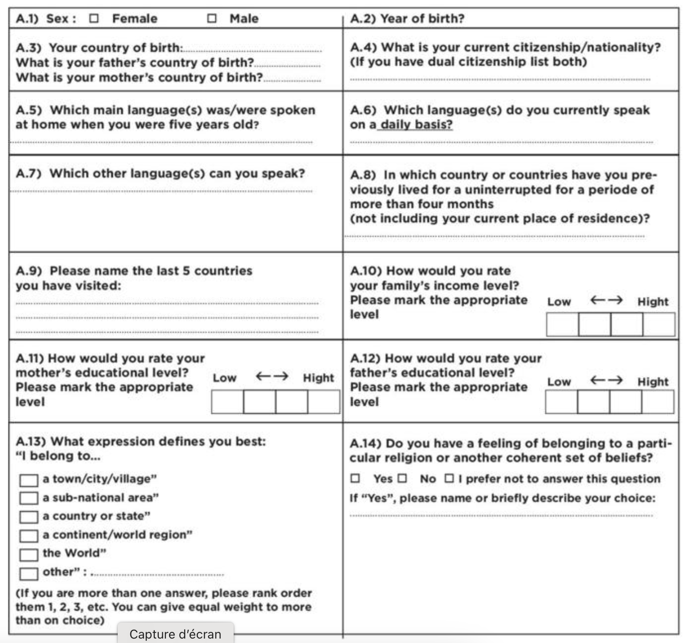
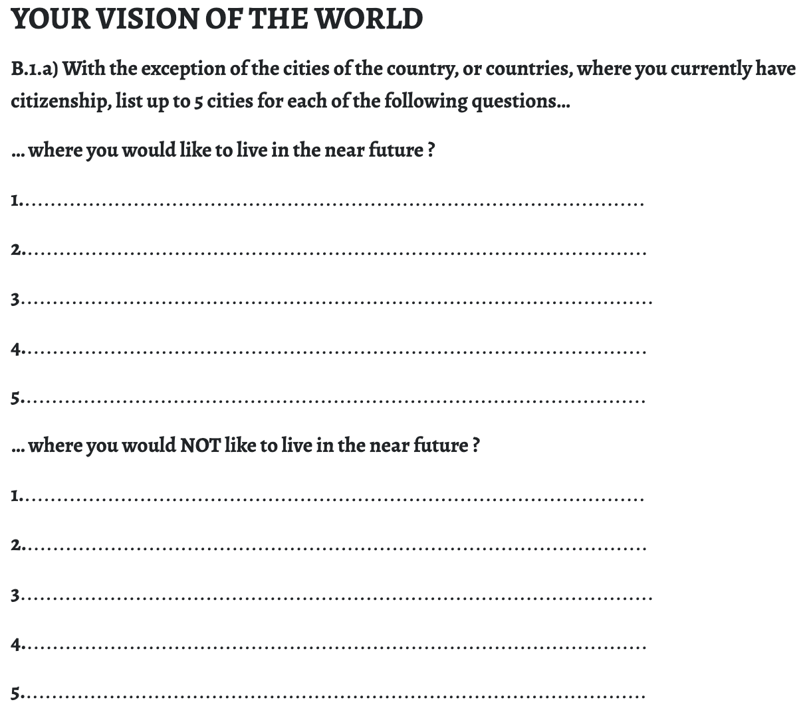
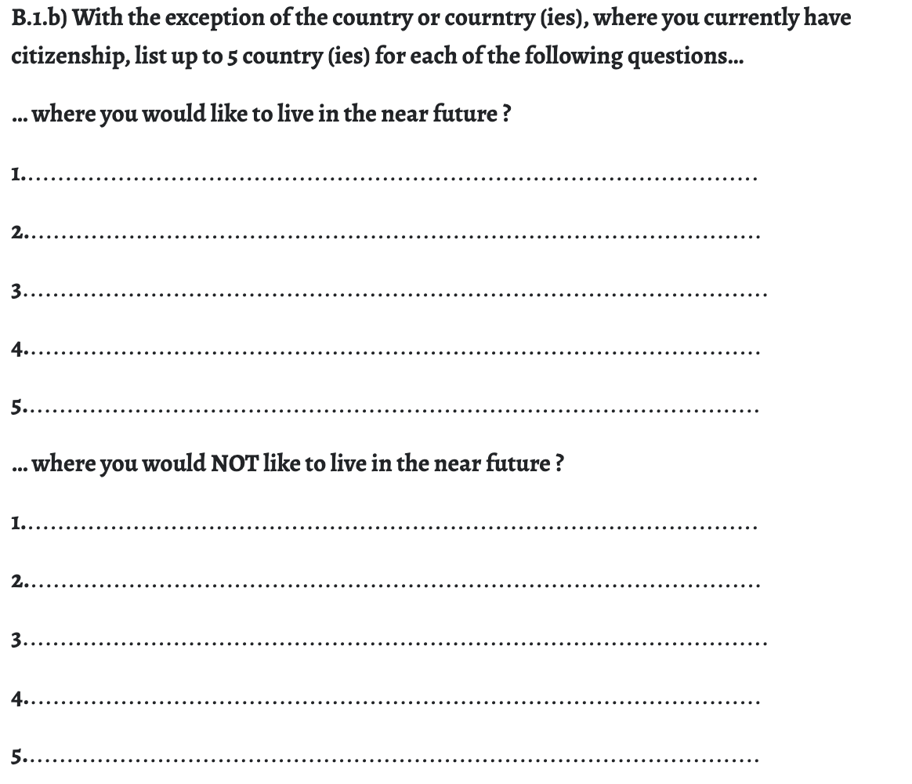

```{r}
library(knitr)
library(dplyr)
library(tidyr)
library(ggplot2)
library(ggrepel)
library(labelled)
library(readxl)
library(questionr)
library(sf)
library(mapsf)

```


## Introduction 

Les archives du projet EuroBroadMap n'ont pas fait l'objet d'un dépôt en bonne dûe forme à la fin du projet et différentes versions de la base de données corrigée ont circulé avant qu'une version stabilisée ne soit finalement arrêtée tardivement. C'est la raison pour laquelle il est important de repartir de cette dernière version et de la tranformer en un fichier stabilisé une bonne fois pour toutes ... 15 ans après !


L'enquête avait été réalisée sur format papier sous la forme d'une feuille A3 recto-verso pliée. Chaque enquêteur l'avait ensuite traduit dans la langue de son pays et adapté dans lé détail. Une première phase de test du questionnaire avait permis d'harmoniser au maximum les questions et de s'assurer qu'elles pourraient être posées dans tous les pays dans les mêmes termes.

En dehors des métadonnées enregistrées par l'enquêteur (lieu et date d'enquête, niveau et cursus des étudiants interrogés), toutes les informations ont été recueillies à partir du questionnaire que remplissaient les étudiants d'une même salle de cours. La durée moyenne de réponse était de 15 à 30 minutes.

# 1. Données de cadrage et expérience du monde

La première partie du questionnaire apportait des données de cadrage sur les individus (âge, sexe) mais aussi sur leurs mobilités personnelles et celle de leurs ascendants. On a ainsi pu évaluer l'expérience plus ou moins grande qu'ont les étudiants de l'étranger, des autres pays et des autres langues. Une question portait plus directement sur le niveau d'échelle auquel les étudiants ont le sentiment d'appartenir, du local au global. Mais on verra par la suite que son interprétation s'est avérée difficile. 


{width=800}


::: {.callout-tip}
## Télécharger le jeu de données
-  [Données au format .xlsx ](https://github.com/worldregio/altermap/raw/refs/heads/main/data/parisdakar/ebmsurvey2009.xlsx)
-  [Données au format .RDS ](https://github.com/worldregio/altermap/raw/refs/heads/main/data/parisdakar/ebmsurvey2009.RDS)

:::


```{r}
don <- read_xlsx("data/parisdakar/ebmsurvey2009.xlsx",sheet = "data")
fra <-don %>% filter(sta=="France")
sen <- don %>% filter(sta=="Sénégal")
meta <- read_xlsx("data/parisdakar/ebmsurvey2009.xlsx",sheet = "meta")
source <- read_xlsx("data/parisdakar/ebmsurvey2009.xlsx",sheet = "source")
```


La feuille data comporte 479 lignes, chacune correspondant aux réponses d'un étudiant français ou sénégalais. L'anaonymat des étudiants est préservé grâce à un code unique.

```{r}
kable(head(don))
```


La définition des variables retenues est présentée dans la feuille de métadonnées en français et en anglais. On se limite ici à l'affichage en français :

```{r}
kable(meta[,1:2])
```


Enfin le dernier onglet de la feuille excel présente la source et indique la citation du projet et des auteurs de l'enquête.

```{r}
kable(source)

```


On se propose dans cet exercice de comparer les caractéristiques des deux échantillons d'étudiants qui ont été collectés respectivement à Paris et Dakar en 2019. L'objectif du projet EuroBroadMap était d'enquêter des étudiants de 3e année de licence et d'arriver dans chaque ville  à un effectif de 240 étudiants répartis en 6 domaines d'études. 


## 1.1 Echantillonage

### Nombre de réponses

```{r}
tab<-table(don$cit)
freq(tab,valid = F, total = T)
```

Il y a eu 208 réponses à Dakar et 271 à Paris. L'objectif de 240 réponses par ville n'a donc pas été tout à fait atteint à Dakar et légèrement dépassé à Paris.


### Domaines d'étude

Les étudiants devaient être échantillonés dans six domaines d'étude : art et littérarure (ART), économie et gestion (BUS), sciences de l'ingénieur, mathématiques, physique et biologie (ENG), santé, pharmaie  et médecine (HEA), sciences politiques et droit (POP), sciences humaines et sociales (SHS). On dispose de cette variable que pour l'échantillon des étudiants de Paris où les quotas semblent assez équilbrés

```{r}
tab<-table(don$stu)
freq(tab,valid = F,total = T)
```

Dans le cas de Dakar,on ignore si les quotas ont été respectés car le champs idenifiant les dommaines d'étude n'a pas été enregistré.


### Sexe

```{r}
par(mfrow=c(1,1))
don$sex<-as.factor(don$sex)
levels(don$sex) <- c("Femmes", "Hommes")
tab<-table(don$cit, don$sex)
lprop(tab)
mosaicplot(tab, col=c("lightgreen","lightyellow"),main = "Sexe des étudiants", sub = "Source : Timera M.B., Grasland C., 2009, Enquête Eurobroadmap" )
```

L'échantillon de Dakar comporte une nette majorité d'hommes. Celui de Paris une légère majorité de femmes. Dans le cas français, il existe peu de variations du sex-ratio par discipline, même si les femmes sont plus nombreuses dans les domaines artisitiques et moins nombreuses en économie-gestion et sciences de l'ingénieur.

```{r}
par <- don %>% filter(cit=="Paris")
tab <- table(par$sex, par$stu)
cprop(tab)
```


### Âge

La consigne étant de cibler si possible des étudiants de 3e année d'universitaire, on pouvait s'attendre à un âge modal d'environ 20 ans. or, si tel est bien le cas à Paris, il n'en va pas de même à Dakar où la majorité des étudiants enquêtés avaient plutôt de 26 à 30 ans.

```{r}
boxplot(don$age~don$cit, horizontal=T,ylim = c(15, 40),
        ylab= "Ville d'enquête", xlab="âge des étudiants", main = "Distribution des âges des étudiants",sub = "Source : Timera M.B., Grasland C., 2009, Enquête Eurobroadmap" )
```


En dehors des variables utilisées pour définir l'échantillon, quelques variables de cadrage ont été retenus pour analyser les résultats aux questions constituant le coeur du questionnaire.


## 1.2 variables de cadrage

### Niveau économique familial

L'autoévaluation du niveau économique a été faite sur une échelle graphique comportant quatre cases. Mais les étudiants ont souvent coché des cases situées sur les lignes séparant les cases, ce qui aboutissait à 9 réponses possibles au lieu de 4. Nous avons procédé à un regroupement pour revenir à 4 niveaux en prenant par défaut le niveau le plus pas en cas d'ambiguïté. On obtient les résultats suivants pour les deux pays : 

```{r}
table(don$inc)
don$inc4<-as.factor(don$inc)
levels(don$inc4)<-c("1 très bas","1 très bas","2.bas","2.bas","3.haut","3.haut","4.très haut","4.très haut")
tab<-table(don$cit, don$inc4)
lprop(tab)
mypal=rainbow(10)
mosaicplot(tab,,col =mypal,main = "Autoévaluation de la richesses familiale", sub = "Source : Timera M.B., Grasland C., 2009, Enquête Eurobroadmap" ,las = 1)
```

On constate - sans surprise - que l'autoévaluation de leur niveau économique par les étudiants est différente dans les deux pays et sensiblement plus élevé dans le cas des étudiants français. 


### Langues parlées


#### Langue maternelle

Nous avons tout d'abord examine les langues maternelles déclarées par les étudiants à l'aide de la question relative à la langue principale parlée à l'âge de cinq ans. Les résultats des deux pays sont très différents.


```{r}
langsen <- sen %>% filter(is.na(lan)==F) %>%
                   group_by(lan) %>% 
                   summarise(n= n())  %>%
                   mutate(rang = rank(-n),
                              pct = 100*n/sum(n)) %>%
                   select(rang, lan, n, pct) %>%
                   arrange(rang)

kable(langsen, digits = c(0,0,0,1),col.names = c("rang","Langue","nb. réponses", "%"),
      caption = "Langues maternelles des étudiants sénégalais")
```


```{r}
langfra <- fra %>% filter(is.na(lan)==F) %>%
                   group_by(lan) %>% 
                   summarise(n= n())  %>%
                   mutate(rang = rank(-n),
                              pct = 100*n/sum(n)) %>%
                   select(rang, lan, n, pct) %>%
                   arrange(rang)

kable(langfra, digits = c(0,0,0,1),col.names = c("rang","Langue","nb. réponses", "%"),
      caption = "Langues maternelles des étudiants français")
```


De prime abord, la diversité semble plus importante en France puisqu'on trouve 13 langues maternelles différentes au Sénégal contre 17 en France. Mais si on raisonne en termes de concentration la réponse est inverse. En France, le français regroupe 87% des réponses suivi par l'arabe (3%) et l'anglais (2%). Au Sénégal, la première langue maternelle est le  Wolof (39%) suivi du Sere (20%), du Diola (16%) et du Fulah (8%).


#### Diversité linguistique

En totalisant l'ensemble des langues que l'étudiant connaît ou a pratiqué depuis son enfance, on obtient une mesure de la diversité de son univers linguistique. 


```{r}
sel <- don %>% filter(nblan >0)
sel$nblan2 <- as.factor(sel$nblan)
levels(sel$nblan2)<-c("1","2","3","4+","4+","4+")
tab<-table(sel$cit, sel$nblan2)
lprop(tab)
mypal=rainbow(10)
mosaicplot(tab,col =mypal,main = "Diversité linguistique", sub = "Source : Timera M.B., Grasland C., 2009, Enquête Eurobroadmap" ,las = 1, ylab ="Nb.de langues parlées")
```

On voit que la plupart des étudiants pratiquent ou ont pratiqué trois langues et que seuls 15 % pratiquent quatre langues et plus. Au Sénégal, la situation la plus fréquente est la pratique de trois ou quatre langues et 30% des étudiants pratiquent quatre langues ou plus. 


### Mobilité internationale 

L'expérience du Monde des étudiants a pu être évaluée par deux questions, l'une portant sur les pays où ils ont séjourné plus de mois (migrations) et l'autre sur les six derniers pays qu'ils ont visité même si ce n'est que pour quelques jours à l'occasion de vacances ou voyages d'étude (mobilités). 

#### Migrations


```{r}
tab<-table(don$cit, don$nbmig)
lprop(tab)
mypal=rainbow(10)
mosaicplot(tab,col =mypal,main = "Migrations internationales", sub = "Source : Timera M.B., Grasland C., 2009, Enquête Eurobroadmap" ,las = 1, ylab ="Nb.séjours > 6 mois")
```

Il n'existe pas de différences significatives entre les étudianst français et sénégalais pour le critère des séjours de plus de six mois à l'étranger. Dans les deux cas, la très grande majorité des étudiants (84 à 87%) n'a pas effectué de séjour de plus de six mois dans un autre pays. 

#### Mobilités


```{r}
tab<-table(don$cit, don$nbvis)
lprop(tab)
mypal=rainbow(15)
mosaicplot(tab,col =mypal,main = "Mobilités internationales", sub = "Source : Timera M.B., Grasland C., 2009, Enquête Eurobroadmap" ,las = 1, ylab ="Nb. visites (max. 5")
```

On trouve en revanche une différence entre les deux pays dans le cas des séjours de courte durée. La majorité des étudiants français ont cité le maximum de pays proposé dans la réponse alors qu'à l'inverse la majorité des étudiants sénégalais n'en ont coté aucun

### Religion

Cette question délicate a été posée en deux temps dans le questionnaire EuroBroadMap en demandant d'abord aux étudiants s'ils avaient une religion ou une croyance de type religieux. Puis en leur faisant préciser celle-ci s'ils en étaient d'accord. On notera qu'on a regroupé les non réponses et les refus de répondre avec la déclaration d'absence de pratique religieuse. 


#### Croyance religieuse


```{r}
don$rel <- as.factor(don$rel)
levels(don$rel) <- c("Non ou refus","Oui")
tab<-table(don$cit, don$rel)
lprop(tab)
mosaicplot(tab, col=c("lightgreen","lightyellow"),main = "Déclaration d'une croyance religieuse", sub = "Source : Timera M.B., Grasland C., 2009, Enquête Eurobroadmap" )
```


Seuls 36% des étudiants français ont déclaré une croyance religieuse contre 88% des étudiants sénégalais. Même si cette question ne recoupe pas exactement la pratique elle témoigne d'une différence fondamentale entre les deux échantillons observés.

#### Religions déclarées


```{r}
relsen <- sen %>% filter(rel == "Yes") %>%
                   group_by(rel_name) %>% 
                   summarise(n= n())  %>%
                   mutate(rang = rank(-n),
                              pct = 100*n/sum(n)) %>%
                   select(rang, rel_name, n, pct) %>%
                   arrange(rang)

kable(relsen, digits = c(0,0,0,1),col.names = c("rang","Langue","nb. réponses", "%"),
      caption = "Religions décalérées des étudiants sénégalais")
```

Dans le cas du Sénégal, les étudiants qui ont déclaré une religion ont opté à 76% pour la religion musulmane et à 21% pour la religion chrétienne (en général) ou catholique (en particulier). 

```{r}
relfra <- fra %>% filter(rel == "Yes") %>%
                   group_by(rel_name) %>% 
                   summarise(n= n())  %>%
                   mutate(rang = rank(-n),
                              pct = 100*n/sum(n)) %>%
                   select(rang, rel_name, n, pct) %>%
                   arrange(rang)

kable(relfra, digits = c(0,0,0,1),col.names = c("rang","Langue","nb. réponses", "%"),
      caption = "Religions décalérées des étudiants français")
```

Dans le cas français on trouve beaucoup moins de réponses (la plupart des étudiants n'ayant pas déclaré de sentiment religieux) avec une majorité de catholiques (50%) ou chrétiens (23%) mais aussi musulmans (10%) ou juifs (7%). 


## 1.3 Echelles d'appartenance territoriale

La questions n'a sans doute pas été posée de la façon la plus satisfaisante mais on peut néanmoins en tirer quelques enseignements. On se limitera ici à l'analyse de la réponse fournie en premier, tout en notant les cas de réponses multiples.

### Différences entre Paris et Dakar

```{r}
sel <- don %>% filter(is.na(lev)==F)
sel$lev2<-as.factor(sel$lev)

levels(sel$lev2)<-c("5.Global","2.Infranational","1.Local","3.National","4.Supranational")
sel$lev2<-as.factor(as.character(sel$lev2))
tab<-table(sel$cit, sel$lev2)
lprop(tab)
mypal=rainbow(10)
mosaicplot(tab,col =mypal,main = "Echelle d'appartenance principale", sub = "Source : Timera M.B., Grasland C., 2009, Enquête Eurobroadmap" ,las = 1, ylab ="Réponses")
```

On voit que les niveaux intermédiaires correspondant aux régions d'un pays (infranational) ou aux régions du Monde (supranational) ont été peu mobilisés dans les deux pays. L'appartenance à l'Europe ou l'Afrique ne semble donc pas privilégiée par les étudiants, tout comme celle à des parties du pays (e.g. Bretagne en France ou Casamance au Sénégal). Les niveaux dominants sont le niveau local au Sénégal (53% des réponses) et le niveau national en France (52% des réponses). Quant au niveau global; il représente 12% des réponses au Sénégal et 16% en France. Nous proposons donc dans les analyses suivantes de regrouper les réponqes en trois classes en fusionnant les réponses 1-2 d'une part  et 4-5 d'autre part.

```{r}
sel <- don %>% filter(is.na(lev)==F)
sel$lev3<-as.factor(sel$lev)
levels(sel$lev3) <- c("Sup","Inf","Inf","Nat","Sup")
sel$lev3 <-as.factor(as.character(sel$lev3))
sen <- sel %>% filter(sta=="Sénégal")
fra <- sel %>% filter(sta=="France")

```


### Echelle d'appartenance et sexe

Y-a-t-il des différences significative entre les hommes et les femmes en matière d'échelle d'appartenance dans l'un ou l'autre des deux échantillons. 

```{r}
par(mfrow=c(1,2), mar=c(3,0,3,0))

## Sénégal
tab<-table(sen$sex,sen$lev3)
lprop(tab)
test<-chisq.test(tab)
texttest<-paste("chi2 =",round(test$statistic,2), " - p-value = ", round(test$p.value,3))
mypal=rainbow(10)
mosaicplot(tab,col =mypal,main = "Dakar", sub = texttest ,las = 1)

## France
tab<-table(fra$sex,fra$lev3)
lprop(tab)
test<-chisq.test(tab)
texttest<-paste("chi2 =",round(test$statistic,2), " - p-value = ", round(test$p.value,3))
mypal=rainbow(10)
mosaicplot(tab,col =mypal,main = "Paris", sub = texttest ,las = 1)

```

La réponse est négative dans les deux cas. Tout au plus peut-on observer que les hommes déclarent plus fréquemment l'échelle nationale comme niveau privilégiée d'appartenance en France alors que c'est l'inverse au Sénégal. Mais dans les deux cas, l'échantillonne permet pas de conclure à une relation significative. 


### Echelle d'appartenance et mobilité internationale

Les étudiants qui ont effectué une mobilité internationale de plus de six mois ont-il des échelles d'appartenance plus globale que ceux qui n'ont jamais séjourné plus de 6 mois dans un pays étranger ?

```{r}
par(mfrow=c(1,2), mar=c(3,0,3,0))

## Sénégal
sen$mig <- as.factor(sen$nbmig>0)
levels(sen$mig) <- c("Non","Oui")
tab<-table(sen$mig,sen$lev3)
lprop(tab)
test<-chisq.test(tab)
texttest<-paste("chi2 =",round(test$statistic,2), " - p-value = ", round(test$p.value,3))
mypal=rainbow(10)
mosaicplot(tab,col =mypal,main = "Dakar", sub = texttest ,las = 1)

## France
fra$mig <- as.factor(fra$nbmig>0)
levels(fra$mig) <- c("Non","Oui")
tab<-table(fra$mig,fra$lev3)
lprop(tab)
test<-chisq.test(tab)
texttest<-paste("chi2 =",round(test$statistic,2), " - p-value = ", round(test$p.value,3))
mypal=rainbow(10)
mosaicplot(tab,col =mypal,main = "Paris", sub = texttest ,las = 1)

```

Les graphiques suggèrent qu'il semble bien exister une relation dans les deux pays d'enquête. Les étudiants ayant effectué un séjour de 6 mois à l'étranger ont davantage tendance à déclarer des appartenances globales ou supranationales et moins à déclarer des appartenances locales ou nationales. Mais l'échantillon d'étudiants ayant effectués des mobilités internationale est trop faible pour conclure à l'existence d'une relation significative. 

# 2. Pays attractifs et répulsifs

Une manière efficace de mettre à jour les représentations du Monde des étudiants a consisté à leur demander les villes et les pays où ils souhaiteraient vivre ou ne pas vivre dans un futur proche. Ces questions en apparence banales se sont révélées très riches en termes d'interprétation et ont été à l'origine du développement de nombreuses méthodes d'analyse inédites. 

{width=600}

{width=600}


Nous n'avons retenu ici que les pays en nous limitant aux 3 premières réponses à chaque question, car beaucoup d'étudiants ont eu des difficultés à en fournir 5, surtout lorsqu'il s'agissait des réponses négatives sur les pays ou villes dans lesquelles ils n'aimeraient pas vivre. 


## 2.1 Données

L'exercice proposé ici aux étudiants va les amener à combiner statistique et cartographie. Ils pourront au choix 

1. utiliser le logiciel R pour effectuer tous les traitements
2. Utiliser Excel pour les analyse statistiques et Qgis pour les analyses cartographiques


::: {.callout-tip}
## Télécharger le jeu de données n°2
-  [Données au format .xlsx ](https://github.com/worldregio/altermap/raw/refs/heads/main/data/parisdakar/ebmsurvey2009.xlsx)
-  [Données au format .RDS ](https://github.com/worldregio/altermap/raw/refs/heads/main/data/parisdakar/ebmsurvey2009.RDS)
- -  [Fonds de carte au format .geojson ](https://github.com/worldregio/altermap/raw/refs/heads/main/data/parisdakar/ebmsurvey2009.RDS)
-  [Fonds de carte au fomat .RDS ](https://github.com/worldregio/altermap/raw/refs/heads/main/data/parisdakar/ebmsurvey2009.RDS)
:::

```{r}
tab <- readRDS("data/parisdakar/tabstates.RDS")
map <- readRDS("data/parisdakar/mapstates.RDS")
```

### Données statistiques

Le fichier de données *tabstates* comporte autant de ligne qu'il y a eu de réponses valides sur les pays attractifs et répulsifs. Un étudiant qui a donné 6 réponses correspondra donc à six lignes dans le tableau. 

```{r}
ex1 <- tab %>% filter(id =="SEN-DKR-ART-205")
kable(ex1[,1:7], caption = "Réponses d'un étudiant sénégalais")

```

L'étudiante Sénégalaise dont le code est *SEN-DKR-ART-205* a déclaré qu'elle aimerai bien vivre au Nigéria, au Burkina Faso et au Canada, mais qu'ellen'aimerait pas vivre en France, en Italie ou en Espagne.  Elle occupe donc 6 lignes dans le tableaux. Les colonnes suivantes nous indiquent qu'il s'agit d'une femme de 49 ans dont la langue maternelle est le Wolof, etc...  Grâce à ce tableau, on peut comparer les réponses des étudiants français ou sénégalais. Mais on peut également réaliser des tableaux plus détaillés par sexe, âge, domaine d'étude, etc..


### Données géométriques

La cartograhie sera réalisée à l'aide d'un fonds de carte des pays du Monde en 2009 en utilisant le code ISO3 pour effectuer les jointures avec le tableau de données. On pourra également réaliser des cartes par continent ou sous-continent si on le souhaite. On choisira par défaut une projection polaireidentique à celle qui a été utilisée dans l'enquête EuroBroadMap pour découper le monde en régions


```{r}
par(mfrow=c(1,1))
mf_theme("agolalight")

mf_map(map, type="base", col="lightyellow")
mf_graticule(map,add = T, lty=2, lwd=0.5)
mf_layout("Projection polaire", frame=T, arrow=F, scale = F, credits="")

```


## 2.1 Pays attractifs

### Sénégal

```{r}
tabsen <- tab %>% filter(sta=="Sénégal")
nbetud <- length(table(tabsen$id))
topsen <- tabsen %>% filter(opi=="pos") %>% 
  group_by(code,nom) %>%
  count() %>%
  ungroup() %>% 
  mutate (pct=100*n/sum(n), rnk = rank(-pct), sal=100*n/nbetud) %>%
  select(rnk_sen=rnk, code, nom, n_sen=n, pct_sen=pct,sal_sen=sal) %>%
  arrange(rnk_sen)


kable(topsen[1:20,],caption ="Pays les plus attractifs pour les étudiants sénégalais en 2009", col.names = c("Rang","Code","Nom", "Nb. réponses", "% réponses", "% étudiants"), digits=c(0,0,0,0,1,1))

```

- **Commentaire** : Les trois pays les plus attractifs pour les étudiants sénégalais interrogés en 2009 à Dakar sont les USA, le Canada et la France, qui sont mentionnés dans leurs trois premiers choix par respectivement 46%, 44% et 39% des étudiants. On trouve ensuite le Royaume-Uni (20%),la Suisse (15%), l'Arabie Saoudite (13%) et nettement plus loin le Japon, l'Italie, le Maroc, l'Afrique du Sud ou l'Australie. La part des pays africains est toutefois moins faible qu'il n'y paraît car plusieurs d'entre eux sont cités surtout s'ils sont situés en Afrique de l'Ouest


```{r}

topsen2 <- tabsen %>% filter(is.na(continent)==F) %>% 
  group_by(region,continent) %>%
  count() %>%
  ungroup() %>% 
  mutate (pct=100*n/sum(n), rnk = rank(-pct), sal=100*n/nbetud) %>%
  select(rnk, continent, region, n, pct) %>%
  arrange(rnk)


kable(topsen2,caption ="Régions du monde les plus attractives pour les étudiants sénégalais en 2009", col.names = c("Rang","Continent", "region","Nb. réponses", "% réponses"), digits=c(0,0,0,0,1))

```

- **Commentaire** : En regroupant les réponses par régions du monde, il apparaît que la plus attractive est l'Europe de l'Ouest (17%) suivie de l'Amérique du Nord, (17%)  l'Afrique de l'Ouest  (13%) et l'Asie de l'Ouest (12%). Il est donc inexacte de considérer que l'Europe est globalement attractive et l'Afrique globalement répulsive. La géographie des pays attractifs est en réalité beaucoup plus subtile, ce que l'on peut voir sur une carte détaillant les résultats.

```{r}
map2 <- left_join(map,topsen)
mf_map(map2, type="base", col="lightyellow")
mf_map(map2, type="prop", var="pct_sen",col="red", inches=0.1, 
       leg_pos = "topleft",
       leg_title = "% réponses")
mf_graticule(map,add = T, lty=2, lwd=0.5)
mf_layout("Pays attractifs : étudiants de Dakar 2009", frame=T, arrow=F, scale = F, credits="Source : Timera M.B. 2009, Enquête Eurobroadmap")
```


### France

```{r}
tabfra <- tab %>% filter(sta=="France")
nbetud <- length(table(tabfra$id))
topfra <- tabfra %>% filter(opi=="pos") %>% 
  group_by(code,nom) %>%
  count() %>%
  ungroup() %>% 
  mutate (pct=100*n/sum(n), rnk = rank(-pct), sal=100*n/nbetud) %>%
  select(rnk_fra=rnk, code, nom, n_fra=n, pct_fra=pct,sal_fra=sal) %>%
  arrange(rnk_fra)


kable(topfra[1:20,],caption ="Pays les plus attractifs pour les étudiants français en 2009", col.names = c("Rang","Code","Nom", "Nb. réponses", "% réponses", "% étudiants"), digits=c(0,0,0,0,1,1))

```

- **Commentaire** : Les deux pays les plus attractifs pour les étudiants franaçis interrogés en 2009 à Paris sont les USA et le Royaume-Uni, qui sont mentionnés dans leurs trois premiers choix par respectivement 41% et 36% des étudiants. On trouve ensuite l'Espagne (24%),l'Italie (22%), le Canada (20%), l'Australie (17%) et l'Allemagne (14%). Il existe une très forte concentration des réponses sur les pays occidentaux d'Europe et d'Amérique


```{r}

topfra2 <- tabfra %>% filter(is.na(continent)==F) %>% 
  group_by(region,continent) %>%
  count() %>%
  ungroup() %>% 
  mutate (pct=100*n/sum(n), rnk = rank(-pct), sal=100*n/nbetud) %>%
  select(rnk, continent, region, n, pct) %>%
  arrange(rnk)


kable(topfra2,caption ="Régions du monde les plus attractives pour les étudiants français en 2009", col.names = c("Rang","Continent", "region","Nb. réponses", "% réponses"), digits=c(0,0,0,0,1))

```

- **Commentaire** : Ce qui frappe le plus dans ces réponses est l'absence presque totale de réponses mentionnant une attraction pour les pays d'Afrique et d'Amérique latine. 

```{r}
map2 <- left_join(map,topfra)
mf_map(map2, type="base", col="lightyellow")
mf_map(map2, type="prop", var="pct_fra",col="red", inches=0.1, 
       leg_pos = "topleft",
       leg_title = "% réponses")
mf_graticule(map,add = T, lty=2, lwd=0.5)
mf_layout("Pays attractifs : étudiants de Dakar 2009", frame=T, arrow=F, scale = F, credits="Source : Timera M.B. 2009, Enquête Eurobroadmap")
```

- **Commentaire** : Les étudiants français partagent avec les étudiants sénégalais une attraction pour l'Amérique du Nord et l'Europe de l'Ouest. Mais ils sont également fortement attirés par l'Europe du Sud, l'Australie et certains pays d'Asie orientale. Très peu de pays d'Afrique ont été cités positivement en dehors de l'Afique du Sud (6 étudiants) et du Sénégal (4 étudiants)


## 2.2 Pays répulsifs

Avant d'interpréter les résultats à cette question, il est important de rappeler que les réponses ont été données en 2009 donc avant les printemps arabes et la guerre civile de Syrie mais peu de temps après les crises majeures qui ont touche l'Irak et l'Afghanistan. L'enquête a eu lieu quelques mois après la fin de la guerre de Gazza de 2008-2009 (*opération "plomb durci"*) qui avait fait déjà de nombreuses victimes civiles et suscité une réprobation internationale contre l'action de l'armée israélienne. L'image de la France en Afrique en général et au Sénégal en particulier s'était fortement dégradée suite au discours de N. Sarkozy à Dakar, affirmant que "*L'homme africain n'est pas entré dans l'histoire*". Inversement, les USA bénéficiaient  de l'image positive de Barack Obama élu en novembre 2008. 


### Sénégal

```{r}
tabsen <- tab %>% filter(sta=="Sénégal")
nbetud <- length(table(tabsen$id))
topsen <- tabsen %>% filter(opi=="neg") %>% 
  group_by(code,nom) %>%
  count() %>%
  ungroup() %>% 
  mutate (pct=100*n/sum(n), rnk = rank(-pct), sal=100*n/nbetud) %>%
  select(rnk_sen=rnk, code, nom, n_sen=n, pct_sen=pct,sal_sen=sal) %>%
  arrange(rnk_sen)


kable(topsen[1:20,],caption ="Pays les plus répulsifs pour les étudiants sénégalais en 2009", col.names = c("Rang","Code","Nom", "Nb. réponses", "% réponses", "% étudiants"), digits=c(0,0,0,0,1,1))

```

- **Commentaire** : Les deux pays les plus répulsifs pour les étudiants sénégalais interrogés en 2009 à Dakar sont l'Afghanistan (28%) et l'Irak (26%) ce qui s'explique assez simplement par les guerres et les violence qui les touchent au moment de l'enquête. Mais le pays suivants sont la France (22%) et Israël (20%) en raison probablement des effets du discours de Dakar de N. Sarkozy (2007) et de l'opération plomb durci à Gazza en 2008-09. Le conflit qui touche la Guinée voisine est également cité (17%) en raison de la proximité et, probablement, d'une meilleur information que celle qu'on trouve en France où ce pays n'est pratiquement pas mentionné. On trouve ensuite la Russie (13%), l'Italie (10%), l'Iran (9%), etc. Le résultat le plus étonnant est le très faible nombre d'étudiant sénégalais qui citent négativement les USA (6%) ce qui est sans doute lié à l'état de grâce du début de la présidence Obama.


```{r}
map2 <- left_join(map,topsen)
mf_map(map2, type="base", col="lightyellow")
mf_map(map2, type="prop", var="pct_sen",col="red", inches=0.1, 
       leg_pos = "topleft",
       leg_title = "% réponses")
mf_graticule(map,add = T, lty=2, lwd=0.5)
mf_layout("Pays répulsifs : étudiants de Dakar 2009", frame=T, arrow=F, scale = F, credits="Source : Timera M.B. 2009, Enquête Eurobroadmap")
```

- **Commentaire** : la cartographie des réponses montre une forte dispersion des réponses entre un grand nombre de pays et une couverture remarquable du continent africain dont presque tous les pays sont cités au moins une fois. ce résultat ne doit pas s'interpréter comme un rejet des pays africains mais plutôt comme la preuve d'une bonne information sur ces pays. A contrario, on remarquera que les pays d'Amérique latine ou d'Asie-Pacifique ne sont pour ainsi dire pas cités. La distance joue clairement un rôle dans la conscience que les étudiants ont de l'existence des pays et de l'appréciatin qu'ils portent sur eux, positivement ou négativement. Nos y reviendrons dans la partie de synthèse.  


### France

```{r}
tabfra <- tab %>% filter(sta=="France")
nbetud <- length(table(tabfra$id))
topfra <- tabfra %>% filter(opi=="neg") %>% 
  group_by(code,nom) %>%
  count() %>%
  ungroup() %>% 
  mutate (pct=100*n/sum(n), rnk = rank(-pct), sal=100*n/nbetud) %>%
  select(rnk_fra=rnk, code, nom, n_fra=n, pct_fra=pct,sal_fra=sal) %>%
  arrange(rnk_fra)


kable(topfra[1:20,],caption ="Pays les plus répulsifs pour les étudiants français en 2009", col.names = c("Rang","Code","Nom", "Nb. réponses", "% réponses", "% étudiants"), digits=c(0,0,0,0,1,1))

```

- **Commentaire** : Le pays le plus répulsif pour les étudiants interrogés à Paris en 2009 est la Chine (27%), suivie de l'Irak (19%), la Russie (19%), l'Iran (16%), les USA (16%) et l'Afghanistan (15%), suivi par le Japon (12%) et l'Allemagne (10%). On retrouve donc bien comme au Sénégal les pays en crise et en guerre Iirak, Afghanistan), mais la liste est pour le reste à bien des égards différente. Les grandes puissances mondiales font l'objet d'un rejet particulier (Chine, Russie, USA, Japon, Inde)  et les pays voisins ne sont pas épargnés (Allemagne, Royaume-Uni). Mais on ne trouve guère de pays pauvres ou éloignés, ceux-ci étant tout simplement ignorés. 


```{r}
map2 <- left_join(map,topfra)
mf_map(map2, type="base", col="lightyellow")
mf_map(map2, type="prop", var="pct_fra",col="red", inches=0.1, 
       leg_pos = "topleft",
       leg_title = "% réponses")
mf_graticule(map,add = T, lty=2, lwd=0.5)
mf_layout("Pays répulsifs : étudiants de Paris 2009", frame=T, arrow=F, scale = F, credits="Source : Didelon C., Grasland C. 2009, Enquête Eurobroadmap")
```

- **Commentaire** : Les étudiants français partagent concentrent leurs opinions négatives sur l'hémisphère Nord et ne mentionnent pratiquement aucun pays au sud de l'équateur. A l'inverse des étudiants sénégalais, ils ne citent pratiquement aucun pays africian en dehors des pays du Maghreb et de ceux de la Corne de l'Afrique. On retrouve donc l'effet de la distance et de l'ignorance déjà noté à propos des étudiants sénégalais. Suggérant l'hypothèse que les pays dont on parle, même négativement, sont des pays auxquels on s'intéresse. Alors que les pays dont on ne parle pas sont ceux qui nous indiffèrent et, à la limite, n'existe pas dans nos représentations. Aucun étudiant parisien n'a cité la Guinée ...

## 2.3 Synthèse


### Saillance et polarisation

Ce que montre bien les analyses précédentes est le fait que l'appréciation que les étudiants donnent d'un pays doit être envisagé selon deux dimensions complémentaires, la saillance et l'opinion

- **la saillance** (en anglais *salience*) est le fait qu'un pays se présente à l'esprit dun étudiant lorsqu'on lui demande de porter un jugement. Peu importe  que le jugement soit positif ou négatif, si un pays est cité par l'étudiant c'est qu'il possède des informations sur lui, qu'il en a reçu et à choisi de les retenir. Bref, la saillance manifeste une reconnaissance de l'exsitence d'un pays et signale sa présence dans la carte mentale de la personne. On la définira donc comme le % des étudiants qui ont cité un pays positivement ou négativement et on la mesurera sur une échelle de 0 à 100

$Saillance_i = 100\times \frac{Pos_i + Neg_i}{n}$

- **la polarisation** est le positionnement d'un individu et par la suite d'un groupe d'individu sur une échelle de jugement allant du négatif au positif. Elle ne peut exister que si le pays est déjà connu par l'individu et - dans le cas d'un groupe - possède une saillance suffisante. Pour reprendre les exemples précédents, on peut affirmer qu'en 2007 les étudiants avaient une opinion sur la Guinée alors que ce n'était pas le cas des étudiants français. Inversement, les étudiants français avaient une opinion sur la Chine mais pas les étudiants sénégalais qui la citaient à peine. On mesure classiquement la polarisation sur une- intervalle allant de -1 (tous les avis sont positifs) à +1 (tous les avis sont négatifs).

$Polarisation_i = \frac{Pos_i-Neg_i}{Pos_i+Neg_i}$

### Sénégal

On ne retient que les pays ayant été cités par au moins 10 étudiants sénégalais pour calculer les indicateurs de saillance et de polarisation.

```{r}
tabsen <- tab %>% filter(sta=="Sénégal")
nbetud <- length(table(tabsen$id))

syntsen <- tabsen %>% group_by(code,nom,continent,opi) %>% 
                      count() %>%
                      pivot_wider(names_from = opi,
                                  values_from = n,
                                  values_fill = 0) %>%
                       mutate(tot=neg+pos,
                              saillance = 100*tot/nbetud,
                              polarisation=(pos-neg)/(pos+neg)) %>%
                      arrange(-saillance) %>%
                      filter(tot>=10)

kable(syntsen[,-3],caption ="Synthèse des perceptions des pays du monde des étudiants sénégalais en 2009", col.names = c("Code","Nom", "Négatif", "Positif", "Total", "Saillance (%)","Polarisation"), digits=c(0,0,0,0,0,1,2))

```

- **Commentaire :** Le pays qui a la plus forte saillance pour les étudiants sénégalais est finalement la France qui est citée par 46 % des étudiants avec légèrement plus d'avis positifs (76) que d'avis négatifs (43) ce qui luis donne un indice de polarisation de +0.26. Les USA et le Canada ont une saillance un peu plus faible (39% et 33%) mais avec des indices de polarisation bien meilleurs (+0.76 et +1). Le Royaume-Uni affiche quant à lui une saillance de 15% avec un excellent indice de polarisation (+0.90 ). Plusieurs pays sont en revanche cités de façons exclusivement négative ou presque avec de fortes saillance : Afghanistan, Irak, Israël, Guinée, Russie. Les pays les plus intéressants sont ceux qui, à l'instar de la France, affichent des indices de polarisation légèrement positifs (Espagne) ou légèrement négatifs (Italie) et font donc l'objet d'opinions partagées de façon à peu près égales. On peut visualiser l'ensemble des résultats à l'aide d'un graphique.

```{r}
ggplot(syntsen, aes(x=saillance, y = polarisation,col=continent)) + 
        geom_point() + 
        geom_text_repel(aes(label = nom))+
        scale_x_log10()+
        ggtitle(label = "Attraction-Répulsion des étudiants sénégalais en 2009" ,
                subtitle = "Source : Timera M.B. 2009, Enquête Eurobroadmap") +
         theme_light()
       
```

- **Commentaire** : Ce graphique permet de mieux saisir la position des pays en fonction des deux paramères de saillance et de polarisation. Les pays situés à droite sont ceux qui sont le plus cités, les pays à gauche les moins cités. Les pays situés en haut sont les plus atractifs, les pats situés en pas sont les moins attractifs. On peut alors opérer des regroupements entre des pays yant des coordonnées proches comme les USA et le Canada (très forte saillance et attraction) ou l'Israël, l'Irak et l'Afghanisan( forte saillance et forte répulsion). On note que les pays africains (en rouge) se caractérisent généralement par une saillance moyenne à faible, mais avec des niveaux de polarisation très variables, des plus attractifs (Mali, Maroc, Côte d'Ivoire, Afrique du Sud) aux moins attractifs (Guinée, Mauritanie, Congo, ...). Les pays ayant des polarisations proches de 0 sont ceux qui méritent une analyse plus précise à partir des autres variables de cadrage puisqu'ils suscitent un nombre équivalent d'avis positif et négatifs. C'est le cas de la France, mais aussi de l'Espagne, la Chine la Gambie, l'Allemagne ou l'Italie. 


### France

On ne retient que les pays ayant été cités par au moins 10 étudiants français pour calculer les indicateurs de saillance et de polarisation.

```{r}
tabfra <- tab %>% filter(sta=="France")
nbetud <- length(table(tabsen$id))

syntfra <- tabfra %>% group_by(code,nom,continent,opi) %>% 
                      count() %>%
                      pivot_wider(names_from = opi,
                                  values_from = n,
                                  values_fill = 0) %>%
                       mutate(tot=neg+pos,
                              saillance = 100*tot/nbetud,
                              polarisation=(pos-neg)/(pos+neg)) %>%
                      arrange(-saillance) %>%
                      filter(tot>=10)

kable(syntfra[,-3],caption ="Synthèse des perceptions des pays du monde des étudiants français en 2009", col.names = c("Code","Nom", "Négatif", "Positif", "Total", "Saillance (%)","Polarisation"), digits=c(0,0,0,0,0,1,2))

```

- **Commentaire :** Le pays qui a la plus forte saillance pour les étudiants français est les USA qui sont cités par 76 % des étudiants parisien avec  plus d'avis positifs (106) que d'avis négatifs (42) ce qui leur donne un indice de polarisation de +0.43. Le Royaume-Uni est un peu moins cité avec une saillance de 57% mais un indice de polarisation plus positif (+0.68). La Chine en troisième position est cité par 42% des étudiants avec une large majorité d'avis négatifs (-0.71). Comme dans le cas du Sénégal, certains pays sont cités de façon exclusivement négative ou presque (Irak, Russie, Iran, Afghanistan,...). Mais on trouve également beaucoup de cas intermédiaires de pays suscitant des opinions partagées (Allemagne, Japon, Suisse, Brésil).  Les opinions des étudiants français semblent donc en général moins unanimes que celles des étudiants sénégalais, ce que l'on peit vérifier sur le graphique de synthèse? 

```{r}
ggplot(syntfra, aes(x=saillance, y = polarisation,col=continent)) + 
        geom_point() + 
        geom_text_repel(aes(label = nom))+
        scale_x_log10()+
        ggtitle(label = "Attraction-Répulsion des étudiants français en 2009" ,
                subtitle = "Source : Grasland C., Didelon C. 2009, Enquête Eurobroadmap") +
         theme_light()
       
```

- **Commentaire** : Grâce à la normalisation des indices de polarisation et de saillance, il est possible de comparer les positions des pays dans les deux graphiques de synthèse des étudiants français et sénégalais. On peut ainsi voir que la situation la plus favorable (forte saillance et polarisation positive) ne se limite pas aux USA et au Canda comme dans le cas sénégalais mais inclue aussi des pays européens comme l'Italie, l'Espagne et le Royaume-Uni. On remrarque aussi l'absence frappante des pays africains sur le graphique puisque seules l'Afrique du Sud et l'Algérie atteignent un niveau de saillance de 5% et y figurent. La carte mentale des étudiants français oppose fondamentalement des pays européens ou nord-américains (appréciés positivement ) à des pays asiatiques auxquels s'ajoute la Russie (appréciés négativement) 


## 5. Cartes mentales


(à faire)


