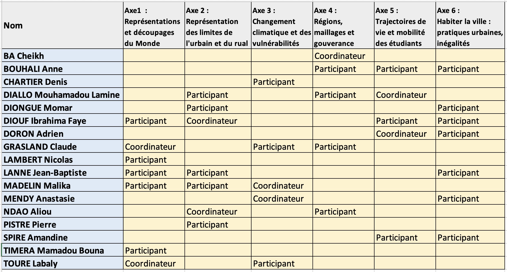

## Constitution des groupes (Janvier-Février 2026)

Le premier séjour des enseignants-chercheurs français à Dakar en janvier 2026 a permis de rencontrer les collègues sénégalais et de proposer six thèmes pouvant se prêter à des expériences pédagogiques dans le domaine des cartes mentales en France et au Sénégal.Ces thèmes ont été ensuite soumis à l'ensemble des participants afin que ceux-ci puissent se positionner sur ceux qui les intéressent le plus. On a demandé également à ceux qui le souhaitaient de se proposer comme coordinateurs. Voici le résultat de la première consultation effectuée en mars 2026

## Réalisation d'expériences pilotes (Mars-Juin 2026)

Il est ensuite revenu à chaque groupe de travail de se réunir pour échanger des idées d'expériences pilotes et les réaliser entre mars et juin 2026 dans le cadre de nos enseignements. Ces expériences devaient idéalement être conduites en parallèle sur des étudiants au Sénégal et en France afin d'en comparer les résultats. Même lorsque les expériences portaient sur les étudiants d'un seul pays, les résultats ont été analysés conjointement par les enseignants des deux pays.

Les résultats de certaines enquêtes réalisées auprès des étudiants ont été restituées à ces derniers sous la forme de billets de blog qu'ils ont pu consulter et qui ont fait alors l'objet de discussions en cours ou en TD :

- [Altermap : Axe 1 Représentations et découpages du Monde en France et au Sénégal](https://worldregio.github.io/altermap/posts/2026-06-19-axe1-test/)

- [Altermap : Axe 4 perception des maillages territoriaux au Sénégal](https://worldregio.github.io/altermap/posts/2026-06-16-axe4-test/)

## Séminaire de Paris (6-8 Juillet 2026)

Le premier séminaire du projet a réuni l'ensemble des groupes de travail sur le campus Condorcet à Paris du 6 au 8 juillet 2026. Il a permis de croiser les résultats des expériences obtenues et de définir des priorités et une stratégie pour l'année universitaire 2026-27 où le projet entrera dans sa phase principale. C'est en effet au cours de cette année universitaire que l'on réalisera des expériences à une échelle plus large, mobilisant les étudiants comme sujet mais aussi comme acteurs des études de cartes mentales. A l'issue de ce séminaire, chacun des axes de travail a mis à jour la page consacrée à ses objectifs 

Une synthèse du projet a par ailleurs été proposée le 9 juillet 2026 à l'occasion du colloque MESSH 2026 :

- ["Combiner méthodes qualitatives et quantitatives pour l’analyse de cartes mentales : retour d’expérience du projet pédagogique franco-sénégalais Altermap"](https://worldregio.github.io/altermap/posts/2026-07-14-messh26/)

