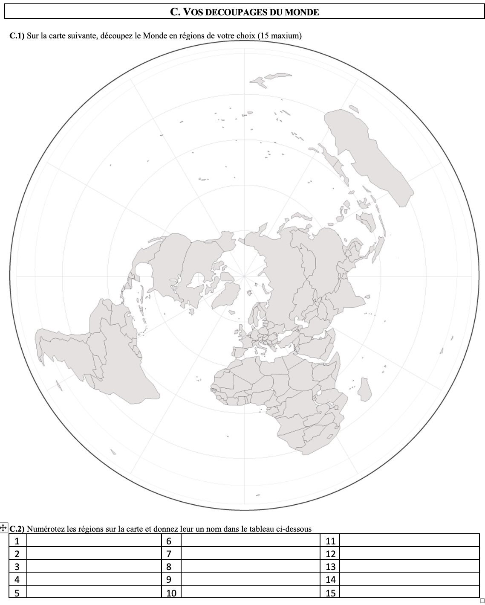
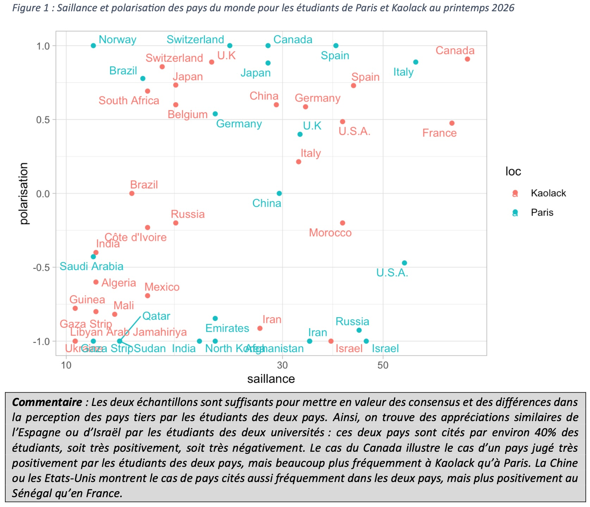

## Participants

- [Ibrahima Faye DIOUF](/equipe/diouf2.html)
- [**Claude GRASLAND (coord.)**](/equipe/grasland2.html)
- [Nicolas LAMBERT](/equipe/lambert2.html)
- [Jean-Baptiste LANNE](/equipe/lanne2.html)
- [Malika MADELIN](/equipe/madelin2.html)
- [Mamadou Bouna TIMERA](/equipe/timera.html)
- [**Labaly TOURE (coord.)**](/equipe/toure2.html)

## Objectifs

L'objectif de l'axe 1 du projet Altermap est de comprendre la façon dont les étudiants se représentent le Monde et son découpage en région, en combinant des approches cartographiques et sémantiques, qualitatives et quantitatives. Nous entendons par "*région du Monde*" le premier niveau de découpage en dessous du niveau global. Il s'agit en général d'ensemble regroupant plusieurs pays (ex. les continents) mais il peut aussi arriver qu'un très grand pays soit considéré à lui seul comme une région du Monde. 

## Expériences

Les expériences pédagogiques qui ont été menées dans le cadre de l'axe 1 ont été facilitées par l'expérience acquise dans le projet EuroBroadMap (2007-2012) dont nous nous sommes largement inspirés pour construire le questionnaire Altermap (Beaugitte & al., 2012 ; Didelon-Loiseau & Grasland, 2014). Le fait que ce questionnaire ait été précisément administré à Dakar et Paris en 2008 nous a poussés à reprendre certaines questions à l'identique pour examiner les évolutions temporelles des représentations (e.g. appréciation des Etats-Unis, de la Chine ou de la Russie). 

#### Données de cadrage

#### Vision du Monde

#### Découpage du Monde

Mais nous avons aussi décidé de supprimer certaines questions et d'en ajouter d'autres dans la partie questionnaire, et aussi de tester l'intérêt d'une approche plus qualitative sous la forme d'entretiens ou de captation du tracé des cartes mentales sous forme de film. 

## Résultats

On peut résumer brièvement quelques enseignements de la phase test, par ailleurs disponibles de façon plus détaillée dans le billet de blog [Altermap : Axe 1 Représentations et découpages du Monde en France et au Sénégal](https://worldregio.github.io/altermap/posts/2026-06-19-axe1-test/)

### Saillance et polarisation des pays du Monde 

Les réponses à la double question "citez cinq pays où vous aimeriez vivre et cinq pays où vous n'aimeriez pas vivre dans un futur proche" demeurent particulièrement éclairante pour comprendre les représentations du Monde des étudiants. La saillance, définie comme la part des étudiants qui citent un pays, positivement ou négativement peu importe, permet de repérer les zones d'attention et les "blancs" des cartes mentales. Un pays cité négativement demeure connu voire reconnu, tandis que les pays qui ne sont jamais cités sont placés en quelque sorte "hors du Monde". Quant à la polarisation, définie comme un indice variant entre -1 (tous les avis sont négatifs) et +1 (tous les avis sont positifs), elle permet de repérer des lieux qui font consensus à l'intérieur d'un groupe et ceux qui suscitent au contraire des clivages ou des débats.

### Liste de mots associés à l'Afrique, la Méditerranée et l'Europe

Alors que le projet EuroBroadMap se limitait à demander aux étudiants de 18 pays du Monde les cinq mots qu'ils associaient à "Europe", nous avons opté ici pour un dispositif en miroir en demandant aux étudiants français et sénégalais de définir cinq mots qu'ils associaient à "Europe", "Méditerranée" et "Afrique". Nous y reviendrons dans la partie de synthèse.

### Découpage du Monde en 2 à 15 régions

Cette activité, qui avait été au fondement du projet EuroBroadMap en 2008, est celle qui a suscité le plus de difficultés et a abouti à un échec partiel lors de son administration auprès des étudiants de Kaolack au Sénégal. Le choix d'une projection polaire semble avoir "désorienté" les étudiants, au propre comme au figuré, au point que seul un tiers des cartes de découpages produites à Kaolack ont pu être numérisées et que, parmi celles-ci, beaucoup comportent des incohérences involontaires dans les dénominations.

## A suivre

Au cours de l'année universitaire 2026-27, nous comptons reprendre le questionnaire sur un échantillon plus large d'étudiants des deux pays en corrigeant la formulation des questions qui ont posé le plus de problèmes. Nous demeurerons sur le niveau L3 pour la population cible des enquêtes mais nous associerons des étudiants de master ou de doctorat dans le traitement des résultats. Deux pistes de travail nouvelles seront lancées.

### Articuler les approches statistiques et géomatiques

Pour l'analyse des cartes de découpage du Monde, il est important d'associer des approches statistiques et géomatiques ce qui pourra être fait dans le cadre des cours de master. L'analyse statistique permettra par exemple de repérer les noms de régions du Monde les plus fréquentes tandis que l'approche géomatique permettra d'analyser leurs tracés. Ces analyses pourront être effectuées conjointement avec les logiciel libre R, Qgis et Observable. On trouvera une première esquisse de ces perspectives dans le billet de blog suivant :

- [Analyse d'un ensemble de cartes mentales à l'aide d'outils de géomatique et de cartographie ](https://worldregio.github.io/altermap/posts/2026-07-02-geomatic/)

### Articuler les approches qualitatives et quantitatives des découpages du Monde

Nous n'avons pas suffisamment hybridé les approches qualitatives et quantitatives ou, plus précisément, les approches par questionnaire et l’entretien semi-directif. Ce qui est dommage, notamment dans le cas du tracé de cartes mentales où l'on peut apprendre beaucoup de choses en filmant le tracé (ordre, minutage, hésitations, ...) et en écoutant les explications données par l'enquêté. Une première expérience a été menée auprès d’un étudiant auquel on a demandé de commenter son découpage tout en dessinant, ce qui a permis d’enregistrer les explications et de minuter le temps passé. On a alors pu reconstituer sous forme de bande dessinée les étapes du découpage ce qui a permis d’analyser des moments de certitude ou d’incertitude, des hésitations, des remords. Cette approche, qui rejoint des expériences menées dans le domaine de la cartographie sensible, nous semble particulièrement prometteuse.

## Références

- **Beauguitte, L., Didelon-Loiseau, C., & Grasland, C. (2012)**. Le projet EuroBroadMap: Visions de l'Europe dans le monde. *Politique européenne, 37(2)*, 156-167.
- **Didelon-Loiseau, C., & Grasland, C. (2014).** Internal and external perceptions of Europe/the EU in the world through mental maps. In **Communicating Europe in times of crisis: External perceptions of the European Union** (pp. 65-94). London: Palgrave Macmillan UK.
- **Montello, D. R., Friedman, A., & Phillips, D. W. (2014).** Vague cognitive regions in geography and geographic information science. *International Journal of Geographical Information Science*, 28(9), 1802–1820.

