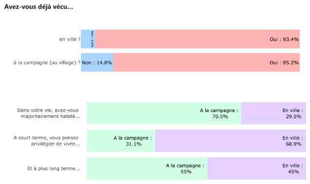
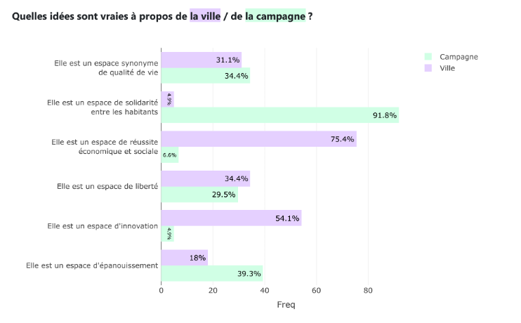

## Participants

- [**Mouhamad Lamine DIALLO (coord)**](/equipe/diallo2.html)
- [Moumar DIONGUE](/equipe/diongue.html)
- [**Ibrahima Faye DIOUF (coord.)**](/equipe/diouf2.html)
- [Jean-Baptiste LANNE](/equipe/lanne2.html)
- [Malika MADELIN](/equipe/madelin2.html)
- [**Aliou NDAO (coord.)**](/equipe/ndao2.html)
- [**Pierre PISTRE (coord.)**](/equipe/pistre2.html)

## Objectifs

L'axe 2 vise à analyser la manière dont les étudiants perçoivent les espaces urbains et ruraux, ainsi que leurs limites géographiques, dans une perspective comparative en France et au Sénégal. Plusieurs approches sont prévues pour étudier ces représentations étudiantes, sous la forme principale d’enquêtes par questionnaire, par des questions fermées ou ouvertes, de photographies de paysage ou encore de cartes mentales.

## Expériences & résultats

Un premier test de l’enquête par questionnaire a été mené en mai 2026, exclusivement au Sénégal au sein de l'Université Cheikh Anta Diop (UCAD) de Dakar et de l'Université Gaston Berger (UGB) de Saint-Louis ; ce premier test n’a pu être mené parallèlement à l’Université Paris Cité en raison de contraintes de calendrier. Plus précisément, il a été réalisé auprès d'un échantillon de 100 étudiants inscrits en licence de géographie, composé de 73,3 % d'étudiants de Licence 1 à l'UCAD et de 26,7 % d'étudiants de Licence 3 à l'UGB.

### Lieux de naissance, de résidence actuelle et de résidence des parents

Une première série de questions portée sur les lieux de naissance, de résidence actuelle et de résidence des parents, et elle semble mettre en évidence une multi-appartenance chez la majorité des étudiants. Elle révèle également des trajectoires de vie qui, pour la plupart, s’inscrivent à la fois en ville et à la campagne. Une prochaine étape envisagée consistera à cartographier ces trajectoires et espaces de vie pour mieux visualiser la diversité des parcours résidentiels des étudiants inscrits dans une même université. 
Les graphiques ci-dessous donnent à voir une première illustration de cette articulation urbain-rural dans les trajectoires de vie des étudiants. En effet, une très grande majorité des étudiants interrogés déclarent avoir vécu dans ces deux types d'espace, et une majorité déclare avoir vécu plus longtemps à la campagne. A court terme, ils envisagent en majorité de continuer de vivre en ville, mais à plus long terme ils sont plus de la moitié à envisager retourner ou aller vivre à la campagne ; cela suggère notamment que cette dernière est un lieu privilégié pour la retraite. 

 
### Représentations de la ville et de la campagne

Une deuxième série de questions portait sur les représentations associées à la ville et à la campagne. Pour la ville, les termes les plus cités renvoient à l'urbanité, au développement économique, aux transports ou aux opportunités d’emploi, d’études et de loisirs. Mais ils renvoient également à des problèmes plus spécifiques au milieu urbain comme la forte concentration démographique, les embouteillages, la pollution, l’insécurité, etc. Ces différents termes illustrent ainsi des perceptions contrastées de la ville, à la fois valorisantes, attractives, et plus négatives. 
Les représentations de la campagne, quant à elles, font référence à la nature, au calme, à l'agriculture, aux paysans, à la famille, à la liberté, à la solidarité, à l'élevage, à la faible densité de population, aux paysages, à l'entraide, à la paix et aux traditions. Ces vocabulaires traduisent une vision plus largement positive du milieu rural, associé à un cadre de vie apaisé, à des liens sociaux forts et à un patrimoine culturel préservé.
Le graphique ci-dessous montre par exemple, pour différentes idées, comment les étudiants les associent plus fortement à la ville et/ou à la campagne. Certaines idées, comme la qualité de vie ou la liberté, sont mentionnées dans les mêmes proportions pour les deux catégories d’espace. Par contre, les étudiants associent beaucoup plus la campagne à des valeurs de solidarité et d’épanouissement, alors que la ville est vue davantage comme un lieu d’innovation, de dynamisme économique et de réussite sociale. 

 
### Paysages de ville et de campagne (village)
Dans la perspective d’une autre partie du questionnaire qui interrogera les représentations des étudiants à partir de photographies de paysages urbains et ruraux, une question ouverte a été introduite dans la phase d’expérimentation. Elle a permis de recueillir différentes caractérisations élémentaires de ces paysages, en voici quelques exemples : 

1.	Pour le paysage de ville, on observe la continuité du bâti, la forte concentration de population, la présence des infrastructures (sanitaires, de transports)... pour le paysage de campagne : faible concentration de la population, habitat dispersé, activité dominante l’agriculture...

2.	Ce sont des paysages différents, on est plus en rapport avec la nature dans le paysage rural qu’en ville, on a une sorte de coexistence entre l’homme et la nature contrairement à la ville où le paysage naturel est détruit au profil de l’habitat.

3.	Paysages urbains : concentration du bâti et des activités dominantes composées essentiellement de secteurs tertiaires et quaternaires. Paysages ruraux : habitats dispersés ou groupés, les activités dominantes sont l’agriculture et l’élevage.

Dans un deuxième temps, lors de la phase principale, le fait de proposer aux étudiants de réfléchir à leurs représentations à partir d’un double corpus photographique (photographies de paysages urbains et ruraux au Sénégal et en France), permettra d’inverser la démarche : non plus partir de leurs mots, mais directement de leurs perceptions paysagères, pour entrevoir notamment s’il existe ou non une  concordance entre les idées qu’ils associent aux catégories de rural et d’urbain, et leurs perceptions sensibles. 

### Carte mentale des limites urbain-rural

Dans la phase principale d’enquête en 2026-2027, il est également prévu d’étudier la manière dont les étudiants se représentent les limites géographiques des espaces urbains et ruraux, à partir de cartes mentales des régions de Dakar et de Paris. 
Un premier test a été réalisé avec les étudiants de Licence 3 de l’UGB au printemps 2026 mais il n’a pas été très concluant, d’où la nécessité d’améliorer la démarche pour la phase principale. Ce premier test a été réalisé sur une partie de la périphérie de Dakar à partir d’extraits cartographiques produits avec [Sketch Map Tool](https://worldregio.github.io/altermap/posts/2026-02-24-sketchmap/). La consigne initiale était la suivante et laissait la possibilité d’une limite simple entre urbain et rural, ou de deux limites pour identifier également des « espaces d’entre-deux » : « *Si vous pensez qu’il n’existe pas vraiment d’espaces d’entre-deux, dessinez la limite entre ville et campagne ; si vous pensez qu’il existe des espaces d’entre-deux, dessinez la limite entre ville et entre-deux + entre entre-deux et campagne* ». 

Ce premier test a permis de mettre en évidence un certain nombre d’enjeux, discutés lors d’un atelier de l’équipe du projet, en juillet 2026 à Paris, notamment 
- la question de l’échelle de l’extrait cartographique présenté aux étudiants, et ainsi du niveau de détail sur la carte (morphologie et continuité du bâti, toponymie). 
- la question de la familiarité des étudiants avec l’espace cartographié (est-il intéressant de proposer aux étudiants des extraits d’un espace dont ils n’ont a priori aucune connaissance ? de proposer par exemple un extrait de la limite urbain-rural à la périphérie de Dakar pour des étudiants français ? et inversement, un extrait de la limite urbain-rural en Ile-de-France pour des étudiants sénégalais ? 
- la possibilité laissée aux étudiants de complexifier la représentation des limites entre rural et urbain (faire figurer des ilôts d’urbanisation, du mitage… au-delà de la limite nette ou du simple gradient). 
Ces éléments permettront de nourrir la mise en application de la phase principale.  

## A suivre
Après la phase expérimentale du printemps 2026, les enquêtes principales de l’axe 2 se dérouleront durant l’année universitaire 2026-2027. Les principaux résultats obtenus seront donc publiés à l’issue de cette année.

