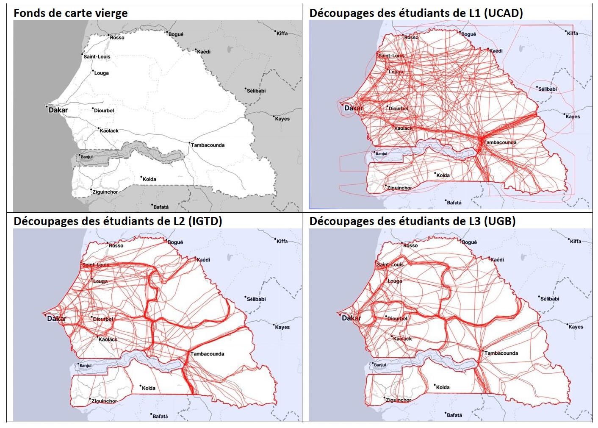
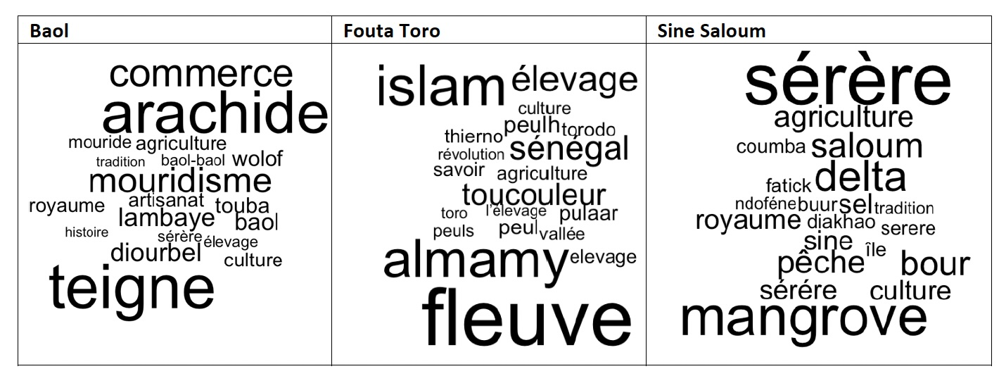
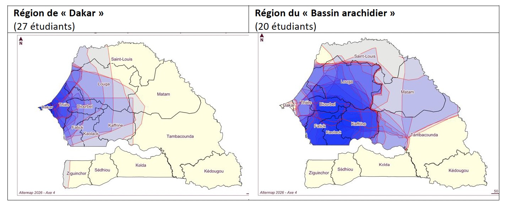
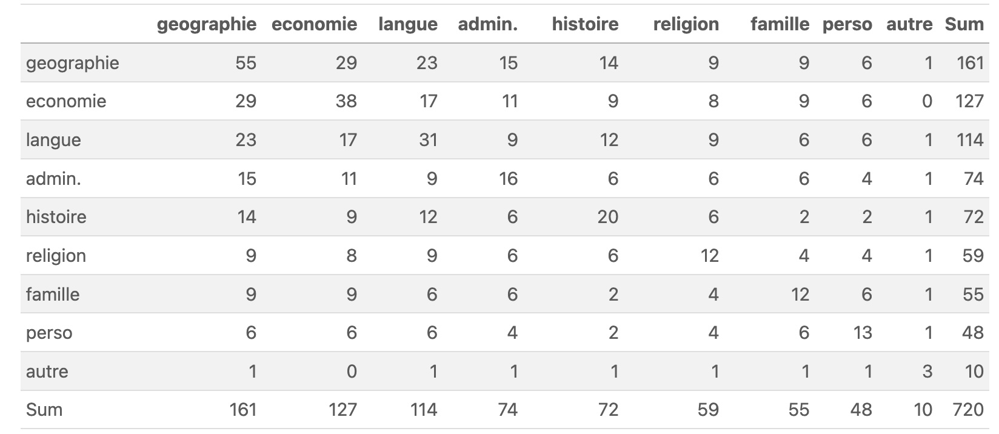
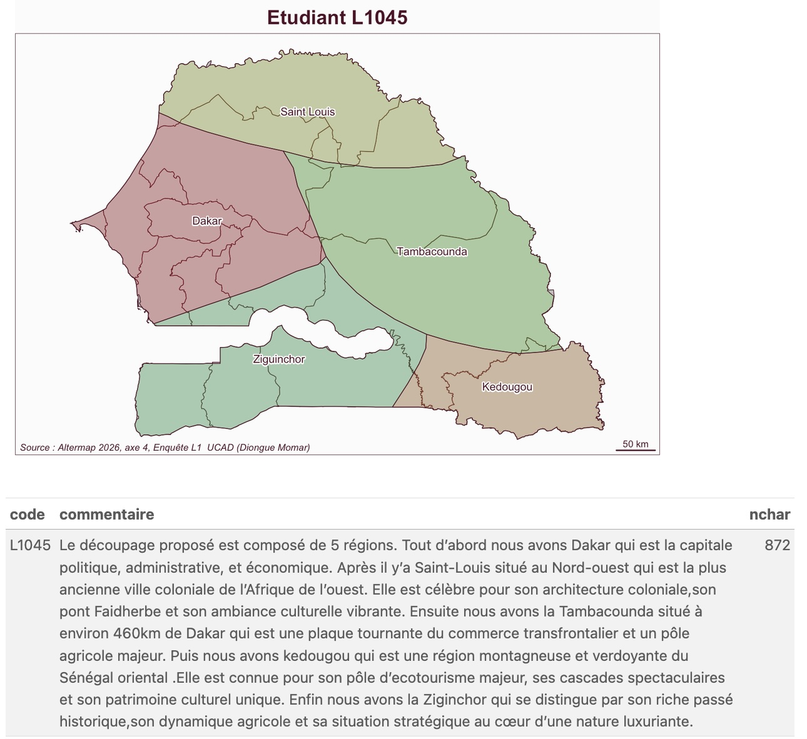
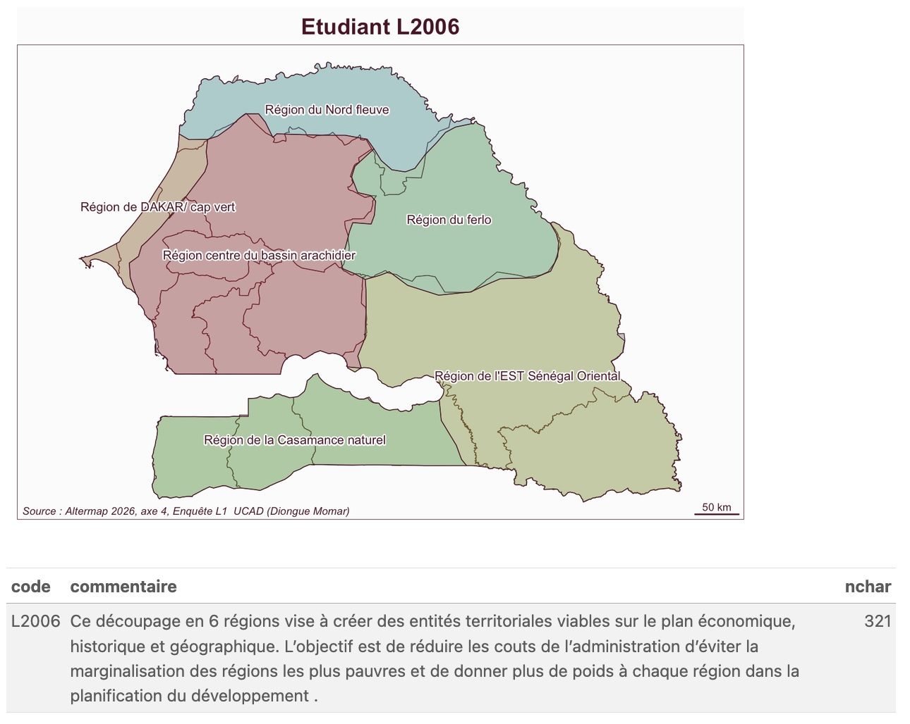
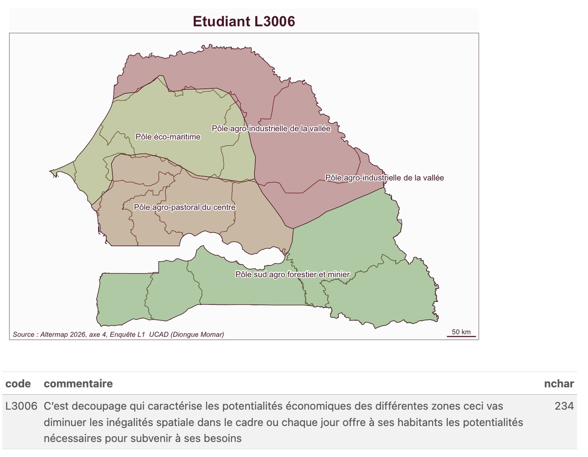

## Participants

- [**Cheik BA (coord.)**](/equipe/ba2.html)
- [** Anne BOUHALI (coord)**](/equipe/bouhali2.html)
- [Mouhamad Lamine DIALLO](/equipe/diallo2.html)
- [Moumar DIONGUE](/equipe/diongue.html)
- [Claude GRASLAND](/equipe/grasland2.html)
- [Aliou NDAO](/equipe/ndao2.html)

## Objectifs

Cet axe comporte de nombreuses analogies avec l’axe 1 puisqu’il a adopté la même structure (questionnaire + découpage d’un territoire sur carte papier) et vise le même objectif de compréhension des logiques de découpage et de dénomination des territoires.Mais il se situe à une échelle différente et soulève des enjeux plus directement liés aux questions politiques, de décentralisation (réformes territoriales) et de gouvernance territoriale. 

## Expériences

Au cours de la phase test, le questionnaire  n’a pas pu être administré auprès des étudiants français faute de temps mais aussi faute de trouver des formulations équivalentes aux questions posées au Sénégal. Il a pu bénéficier en revanche d’un échantillonnage sur trois sites (Université Cheikh Anta Diop (département de géographie/FLSH et Institut de Gouvernance territoriale et de Développement local/UCAD et le département de géographie de l’Université Gaston Berger), à trois niveaux d’étude différents (L1, L2, L3). 

On peut résumer brièvement ici quelques enseignements tiresde la phase test, par ailleurs disponibles de façon plus détaillée dans le billet de blog  [Altermap : Axe 4 perception des maillages territoriaux au Sénégal](https://worldregio.github.io/altermap/posts/2026-06-16-axe4-test/)

## Résultats

#### Découpage du Sénégal en région

A la différence de l’axe 1, tous les étudiants ont  réussi à proposer des découpages, mais avec une singularité très forte de l’un des groupes (L1) par rapport aux deux autres (L2 et L3) en matière de tracé. S’agit-il d’une « vraie » différence ou d’un biais introduit soit par la qualité des photocopies, soit par les consignes données par l’enquêteur en début de séance ? En tous les cas la phase test incite à réfléchir au choix du support cartographique fourni aux étudiants car celui-ci exerce à coup sûr une influence sur les résultats.

#### Technique des mots associés

La technique des mots associés a été mobilisée comme dans l'axe 1 pour compléter l'analyse des découpages régionaux effectués par les étudiants. Mais elle n'a pas été appliquée aux régions administratives actuelles mais plutôt à des territoires historiques présents dans la mémoire collective tels que les anciens royaumes de l’époque précoloniale. La plupart des étudiants ont été en mesure d’associer trois à cinq mots à chacune de ces régions historiques avec des récurrences de terme montrant un certain consensus autour de stéréotypes.

#### Regionalisation floue

On aurait pu craindre que ces questions historiques produisent un important effet de halo sur le découpage du pays que devaient effectuer les étudiants en 2 à 10 régions sur un document papier. Mais si cet effet a pu exister – on trouve 16 étudiants ayant tracé une région Baol, 20 une région Sine Saloum, etc. –, il existe aussi d’autres formes de dénomination qui ont été largement mobilisées dans les découpages comme la « région de Dakar » ou le « bassin arachidier ». Ces régions présentent manifestement des limites floues et variables d'un étudiant à l'autre

#### Analyse des justifications et critères de régionalisation

Les étudiants étaient amenés à préciser les critères utilisés pour découper le Sénégal en en cochant un ou plusieurs dans la liste proposée. les trois critères les plus utilisés par les étudiants sont la géographie (55), suivi de l’économie (38) et la langue (31). Viennent ensuite l’histoire (20), l’administration (16), le ressenti personnel (13), la famille (12) et la religion (12). Il faut toutefois prendre en compte la complexité des choix opérés et le croisement très fréquent de critères les uns avec les autres.

## A suivre

#### Hybridation des méthodes qualitatives et quantitatives

La phase test a montré la richesse des analyses quantitatives menées à l'aide de questionnaire. Mais elle en a également révélé certaines limites dès lors qu'elle imposait aux étudiants des questions fermées et comportait des effets de halo entre certaines d'entre elles (par exemple le fait que des questions sur les régions historiques et culturelles soient posées avant l'exercice de découpage du pays en région). La seule question ouverte qui concernait la justification du découpage proposé a suscité des réponses souvent très intéressantes des étudiants.

:::::::: columns
::: {.column width="33%"}

:::

::: {.column width="33%"}

:::

::: {.column width="33%"}

:::
::::::::

Ceci suggère l'intérêt de compléter les questionnaires par des entretiens semi-directifs ou des focus group.

#### Comparaison Sénégal-France

Il serait intéressant, pour une partie au moins des questions et des approches méthodologiques, de construire des exercices parallèles au Sénégal et en France. 
