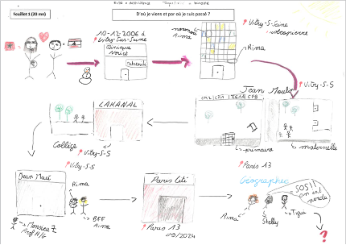
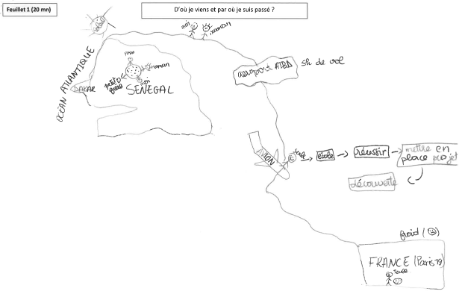

## Participants

- [Anne BOUHALI](/equipe/bouhali2.html)
- [**Mouhamad Lamine DIALLO (coord)**](/equipe/diallo2.html)
- [Momar DIONGUE](/equipe/diongue2.html)
- [Ibrahima Faye DIOUF](/equipe/diouf2.html)
- [**Adrien DORON (coord.)**](/equipe/doron2.html)
- [Jean-Baptiste LANNE](/equipe/lanne2.html)
- [Anastasie MENDY](/equipe/mendy.html)
- [Amandine SPIRE](/equipe/spire2.html)

## Objectifs

Comprendre comment une trajectoire d'étudiant s'inscrit dans des mobilités plus larges, à l'échelle d'une vie, et articule des éléments familiaux, personnels, migratoires et des relations sociales. Cet axe propose d'explorer ce que signifie être étudiant au regard de sa trajectoire de vie : la trajectoire sociale et spatiale, les lieux qui font sens, la matérialité des ancrages, les moments de transition, avec qui leurs parcours se construisent.
       
 
## Expériences
   
### Durant la phase test
      
Cet axe a associé un exercice de réalisation d’une carte mentale à un petit entretien mené en binôme par les étudiants eux-mêmes, dans le cadre d’un cours de formation aux méthodes d'enquête qualitative. 

- Après une introduction de la part de deux enseignants sur la carte mentale [^1], un premier étudiant était amené à répondre par une carte mentale à une question volontairement très large : « *d’où je viens et par où je suis passé ?* ». 
Une fois la carte mentale tracée sur papier libre, l’étudiant dessinateur était appelé à commenter par écrit son propre dessin en répondant à la consigne « *ce que j’ai voulu montrer sur la carte* ». 

- Dans un deuxième temps, il passait à son binôme la carte mentale. Le ou la collègue devait alors préparer un ensemble de questions appelées par la découverte de cette carte mentale « *pour comprendre d’où il/elle vient et par où il/elle est passé-e* ». 

- Un dernier temps de l’exercice consistait en un entretien ouvert durant lequel le second étudiant posait ses questions au premier étudiant, et en proposait une synthèse écrite sur un dernier feuillet en répondant à la question de synthèse suivante : « *à l’issue de l’expérience, qu’ai-je compris de la trajectoire de mon binôme ?* ». 
 

[^1]: Dans le cadre du [cours d’enquêtes qualitatives assuré par A. Doron et J.B. Lanne en Licence 2 géographie en 2025/2026](https://odf.u-paris.fr/fr/offre-de-formation/licence-XA/sciences-humaines-et-sociales-SHS/geographie-et-amenagement-K2VO0TXZ/licence-geographie-et-amenagement-parcours-geographie-amenagement-environnement-developpement-IGXS1T5H/fondamental-M3PR341L/methodes-et-outils-4-M3PVUJX2/initiation-aux-techniques-d-enquetes-qualitatives-M3PW2II8.html).
   

## Résultats

Exemples de cartes mentales répondant différemment à la question « d’où je viens et par où je suis passé ».

- **Deux exemples de cartes mentales représentant les trajectoires de vie de deux étudiant-es depuis la naissance pour l’un, depuis le pays d’origine pour l’autre (Sénégal) en L2.**

:::::::: columns
::: {.column width="45%"}

:::

::: {.column width="5%"}
:::

::: {.column width="45%"}

:::
::::::::

- **Deux exemples de cartes mentales représentant les mobilités du domicile à l’Université Paris Cité de deux étudiant-es de L2**

:::::::: columns
::: {.column width="45%"}

:::

::: {.column width="5%"}
:::

::: {.column width="45%"}

:::
::::::::

Ces quatre exemples de cartes mentales montrent deux façons différentes de comprendre la question préliminaire, et donc d’interpréter la notion de trajectoire.
Pour les deux premiers cas, c’est la trajectoire biographique qui a été choisie, avec des modes de représentation variés, entre petites vignettes figuratives centrées sur un espace très local, et construction d’une cartographie articulant une expérience migratoire entre le Sénégal et la France. Cette approche a été choisie par 14 étudiants. Elle a conduit, de manière inductive à une cristallisation de l’axe 5 du projet autour de la notion de trajectoire et sur la prise en compte d’un espace-temps élargi. Une autre partie des cartes mentales (14 sur le total des 32 cartes dessinées) a fait le choix de représenter la mobilité quotidienne et le déplacement domicile-université. Les figurés sont également très différents sur les deux exemples proposés ici : d’un côté l’accent a été mis sur la succession de paysages, du rural vers l’hyper-centre parisien, de l’autre, une cartographie qui reprend finalement la sémiologie des transports en commun franciliens empruntés quotidiennement. Cette approche vient nourrir l’axe 6 du projet centré sur l’espace-temps du quotidien.
 
Une proportion importante de ces 32 cartes mentales dessinées au total cartographie également des palettes d’émotions contradictoire – tristesse du départ du domicile/ de la région / du pays d’origine, familiarité et intimité du domicile familial, stress des transports en commun – et des sensations – découverte du froid à l’arrivée en France métropolitaine, fatigue du voyage/déplacement quotidien etc.

## A suivre
   
Un questionnaire est actuellement en construction pour explorer ces deux aspects de la notion de trajectoire et sera administré dans les deux pays, à associer à un exercice de carte mentale. Ce questionnaire vise à construire les données communes des trajectoires étudiantes aux axes 5 et 6.

