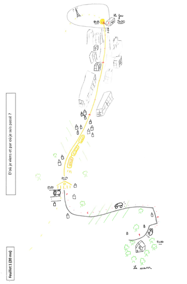
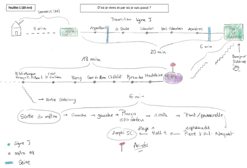

## Participants

- [Anne BOUHALI](/equipe/bouhali2.html)
- [Mouhamad Lamine DIALLO](/equipe/diallo2.html)
- [**Moumar DIONGUE (coord.)**](/equipe/diongue.html)
- [Ibrahima Faye DIOUF](/equipe/diouf2.html)
- [Adrien DORON](/equipe/doron2.html)
- [**Jean-Baptiste LANNE (coord.)**](/equipe/lanne2.html)
- [Anastasie MENDY](/equipe/mendy.html)
- [**Amandine SPIRE (coord.)**](/equipe/spire2.html)

## Objectifs

Cet axe propose d’explorer la manière dont les étudiant.es habitent et se représentent la ville. Qu’est-ce qu’être étudiant en ville ? Quelles sont les conditions citadines étudiantes, le logement, les mobilités quotidiennes, les pratiques sociales et spatiale ? 
Cette question croise les conditions et les lieux des études mais également tous les espaces pratiqués du quotidien : logement, loisirs, travail, sociabilités d’études. On questionnera l’articulation de ces lieux et temps, les contraintes associées et les pratiques. 

## Expériences

Cet axe 6 découle de l’expérience développée dans l’axe 5 : l’association à un exercice de réalisation d’une carte mentale à un petit entretien mené en binôme par les étudiants eux-mêmes, dans le cadre d’un cours de formation aux méthodes de l’enquête qualitative. 

- Après une introduction de la part de deux enseignants sur la carte mentale [^1], un premier étudiant était amené à répondre par une carte mentale à une question volontairement très large : « *d’où je viens et par où je suis passé ?* ». 
Une fois la carte mentale tracée sur papier libre, l’étudiant dessinateur était appelé à commenter par écrit son propre dessin en répondant à la consigne « *ce que j’ai voulu montrer sur la carte* ». 

- Dans un deuxième temps, il passait à son binôme la carte mentale. Le ou la collègue devait alors préparer un ensemble de questions appelées par la découverte de cette carte mentale « *pour comprendre d’où il/elle vient et par où il/elle est passé-e* ». 

- Un dernier temps de l’exercice consistait en un entretien ouvert durant lequel le second étudiant posait ses questions au premier étudiant, et en proposait une synthèse écrite sur un dernier feuillet en répondant à la question de synthèse suivante : « *à l’issue de l’expérience, qu’ai-je compris de la trajectoire de mon binôme ?* ». 
  
 

[^1]: Dans le cadre du [cours d’enquêtes qualitatives assuré par A. Doron et J.B. Lanne en Licence 2 géographie en 2025/2026](https://odf.u-paris.fr/fr/offre-de-formation/licence-XA/sciences-humaines-et-sociales-SHS/geographie-et-amenagement-K2VO0TXZ/licence-geographie-et-amenagement-parcours-geographie-amenagement-environnement-developpement-IGXS1T5H/fondamental-M3PR341L/methodes-et-outils-4-M3PVUJX2/initiation-aux-techniques-d-enquetes-qualitatives-M3PW2II8.html).

## Résultats

Exemples de cartes mentales répondant différemment à la question « d’où je viens et par où je suis passé ».

- **Deux exemples de cartes mentales représentant les mobilités du domicile à l’Université Paris Cité de deux étudiant-es de L2**

:::::::: columns
::: {.column width="45%"}

:::

::: {.column width="5%"}
:::

::: {.column width="45%"}

:::
::::::::

  
Ces exemples représentent le choix d’un partie importante des étudiant.es  (14 sur le total des 32 cartes dessinées) de représenter la mobilité quotidienne et le déplacement domicile-université. Les figurés sur les deux exemples proposés ici mettent l’accent sur la succession de paysages, du rural vers l’hyper-centre parisien d’un côté et, de l’autre, une cartographie qui reprend finalement la sémiologie des transports en commun franciliens empruntés quotidiennement. 

Cette approche vient nourrir l’axe 6 du projet qui décline la notion de trajectoire dans l’espace-temps du quotidien. Mais au-delà d’une entrée par les mobilités quotidienne, il s’agit de déployer les pratiques et représentation de la ville habitée et vécue par les étudient.es : espaces et temps des études, du logement, des mobilités, des loisirs, des sociabilités. Ces espace-temps vécus sont aussi porteurs de ressources, de contraintes et d’émotions.
 
## A suivre
   
Un questionnaire est actuellement en construction pour explorer ces deux aspects de la notion de trajectoire et sera administré dans les deux pays, à associer à un exercice de carte mentale. Ce questionnaire vise à construire les données communes des trajectoires étudiantes aux axes 5 et 6.
   
