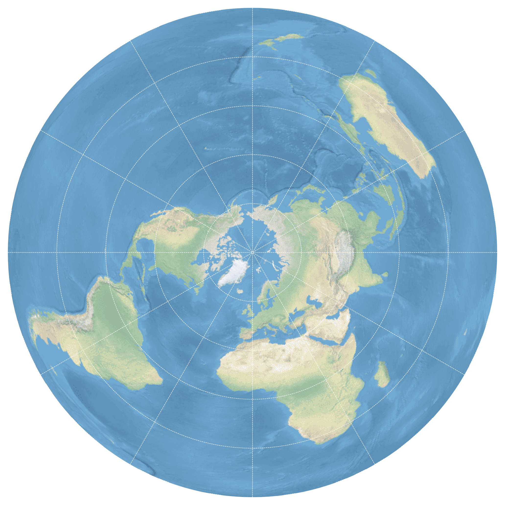
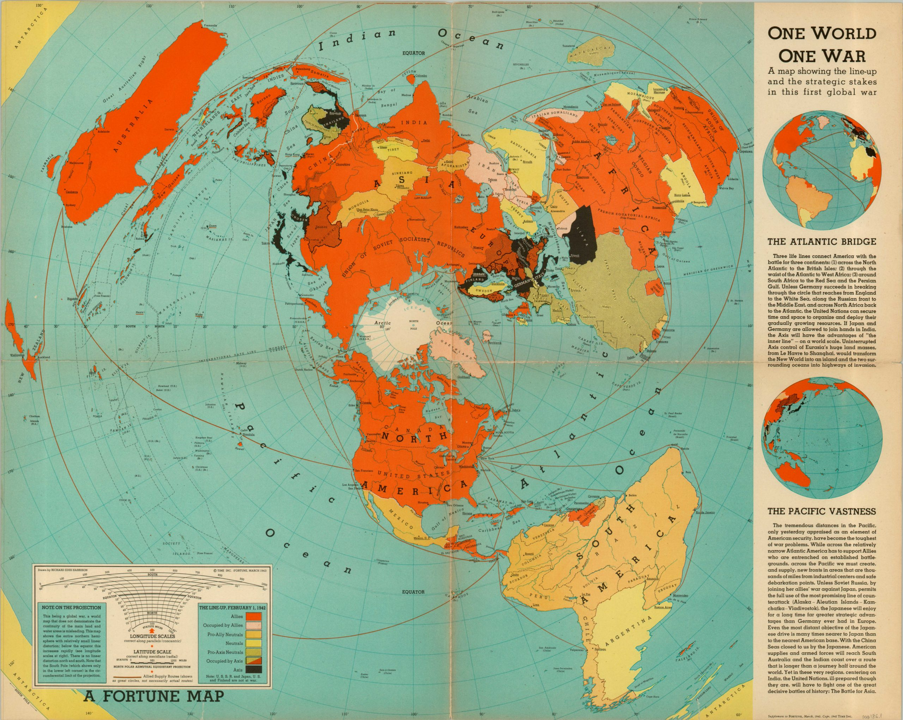

La projection polaire est une projection azimutale centrée sur le pôle Nord, dans laquelle la surface de la Terre est projetée sur un plan tangent au pôle. Dans sa version équivalente, elle conserve les surfaces, ce qui permet de comparer correctement les étendues des continents et des océans. En revanche, cette propriété se fait au prix de fortes déformations des formes et des angles à mesure que l’on s’éloigne du centre. Ainsi, des territoires comme l’Australie peuvent apparaître très déformés. Avec cette projection à la forme circulaire, la carte peut être tournée sans forcément privilégier une orientation particulière. Ainsi, cette projection cartographique ne définit ni haut ni bas, mais propose une organisation de l’espace centrée sur le pôle, ce qui rompt avec les représentations plus familières du monde.

{}

**Quelques éléments historiques**

Dans le contexte des années 1940, marqué par ce que le géographe français  Emmanuel de Martonne qualifie d’« ère de la géographie aérienne », les modes de représentation du monde connaissent un profond renouvellement, en lien avec le développement de l’aviation et une vision plus globale des conflits. La projection polaire apparait alors comme un outil particulièrement pertinent. Un exemple emblématique est la carte « One World, One War », réalisée en 1942 par Richard E. Harrison et publiée dans le magazine Fortune [@harrison1942oneworld]. En adoptant cette projection particulière, sa carte met en évidence la dimension véritablement mondiale de la Seconde Guerre mondiale, en montrant la proximité relative des continents et la continuité des théâtres d’opérations. Elle rompt ainsi avec les représentations classiques héritées des projections cylindriques, en soulignant qu’il s’agit d’un conflit global, se déroulant à l’échelle de l’ensemble de la planète.

{}

Une fois la guerre finie, cette manière de représenter le monde dans sa globalité infuse progressivement dans les milieux diplomatiques. Lors de la création de l’Organisation des Nations unies en 1945, la question d’un emblème universel se pose rapidement. Une première proposition est alors élaborée par l’équipe de graphistes dirigée par Oliver Lincoln Lundquist, au sein des services américains liés à l’ancêtre de la Central Intelligence Agency. Le choix se porte sur une carte du monde en projection polaire, entourée de rameaux d’olivier symbolisant la paix. Le but : donner l’image d’un monde uni et équitable. Et en plus, la forme ronde de cette projection rentre parfaitement des les badges prévus pour l’occasion [@capdepuy2018histoires].

Dans cette première version, les États-Unis occupent une position sur l’axe Nord-Sud, légèrement en dessous du centre de la carte. Les pays de l’hémisphère Sud sont, quant à eux, placés dans la partie supérieure (à l’exception de l’Amérique du Sud), séparés de ceux du Nord par une ligne horizontale centrale, tandis que la représentation s’interrompt au-delà de 40° de latitude Sud. En 1946, une version révisée corrige en partie ces déséquilibres en étendant la carte vers le Sud et en modifiant son orientation. 

![Le Logo des Nations Unies [@bahoken2025cartographia]](onu.png){}

Adopté officiellement en 1947 par l’Assemblée générale, cet emblème devient le drapeau d’une organisation qui se veut universelle : une carte du monde entourée de rameaux d’olivier sur fond bleu, symbole d’un idéal de paix partagé à l’échelle planétaire.


