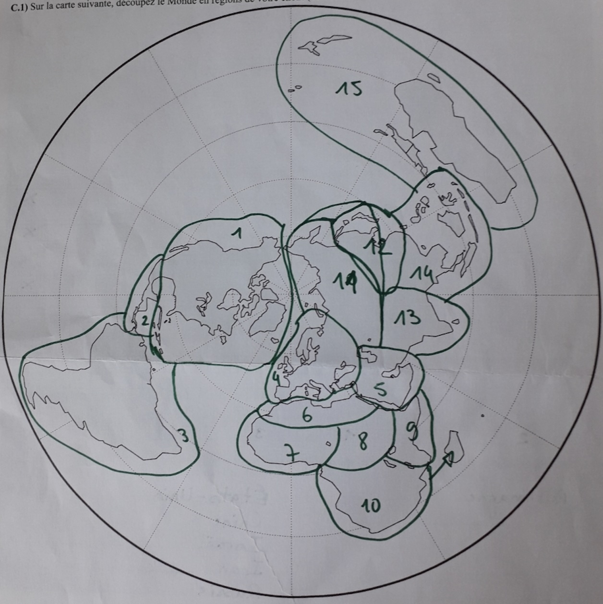
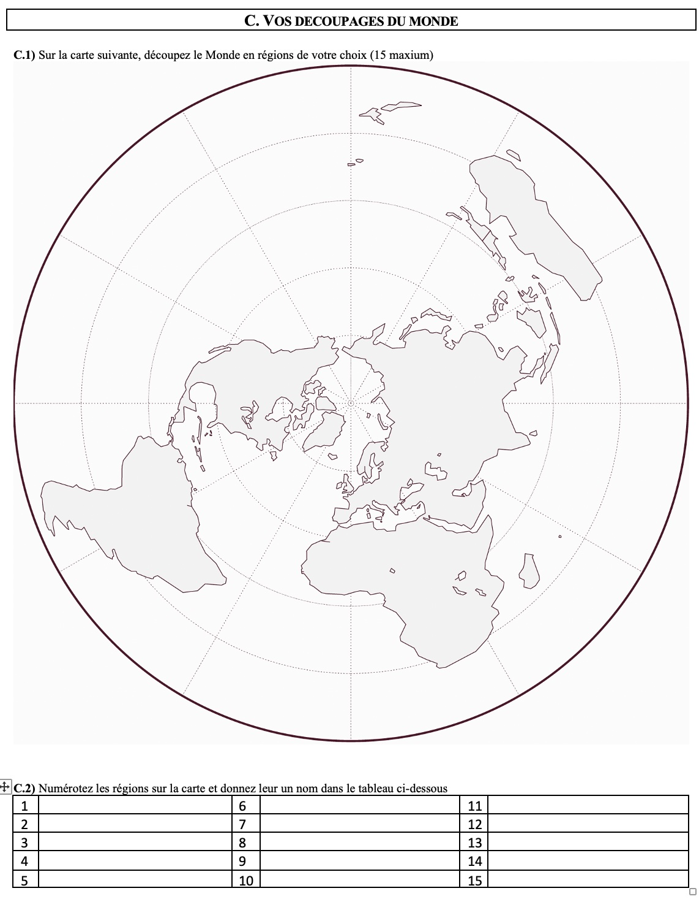

- **L'objectif de ce billet est de présenter une petite expérience de découpage commentée d'une carte mentale. Nous pensions initialement réaliser une video du découpage mais suite à une erreur de manipulation nous n'avons pu conserver que la bande son. Celle-ci permet de retracer les étapes suivies par la personne enquêtée (ordre du découpage) ainsi que les hésitations et les choix qui sont effectués.**

- **Nous avons interrogé ici un étudiant de master 1 de géographie qui a d'abord répondu au questionnaire habituel sur les découpages du Monde, puis qui a procédé au découpage du Monde en environ neuf minutes. Nous reprenons ci-dessous les commentaires qu'il a effectué en ajoutant le minutage à partir du début de l'opération. Et nous montrons visuellement les étapes de construction du découpage qui ont abouties à la carte finale que voici**


<div style="text-align: center;">
{width=400}
</div>


## (0) Départ

- **0:00** *Enquêteur : on vous demande de découper le Monde en 2 à 15 régions*
- **0:20** Vous voulez faire un peu du Harvey . ..
- **0:30** *Enquêteur :  Non, c’est comment vous vous découperiez le Monde si on vous demandait de la faire. Découper en 2 à 15 régions, mettre des numéros et des noms aussi …*

{height=400}

## (1) Les trois Amériques

- **1:41** : D’accord Je mettrai … comme ça … Amérique du Nord 
- **1.54** : Je pense que je découperai quand même … je mettrai Amérique Centrale  …
- **2:10** : … Amérique du Sud

```{r, echo=F, warning=F, message=F}
library(sf, quietly=T,verbose = F,warn.conflicts = F)
library(mapsf, quietly=T,verbose = F, warn.conflicts = F)
library(dplyr, quietly=T,verbose = F, warn.conflicts = F)
frame<- st_read("../../data/axe1/worldmaps/WORLD30.shp", quiet=T)
states<- st_read("../../data/axe1/worldmaps/WORLD_WUTS5.shp",quiet=T)
map<- st_read("../../data/axe1/maps/XXX-062.geojson",quiet=T)
map <- map %>% group_by(id) %>% summarise()
map$id<-substr(map$id+1000,3,4)
map$names <- c("Amérique du Nord", "Amérique Centrale","Amérique du Sud",
                  "Europe","Moyen Orient", "Afrique du Nord","Afrique de l'Ouest",
                  "Afrique centrale","Afrique de l'Est","Afrique du Sud",
                  "Asie du Nord", "Asie de l'Est","Asie centrale",
                  "Asie du Sud","Océanie")
map$rnknames <- paste(map$id, map$names)
sel<- map[1:3,]

mf_init(frame, expandBB = c(0,0,0,-0.4))
mf_map(frame, type="base",col="gray95",lty=3, add=T)
mf_map(states, type="base",col="gray80", add=T)
mf_map(sel, type="typo", 
       var="rnknames",
       add=T, 
       alpha=0.3,
       leg_pos = "topleft",
       leg_title_cex = 1.3,
       leg_val_cex = 1,
       leg_title = "Régions")
mf_layout(title = paste("Etape 1"),
          credits = "Source : Enquête Altermap 2026", 
          frame=T,
          scale = F, 
          arrow=F)
```


## (2) Comment est-ce qu'on découpe l'Europe ?

- **2:20** : Ensuite … Ah, c’est compliqué … on va … Ah, c’est compliqué
- **2:33** : Non mais quand même, comment est-ce qu’on découpe l’Europe par exemple ? C’est dur … Hum …
- **3:00** : On va rester sur une définition classique ….Je vais mettre l’Europe … jusqu’au Caucase …. Euh …

```{r, echo=F, comment=F,warning=F}
sel<- map[1:4,]

mf_init(frame, expandBB = c(0,0,0,-0.4))
mf_map(frame, type="base",col="gray95",lty=3, add=T)
mf_map(states, type="base",col="gray80", add=T)
mf_map(sel, type="typo", 
       var="rnknames",
       add=T, 
       alpha=0.3,
       leg_pos = "topleft",
       leg_title_cex = 1.3,
       leg_val_cex = 1,
       leg_title = "Régions")
mf_layout(title = paste("Etape 2"),
          credits = "Source : Enquête Altermap 2026", 
          frame=T,
          scale = F, 
          arrow=F)
```


## (3) Moyen-Orient, Proche-Orient et Afrique du Nord ?

- **3:30** : Quand même j’incluerai le Moyen-Orient  mais je n'inclus pas l’Egypte. … J’aurais aussi pu faire … Proche-orient ….
- **3:45** : Euh … Je ferai l’Afrique du Nord  sans l’appeler Maghreb car je pense que l’Egypte c’est pas le Maghreb …

```{r, echo=F, comment=F,warning=F}
sel<- map[1:6,]

mf_init(frame, expandBB = c(0,0,0,-0.4))
mf_map(frame, type="base",col="gray95",lty=3, add=T)
mf_map(states, type="base",col="gray80", add=T)
mf_map(sel, type="typo", 
       var="rnknames",
       add=T, 
       alpha=0.3,
       leg_pos = "topleft",
       leg_title_cex = 1.3,
       leg_val_cex = 1,
       leg_title = "Régions")
mf_layout(title = paste("Etape 3"),
          credits = "Source : Enquête Altermap 2026", 
          frame=T,
          scale = F, 
          arrow=F)
```

## (4) L'Afrique subsaharienne en quatre région culturelles
- **4:00** Là c’est compliqué … c’est un peu compliqué … Là je pense que déjà on va faire ça … Tac ! … Afrique de l’Ouest.
- **4:21** : Là c’est plus compliqué parce que pour moi je découperai … je mettrai … mais je ne sais pas forcément les  … nommer.
- **4:48** : Moi je trouve que l’Afrique de l’Est, l’Afrique centrale  et l’Afrique du Sud ont des cultures vraiment différentes, donc je les découperai aussi… Alors les découpages d’un point de vue géographique ne sont pas les plus précis… par rapport aux pays, principalement (*le fonds de carte ne comportait pas les limites de pays*)
- **5:25** Et Afrique du Sud, pas dans le sens du pays, bien sûr… OK … J’ai oublié d’inclure Madagascar…. Je pense que ça va quand même plus avec le Sud (*ajoute une flèche*)

```{r, echo=F, comment=F,warning=F}
sel<- map[1:10,]

mf_init(frame, expandBB = c(0,0,0,-0.4))
mf_map(frame, type="base",col="gray95",lty=3, add=T)
mf_map(states, type="base",col="gray80", add=T)
mf_map(sel, type="typo", 
       var="rnknames",
       add=T, 
       alpha=0.3,
       leg_pos = "topleft",
       leg_title_cex = 1.3,
       leg_val_cex = 1,
       leg_title = "Régions")
mf_layout(title = paste("Etape 4"),
          credits = "Source : Enquête Altermap 2026", 
          frame=T,
          scale = F, 
          arrow=F)
```

## (5) L'Asie lointaine et compliquée
- **5:43** : Euh … Je pense que je ferai … quelque chose comme ça (*trace une région incluant Russie, Chine Japon, Corée*) … Comment est-ce qu’on appelle ça ? … Euh  … Asie du Nord  … Asie Centrale
- **6:34** : Ah ! Houla non, … Houla … Plutôt comme ça (*redécoupe l’Asie du Nord pour séparer la Russie de Chine, Japon et Corée)* … et ici je mettrai …. Attendez … Asie de l’Est. Je pense quand même comme ça. (*ajoute l’Asie du Sud*)
- **8:04** : Non … C’est pas pour diviser … mais les cultures sont tellement différentes … on ne peut pas toutes les mettre dans le même panier…

```{r, echo=F, comment=F,warning=F}
sel<- map[1:14,]

mf_init(frame, expandBB = c(0,0,0,-0.4))
mf_map(frame, type="base",col="gray95",lty=3, add=T)
mf_map(states, type="base",col="gray80", add=T)
mf_map(sel, type="typo", 
       var="rnknames",
       add=T, 
       alpha=0.3,
       leg_pos = "topleft",
       leg_title_cex = 1.3,
       leg_val_cex = 1,
       leg_title = "Régions")
mf_layout(title = paste("Etape 5"),
          credits = "Source : Enquête Altermap 2026", 
          frame=T,
          scale = F, 
          arrow=F)
```

## (6) L'Océanie pour finir
- **8:24** : Et j’ajoute l’Océanie que je ne connais pas très bien 
- **9:00** : (*terminé*)

```{r, echo=F, comment=F,warning=F}
sel<- map

mf_init(frame, expandBB = c(0,0,0,-0.4))
mf_map(frame, type="base",col="gray95",lty=3, add=T)
mf_map(states, type="base",col="gray80", add=T)
mf_map(sel, type="typo", 
       var="rnknames",
       add=T, 
       alpha=0.3,
       leg_pos = "topleft",
       leg_title_cex = 1.3,
       leg_val_cex = 1,
       leg_title = "Régions")
mf_layout(title = paste("Etape 6"),
          credits = "Source : Enquête Altermap 2026", 
          frame=T,
          scale = F, 
          arrow=F)
```


