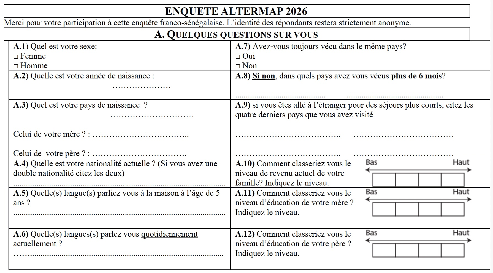
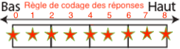
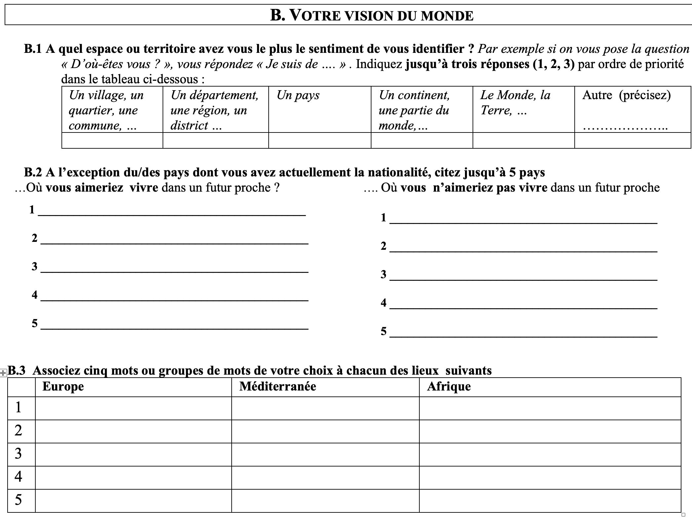
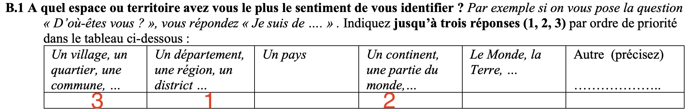
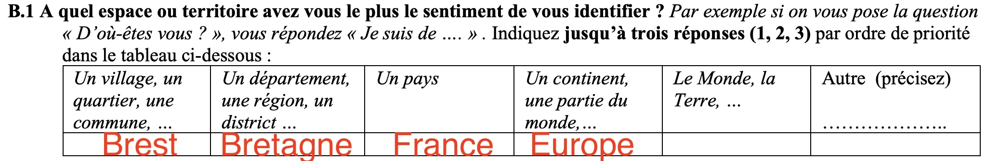

- **L'objectif de ce billet est de présenter les premiers résultats de la phase test du questionnaire sur les représentatons et découpages du Monde.**


```{r, echo=FALSE, warning=FALSE}
library(knitr, warn.conflicts = F, quietly =T, verbose=F)
library(dplyr, warn.conflicts = F, quietly=T, verbose=F)
library(tidyr, warn.conflicts = F, quietly=T, verbose=F)
library(ggplot2, warn.conflicts = F, quietly=T, verbose=F)
library(ggrepel, warn.conflicts = F, quietly=T, verbose=F)
library(labelled, warn.conflicts = F, quietly=T, verbose=F)
library(readxl, warn.conflicts = F, quietly=T, verbose=F)
library(questionr, warn.conflicts = F, quietly=T, verbose=F)
library(sf, warn.conflicts = F, quietly=T, verbose=F)
library(mapsf, warn.conflicts = F, quietly=T, verbose=F)
library(readxl, warn.conflicts = F, quietly=T, verbose=F)
library(quanteda, warn.conflicts = F, quietly=T, verbose=F)
library(wordcloud, warn.conflicts = F, quietly=T, verbose=F)
library(quanteda.textplots, warn.conflicts = F, quietly=T, verbose=F)
library(quanteda.textstats, warn.conflicts = F, quietly=T, verbose=F)
library(RColorBrewer, warn.conflicts = F, quietly=T, verbose=F)
library(beanplot, warn.conflicts = F, quietly=T, verbose=F)
library(stringr, warn.conflicts = F, quietly=T, verbose=F)
library(FactoMineR, warn.conflicts = F, quietly=T, verbose=F)
library(explor, warn.conflicts = F, quietly=T, verbose=F)

```


## Introduction 


# A. CADRAGE

La première partie du questionnaire apportait des données de cadrage sur les individus (âge, sexe), sur la perception du niveau de revenu de la famille et les études des parents, ainsi que l'expérience international de la mobilité.


{width=800}


::: {.callout-tip}
## Télécharger les données issues de la phase test :

-  [Données d'enquête issus de kobo au format.xlsx ](https://github.com/worldregio/altermap/raw/refs/heads/main/data/Axe1_final/data/survey.xlsx)
-  [Découpages du Monde des étudiants au format .geojson  ](https://github.com/worldregio/altermap/raw/refs/heads/main/data/Axe1_final/data/map_reg.geojson)
:::


On commence par charger les questionnaires issus de Kobo Toolbox en format "label" (texte complet) ou en format "codes" (codes) pour constituer notre tableau de données. Selon le cas on utilisera l'un ou l'autre tableau pour nos analyses. On va ensuite construire à partir de ces deux fichiers notre tableau de donnée de référence

```{r}
don<- read_xlsx("../../data/Axe1_final/data/survey.xlsx",na = "NA")
don_fra<-don %>% filter(lieu=="UPC - Paris - France")
don_sen<-don %>% filter(lieu=="USSEIN - Kaolack - Sénégal")

mysource <- "Touré L., Grasland C., 2026, Altermap Axe 1 : Représentations du Monde"

```


On se propose dans cette première analyse d'étudier les réponses des étudiants de licence SIG de l'Université de USSEIN à Kaolack (Sénégal)


## Sexe

```{r}
par(mfrow=c(1,1))
tab<-table(don$lieu,don$sexe)
kable(addmargins(tab), caption = "Effectifs par sexe")
kable(lprop(tab,valid = F, total = T), digits=1)
par(mar = c(3,3,3,3))
mosaicplot(tab,col = c("lightyellow","lightgreen"),main = "Comparaison des effectifs par sexe", sub = mysource ,las = 1)
chisq.test(tab)

```

- **Commentaire** : Les deux échantillons sont globalement paritaires avec une proportion un peu plus forte d'homme à Kaolack (57%) qu'à Paris (51%).

## Âge

```{r}

don$age3 <-cut(don$age, breaks=c(20,21,25,30), include.lowest = T)
levels(don$age3)<-c("20-21 ans","22-25 ans", "26-28 ans")
tab<-table(don$lieu,don$age3)
kable(addmargins(tab), caption = "Effectifs par âge")
kable(lprop(tab,valid = F, total = T), digits=1)
par(mar = c(3,3,3,3))
mosaicplot(tab,col = c("lightyellow","orange","red"),main = "Comparaison des effectifs par âge", sub = mysource ,las = 1)
chisq.test(tab)
```

- **Commentaire** : Bien que situés au même niveau d'étude (licence 3 de géographie ou de SIG), les étudiants sénégalais sont en moyenne nettement plus âgés que les étudiants français.Ceci s'explique par une entrée plus tardive dans les études universitaires et un plus fort taux de redoublement au cours de la licence. 


## Niveau social

### Niveau économique familial

L'autoévaluation du niveau économique a été faite sur une échelle graphique comportant quatre cases. Mais les étudiants ont souvent coché des cases situées sur les lignes séparant les cases, ce qui aboutissait à 9 réponses possibles



On a choisi de se ramener à 5 classes en regroupant les niveaux 1-2, 3-4, 5, 6-7 et 8-9.

```{r}
don$rich <- as.factor(don$revenu)
don$rich <- case_when(don$rich==0 ~ "1. très bas",
                      don$rich==1 ~ "1. très bas",
                      don$rich==2 ~ "2. bas",
                      don$rich==3 ~ "2. bas",
                      don$rich==4 ~ "3. moyen",
                      don$rich==5 ~ "4. haut",
                      don$rich==6 ~ "4. haut",  
                      .default = "5. très haut"                   
                      )
tab<-table(don$lieu,don$rich)
kable(addmargins(tab), caption = "Perception du niveau de richesse familial")
kable(lprop(tab), digits=1)
mypal=rainbow(12)
mosaicplot(tab,col =mypal,main = "Perception du niveau de richesse familial", sub = mysource ,las = 1)
chisq.test(tab,simulate.p.value = T)

```

- **Commentaire** : S'agissant d'une auto-évaluation, on ignore si les étudiants ont pris comme référentiel la situation dans leur propre pays ou au nveau international. Il apparaît en tous les cas que les étudiants de Kaolack se sont attribués des niveaux économiques dans l'ensemble plus faibles que les étudians de l'Université Paris Cité. Ils ont également davantage utilisé le niveau "moyen" que les étudiants français.


### Niveau d'éducation des parents

On analyse ensuite la façon dont les étudiants évaluent le niveau d'éducation de leurs parents : 

```{r}
don$edu_mere <- as.factor(don$etu_mere)
don$edu_mere <- case_when(don$edu_mere==0 ~ "1. très bas",
                      don$edu_mere==1 ~ "1. très bas",
                      don$edu_mere==2 ~ "2. bas",
                      don$edu_mere==3 ~ "2. bas",
                      don$edu_mere==4 ~ "3. moyen",
                      don$edu_mere==5 ~ "4. haut",
                      don$edu_mere==6 ~ "4. haut",  
                      .default = "5. très haut"                   
                      )
tab<-table(don$lieu,don$edu_mere)
kable(addmargins(tab), caption = "Perception du niveau d'éducation de la mère")
kable(lprop(tab), digits=1)
mypal=rainbow(12)
mosaicplot(tab,col =mypal,main = "Perception du niveau d'éducation de la mère", sub = mysource,las = 1)
chisq.test(tab,simulate.p.value = T)
```

```{r}
don$edu_pere <- as.factor(don$etu_pere)
don$edu_pere <- case_when(don$edu_pere==0 ~ "1. très bas",
                      don$edu_pere==1 ~ "1. très bas",
                      don$edu_pere==2 ~ "2. bas",
                      don$edu_pere==3 ~ "2. bas",
                      don$edu_pere==4 ~ "3. moyen",
                      don$edu_pere==5 ~ "4. haut",
                      don$edu_pere==6 ~ "4. haut",  
                      .default = "5. très haut"                   
                      )

tab<-table(don$lieu,don$edu_pere)
kable(addmargins(tab), caption = "Perception du niveau d'éducation du père")
kable(lprop(tab), digits=1)
mypal=rainbow(12)
mosaicplot(tab,col =mypal,main = "Perception du niveau d'éducation du père", sub = mysource,las = 1)
chisq.test(tab,simulate.p.value = T)
```

- **Commentaire** : Une différence intéressante apparaît dans les évaluations respectives des pères et des mères des étudiants. Dans le cas des étudiants de Paris Cité, le niveau d'éducation de la mère et du père est jugé sensiblement égal voire légèrement plus élevé pour les mères. Au contraire, dans le cas des étudiants de Kaolack, le niveau d'éducation des pères est jugé beaucoup plus élevé que celui des mères par les étudiants. Ce résultat est intéressant mais difficile à interpréter car on ignore s'il relève d'appréciations objectives ou subjectives. 


## Mobilités 

L'expérience du Monde des étudiants par les mobilités internationales est intéressante à évaluer car elle conditionne certainement leur vision du Monde. Elle a pu être évaluée par deux questions, l'une portant sur les pays où ils ont séjourné plus de mois (migrations) et l'autre sur les six derniers pays qu'ils ont visité même si ce n'est que pour quelques jours à l'occasion de vacances ou voyages d'étude (mobilités). 

### Séjours de plus de 6 mois 


```{r}
don$mig<-as.factor(don$mig_nb>0)
levels(don$mig) <- c("Non","Oui")

tab<-table(don$lieu, don$mig)

kable(addmargins(tab), caption = "Expérience internationale")
kable(lprop(tab,valid = F, total = T), digits=1)
par(mar = c(3,3,3,3))
mosaicplot(tab,col = c("lightblue","lightyellow"),main = "Expérience internationale de plus de 6 mois", sub = mysource ,las = 1)
chisq.test(tab)
```

- **Commentaire**: Dans les deux échantillons, Très peu d'étudiants interrogés ont vécu à l'étranger plus de 6 mois mais cette proportion est tout de même plus élevée pour les étudiants français (23%) que pour les étudiants sénégalais (5%).

### Mobilités de courte durée

On examine le nombre de pays visités quels que soit la durée du séjour, le maximum de réponse étant limité à 4.

```{r}

tab<-table(don$lieu, don$mob_nb)
kable(addmargins(tab), caption = "Derniers pays visités (maximum 4)")
kable(lprop(tab,valid = F, total = T), digits=1)
par(mar = c(3,3,3,3))
mypal=rainbow(12)
mosaicplot(tab,col = mypal,main = "Derniers pays visités (maximum 4)", sub = mysource ,las = 1)
chisq.test(tab,simulate.p.value = T)
```

- **Commentaire** : Il y a une différence fondamentale entre les deux échantillons en ce qui concerne les mobilités de courte durée. 72 % des étudiants parisiens ont été en mesure de citer quatre pays qu'ils ont visité. A l'inverse, 91% des étudiants sénégalais n'en ont cité aucun. Si cette opposition s'explique largement par le facteur économique, elle n'en suscite pas moins l'interrogation par rapport au fait que les étudiants sénégalais semblent beaucoup plus déclarés un sentiment d'appartenance aux échelles supranational que les étudiants français comme nous l'avons vu précédemment. 


```{r}
par(mfrow=c(1,2))

## USSEIN

x <- c(don_sen$mob1, don_sen$mob2,don_sen$mob3,don_sen$mob4)
tab <-table(x)
sta <- data.frame(iso3=names(tab), nbvis = as.numeric(tab)) %>% arrange(-nbvis)

map<-readRDS("../../data/ebm/geom/ebm_states.RDS")
map <- left_join(map, sta)
map$OK <-as.factor(is.na(map$nbvis)==F)
levels(map$OK) <- c("Oui","Non")
mf_map(map, type="typo", var="OK", pal=c("gray95","lightyellow"), leg_pos = NA)
mf_map(map, type="prop", var="nbvis",col="red", inches=0.1, 
       val_max = 24,
       leg_pos = "topleft",
       leg_title = "nb. réponses")
mf_graticule(map,add = T, lty=2, lwd=0.5)
mf_layout("Etudiants L3-SIG , Kaolack", frame=T, arrow=F, scale = F, credits=mysource)

## UPC

x <- c(don_fra$mob1, don_fra$mob2,don_fra$mob3,don_fra$mob4)
tab <-table(x)
sta <- data.frame(iso3=names(tab), nbvis = as.numeric(tab)) %>% arrange(-nbvis)

map<-readRDS("../../data/ebm/geom/ebm_states.RDS")
map <- left_join(map, sta)
map$OK <-as.factor(is.na(map$nbvis)==F)
levels(map$OK) <- c("Oui","Non")
mf_map(map, type="typo", var="OK", pal=c("gray95","lightyellow"), leg_pos = NA)

mf_map(map, type="prop", var="nbvis",col="red", inches=0.1, 
       val_max=24,
       leg_pos = "topleft",
       leg_title = "nb. réponses")
mf_graticule(map,add = T, lty=2, lwd=0.5)
mf_layout("Etudiants L3 Géographie, Paris", frame=T, arrow=F, scale = F, credits=mysource)


```


- **Commentaire** : L'effet de proximité est très présent dans les deux échantillons, la plupart des mobilités de courte durée se concentrant sur les pays voisins dans les deux cas. Mais on trouve dans le cas parisien un nombre élevé d'étudiants ayant voyagé dans des pays plus éloignés tels que les USA, le Japon ou la Thaïlande. Et également des pays ayant séjourné dans les pays d'Afrique, sans doute parce qu'ils en sont originaires et font leurs études à Paris Cité.


# B. ECHELLES

La seconde partie du questionnaire visait à analyser certains éléments de la vision du Monde des étudiants en utilisant trois entrées différentes : les échelles d'appartenance, les pays attractifs et répulsifs, les mots associés à certains espaces. 

{width=800}


La questions sur les échelles d'appartenance n'a sans doute pas été formulée de façon satisfaisante car beaucoup d'étudiants ont répondu d'une façon différente de celle qui avait été anticipée par les enquêteurs.

On attendait en effet des étudiants qu'ils choisissent parmi les niveaux proposés les trois échelle territoriale auxquelles ils s'identifient le plus en les ordonnant. Soit une réponse du type suivant  :  

{width=800}

Mais certains étudiant  ont compris la question différemment et ont plutôt indiqué les lieux correspondant à leurs échelles d'appartenance territoriale, sans les hiérarchiser, aboutissant à des réponses du type suivant : 


{width=800}

Il est donc clair que la question doit être construite différemment dans les enquêtes futures et relève peut-être d'ailleurs plus d'un entretiens qualitatif où l'on poserait la question *"D'où êtes-vous ?"* sans préjuger du résultat mais en relançant la personne interrogée pour détecter l'existence de niveaux multiples. Il n'est d'ailleurs pas certain que l'idée d'ordonner les échelles soit pertinente. La réponse à la question peut en effet varier selon le contexte où elle est posée. Un sénégalais interrogé sur ses orignes dans un pays très éloigné pourra répondre qu'il vient du Sénégal ou d'Afrique. Le même individu interrogé par un habitant de son pays répondra plutôt qu'il vient de Casmance ou de Saint-Louis ... 

Peut-on néanmoins tirer quelques enseignements des réponses obtenues ?


## Echelle principale


Si on se limite aux  étudiants qui ont fourni un classement des échelles, on peut construire un tableau donnant l'échelle principale d'appartenance i.e. celle qui a été classée en première place :


```{r}

# réordonne les modalités
x <- don$ech_principale
x<-case_when(x=="... Un continent, une partie du Monde" ~ "4. Supranational",
             x== "Monde" ~ "5. Mondial",
             x== "... Un département, une région"~ "2. Infranational",
             x== "... Un pays" ~ "3. National",
            x==  "... Une ville, un quartier, un village" ~ "1. Local",
            x=="Autre"~ "5. Autre",
            .default = NA ) 
don$lev<-x


tab<-table(don$lieu, don$lev)
kable(addmargins(tab), caption = "Echelle principale d'appartenance")
kable(lprop(tab,valid = F, total = T), digits=1)
par(mar = c(3,3,3,3), mfrow=c(1,1))
mypal=rainbow(12)
mosaicplot(tab,col = mypal,main = "Echelle principale d'appartenance", sub = mysource ,las = 1)
chisq.test(tab,simulate.p.value = T)

```

- **Commentaire** : Le premier niveau d'appartenance déclaré par les étudiants de Kaolack est le niveau local (76%) , suivi du niveau infranational (12%) et du niveau national (8%). Pour les étudiants parisiens , les niveaux locaux et infranationaux sont à peu près à égalité (36 et 38%) tandis que le niveau national demeure élevé et bien plus fort qu'au Sénégal (23%). Les niveaux continentaux (Afrique, Europe) , ne sont pour ainsi dire jamais mentionnés en premier choix et le niveau mondial est totalement absent. La différence de choix entre les deux échantillons est très significative (p < 0.001).


## Ensemble des échelles

Les conclusions sont-elles les mêmes si l'on considère non plus le premier choix mais l'ensemble des niveaux déclarés par les étudiants ?

```{r}

col<-don[,c("lieu","ech1_local","ech2_regional","ech3_national", "ech4_continental", "ech5_mondial")] %>% pivot_longer(cols= 2:6)

tab <-col %>% group_by(lieu, echelle=name) %>% summarise(n=sum(value, na.rm=T)) %>% pivot_wider(names_from = lieu, values_from = n) %>% as.data.frame()


par(mfrow=c(1,2),mar=c(5,5,3,1))
x<-100*tab$`UPC - Paris - France`/61
names(x)<-c("1.Local","2. Infranational","3.National","4. Continental","5. Mondial")
barplot(x,horiz = T,
        las=1,
        col=rainbow(13),cex.names = 0.6,
        xlab="% étudiants",
        main="UPC - Paris - France",
        sub = mysource,
        cex.sub=0.6)

 x<-100*tab$`USSEIN - Kaolack - Sénégal`/86
names(x)<-c("1.Local","2. Infranational","3.National","4. Continental","5. Mondial")
barplot(x,
        horiz=T,
        las=1,
        col=rainbow(13),cex.names = 0.6,
        xlab="% étudiants ",
        main="USSEIN - Kaolack - Sénégal",
        sub = mysource,
        cex.sub=0.6)
```


- **Commentaire** : Les deux profils sont désormais beaucoup plus ressemblants. Dans les deux échantillons, plus de 80% des étudiants ont mentionné le niveau local, infrnational ou national dans leurs réponses. Mais on observe une propension nettement plus élevé des étudiants de Kaolack à déclarer des appartenance au niveau supranational par rapport aux étudiants parisiens. 


## Ouverture au monde

On rassemble les étudiants qui ont déclaré un niveau continental ou mondial dans leur réponses afin d'examiner s'il existe une différence entre les deux échantillons.


```{r}
don$glob<- don$ech4_continental==1| don$ech5_mondial==1
don$glob<-as.factor(don$glob)
levels(don$glob) <- c("Non","Oui")

tab<-table(don$lieu, don$glob)

kable(addmargins(tab), caption = "Appartenance mondiale ou continentale")
kable(lprop(tab,valid = F, total = T), digits=1)
par(mar = c(3,3,3,3))
mosaicplot(tab,col = c("lightblue","lightyellow"),main = "Appartenance mondiale ou continentale", sub = mysource ,las = 1)
chisq.test(tab)
```


- **Commentaire** : les étudiants sénégalais sont significativement (p < 0.05) plus nombreux que les étudiants français a déclarer un sentiment d'appartenance à un niveau supranational (Afrique de l'Ouest, Afrique, Monde) que les étudiants français (Europe de l'Ouest, Europe, Monde). Cela montre que si l'attachement au local se retrouve dans les deux échantillons, les étudiants sénégalais semblent avoir davantage tendance que les étudiants français à déclare des appartenances à des échelles dépassant les frontières de leur pays.

# C. POLARISATION

Une manière efficace de mettre à jour les représentations du Monde des étudiants a consisté à leur demander les pays où ils souhaiteraient vivre ou ne pas vivre dans un futur proche. Cela suppose une petite préparation des données pour créer un tableau ou chaque ligne correspond à une réponse sur les pays attractifs ou répulsifs. En d'autres termes les réponses de chaque étudiant correspondront à 10 lignes, 5 pour les pays cités positivement et 5 pour les pays cités négativement.On accompagnera ces réponses des informations que l'on juge utile sur les étudiants afin de pouvoir ensuite faire des regroupements. 

A titre d'exemple, voici la forme que prendront les réponses d'une personnes enquêtée dont on a conservé comme variables explicaives le sexe, l'âge,le niveau de richesse et les pays visités : 

```{r}
donpos <- don %>% pivot_longer(cols = 42:46) %>% select(code,lieu, sexe, age, name, value)
donneg <- don %>% pivot_longer(cols = 47:51) %>% select(code,lieu, sexe, age, name, value)
donpol <-rbind(donpos, donneg) %>% mutate(opi=substr(name,1,3),
                                          rnk = substr(name,4,4),
                                          iso3 = value) %>%
                              select(code,lieu,sexe, age, opi, rnk, iso3) %>%
                              arrange(code, opi, rnk)


codgeo <- map %>% st_drop_geometry() %>% select(iso3,nom=name) %>% filter(nom !="West Bank") 
codgeo$nom[codgeo$iso3=="GBR"] <- "U.K"
codgeo$nom[codgeo$iso3=="USA"] <- "U.S.A."
codgeo$nom[codgeo$iso3=="RUS"] <- "Russia"
codgeo$nom[codgeo$iso3=="ARE"] <- "Emirates"
codgeo$nom[codgeo$iso3=="PRK"] <- "North Korea"
codgeo$nom[codgeo$iso3=="LIB"] <- "Libya"
codgeo$nom[codgeo$iso3=="IRN"] <- "Iran"
donpol <- donpol %>% left_join(codgeo)

exemple <- donpol %>% filter(code=="074")

kable(exemple)
```

-**Commentaire :** L'étudiant de Kaolack  074 est un homme de 25 ans. Il ne souhaiterait pas vivre en France, Italie, Mali, Gambie ou Australie. Il aimerait bien vivre en Chine, au Canada, en Afrique du Sud, au Japon ou en Corée du Nord. 


### Pays attractifs

Si on ne tient pas compte du rang des pays cités positivement, on peut établir un tableau de fréquence indiquant le nombre de fois ou un pays a été cité positivement par l'un des étudiants de chacun de nos deux échantillon. On calcule ensuite pour chaque échantillon le pourcentage des étudiants qui ont cité le pays en question ce qui facilite la comparaison puisque les deux échantillons sont de tailles différentes.


```{r}
#table(donpol$lieu)
## USSEIN
nbetud<-dim(don_sen)[1]
top1 <- donpol %>% filter(opi=="att", lieu=="USSEIN - Kaolack - Sénégal",is.na(iso3)==F) %>% 
  group_by(iso3, nom) %>%
  count() %>%
  ungroup() %>% 
  mutate ( nb=n, rnk = rank(-n), sal=100*n/nbetud) %>%
  select(rnk, iso3, nom,nb, sal) %>%
  arrange(rnk)

## UPC
nbetud<-dim(don_fra)[1]
top2 <- donpol %>% filter(opi=="att", lieu=="UPC - Paris - France",is.na(iso3)==F) %>% 
  group_by(iso3, nom) %>%
  count() %>%
  ungroup() %>% 
  mutate ( nb=n, rnk = rank(-n), sal=100*n/nbetud) %>%
  select(rnk, iso3, nom,nb, sal) %>%
  arrange(rnk)


top <-cbind(top1[1:20,-2], top2[1:20,-c(1,2)])
kable(top, digits=c(0,0,0,1,0,0,1),
      col.names = c("rang", "Kaolack","nb. réponses","%","Paris","nb. réponses","%"))

```


```{r}
par(mfrow=c(1,2))
## USSEIN
map2 <- left_join(map,top1)
map2$OK <-as.factor(is.na(map2$sal)==F)
levels(map2$OK) <- c("Oui","Non")
mf_map(map2, type="typo", var="OK", pal=c("gray95","lightyellow"), leg_pos = NA)
mf_map(map2, type="prop", var="sal",col="blue", inches=0.1, val_max = 72,
       leg_pos = "topleft",
       leg_title = "% étudiants")
mf_graticule(map,add = T, lty=2, lwd=0.5)
mf_layout("Etudiants L3 SIG, Kaolack", frame=T, arrow=F, scale = F, credits=mysource)

## UPC
map2 <- left_join(map,top2)
map2$OK <-as.factor(is.na(map2$sal)==F)
levels(map2$OK) <- c("Oui","Non")
mf_map(map2, type="typo", var="OK", pal=c("gray95","lightyellow"), leg_pos = NA)
mf_map(map2, type="prop", var="sal",col="blue", inches=0.1, val_max=72, 
       leg_pos = "topleft",
       leg_title = "% étudiants")
mf_graticule(map,add = T, lty=2, lwd=0.5)
mf_layout("Etudiants L3 Géographie, Paris", frame=T, arrow=F, scale = F, credits=mysource)


```

- **Commentaire** : 


### Pays répulsifs


```{r}
#table(donpol$lieu)
## USSEIN
nbetud<-dim(don_sen)[1]
top1 <- donpol %>% filter(opi=="rep", lieu=="USSEIN - Kaolack - Sénégal",is.na(iso3)==F) %>% 
  group_by(iso3, nom) %>%
  count() %>%
  ungroup() %>% 
  mutate ( nb=n, rnk = rank(-n), sal=100*n/nbetud) %>%
  select(rnk, iso3, nom,nb, sal) %>%
  arrange(rnk)

## UPC
nbetud<-dim(don_fra)[1]
top2 <- donpol %>% filter(opi=="rep", lieu=="UPC - Paris - France",is.na(iso3)==F) %>% 
  group_by(iso3, nom) %>%
  count() %>%
  ungroup() %>% 
  mutate ( nb=n, rnk = rank(-n), sal=100*n/nbetud) %>%
  select(rnk, iso3, nom,nb, sal) %>%
  arrange(rnk)


top <-cbind(top1[1:20,-2], top2[1:20,-c(1,2)])
kable(top, digits=c(0,0,0,1,0,0,1),
      col.names = c("rang", "Kaolack","nb. réponses","%","Paris","nb. réponses","%"))

```


```{r}
par(mfrow=c(1,2))
## USSEIN
map2 <- left_join(map,top1)
map2$OK <-as.factor(is.na(map2$sal)==F)
levels(map2$OK) <- c("Oui","Non")
mf_map(map2, type="typo", var="OK", pal=c("gray95","lightyellow"), leg_pos = NA)
mf_map(map2, type="prop", var="sal",col="red", inches=0.1, val_max = 72,
       leg_pos = "topleft",
       leg_title = "% étudiants")
mf_graticule(map,add = T, lty=2, lwd=0.5)
mf_layout("Etudiants L3 SIG, Kaolack", frame=T, arrow=F, scale = F, credits=mysource)

## UPC
map2 <- left_join(map,top2)
map2$OK <-as.factor(is.na(map2$sal)==F)
levels(map2$OK) <- c("Oui","Non")
mf_map(map2, type="typo", var="OK", pal=c("gray95","lightyellow"), leg_pos = NA)
mf_map(map2, type="prop", var="sal",col="red", inches=0.1, val_max=72, 
       leg_pos = "topleft",
       leg_title = "% étudiants")
mf_graticule(map,add = T, lty=2, lwd=0.5)
mf_layout("Etudiants L3 Géographie, Paris", frame=T, arrow=F, scale = F, credits=mysource)


```

- **Commentaire** : 


### Synthèse

Ce que montrent bien les analyses précédentes est le fait que l'appréciation que les étudiants donnent d'un pays doit être envisagé selon deux dimensions complémentaires, la saillance et l'opinion

- **la saillance** (en anglais *salience*) est le fait qu'un pays se présente à l'esprit dun étudiant lorsqu'on lui demande de porter un jugement. Peu importe  que le jugement soit positif ou négatif, si un pays est cité par l'étudiant c'est qu'il possède des informations sur lui, qu'il en a reçu et à choisi de les retenir. Bref, la saillance manifeste une reconnaissance de l'exsitence d'un pays et signale sa présence dans la carte mentale de la personne. On la définira donc comme le % des étudiants qui ont cité un pays positivement ou négativement et on la mesurera sur une échelle de 0 à 100

$Saillance_i = 100\times \frac{Pos_i + Neg_i}{n}$

- **la polarisation** est le positionnement d'un individu et par la suite d'un groupe d'individu sur une échelle de jugement allant du négatif au positif. Elle ne peut exister que si le pays est déjà connu par l'individu et - dans le cas d'un groupe - possède une saillance suffisante. On mesure classiquement la polarisation sur un intervalle allant de -1 (tous les avis sont positifs) à +1 (tous les avis sont négatifs).

$Polarisation_i = \frac{Pos_i-Neg_i}{Pos_i+Neg_i}$


On ne retient que les pays ayant été cités par au moins 10% des étudiants à l'interieur de chaque échantillon.

```{r}
## USSEIN
nbetud<-dim(don_sen)[1]
synt1 <- donpol %>% filter(is.na(iso3)==F,lieu=="USSEIN - Kaolack - Sénégal") %>%
                     group_by(iso3,nom,opi) %>% 
                      count() %>%
                      pivot_wider(names_from = opi,
                                  values_from = n,
                                  values_fill = 0) %>%
                       mutate(tot=att+rep,
                              saillance = 100*tot/nbetud,
                              polarisation=(att-rep)/(att+rep)) %>%
                      arrange(-saillance) %>%
                      filter(saillance>=10) %>% 
                     mutate(loc="Kaolack")

## UPC
nbetud<-dim(don_fra)[1]
synt2 <- donpol %>% filter(is.na(iso3)==F,lieu=="UPC - Paris - France") %>%
                     group_by(iso3,nom,opi) %>% 
                      count() %>%
                      pivot_wider(names_from = opi,
                                  values_from = n,
                                  values_fill = 0) %>%
                       mutate(tot=att+rep,
                              saillance = 100*tot/nbetud,
                              polarisation=(att-rep)/(att+rep)) %>%
                      arrange(-saillance) %>%
                      filter(saillance>=10) %>% 
                      mutate(loc="Paris")

synt<-rbind(synt1,synt2)

```


```{r}
ggplot(synt, aes(x=saillance, y = polarisation,col=loc)) + 
        geom_point() + 
        geom_text_repel(aes(label = nom),cex=3.5)+
        scale_x_log10()+
        ggtitle(label = "Saillance et polarisation des étudiants de Kaolack et Paris  en 2026" ,
                subtitle = mysource) +
         theme_light()
       
```

- **Commentaire** : 


### Cartogramme

On déforme la surface des régions pour leur donner une superficie proportionnelle à leur saillance, c'est-à-dire au nombre de fois où ils ont été cités. Puis on les colorie en fonction de la valeur de l'indice de polarisation , de rouge foncé pour les régions les plus répulsives à bleu foncé pour les plus attractives, en passant par jaune clair pour les régions neutres qui ont autant d'avis positis que négatifs.

```{r, eval=F}

#### PREPARE LES DONNEES POOUR L'ANAMORPHOSE ####

map <- st_read("../../data/Axe1_final/numerisateur/world_209.geojson") %>%
  select(iso3=ISO3,NAMEen, NAMEfr, geometry) %>% filter(iso3 !="ATA")


nbetud<-dim(don_sen)[1]
synt1 <- donpol %>% filter(is.na(iso3)==F,lieu=="USSEIN - Kaolack - Sénégal") %>%
                     group_by(iso3,nom,opi) %>% 
                      count() %>%
                      pivot_wider(names_from = opi,
                                  values_from = n,
                                  values_fill = 0) %>%
                       mutate(tot=att+rep,
                              saillance = 100*tot/nbetud,
                              polarisation=(att-rep)/(att+rep)) %>%
                      select(iso3, saillance_sen=saillance, polarisation_sen=polarisation)
map <- left_join(map,synt1)


nbetud<-dim(don_fra)[1]
synt2 <- donpol %>% filter(is.na(iso3)==F,lieu=="UPC - Paris - France") %>%
                     group_by(iso3,nom,opi) %>% 
                      count() %>%
                      pivot_wider(names_from = opi,
                                  values_from = n,
                                  values_fill = 0) %>%
                       mutate(tot=att+rep,
                              saillance = 100*tot/nbetud,
                              polarisation=(att-rep)/(att+rep)) %>%
                      select(iso3, saillance_fra=saillance, polarisation_fra=polarisation)
map <- left_join(map,synt2)

st_write(map,"polarisation.geojson",delete_dsn = T)
```


```{r, eval=F}

## Création du cartogramme de kaolack (prend plusieurs minutes)

map<-st_read("polarisation.geojson") %>% st_transform(3785)
map$sail <-map$saillance_sen
map$pol <- map$polarisation_sen
map$sail[is.na(map$sail)]<-0.1
map$pol[is.na(map$pol)]<-0
map$sail[map$iso3=="SEN"]<-100
wc <- cartogram_cont(map, "sail",itermax = 30,prepare = "none")
saveRDS(wc,"worldmap_kaolack.RDS")


```


```{r, eval=F}

## Création du cartogramme de paris(prend plusieurs minutes)

map<-st_read("polarisation.geojson") %>% st_transform(3785)
map$sail <-map$saillance_fra
map$pol <- map$polarisation_fra
map$sail[is.na(map$sail)]<-0.1
map$pol[is.na(map$pol)]<-0
map$sail[map$iso3=="FRA"]<-100
wc <- cartogram_cont(map, "sail",itermax = 30,prepare = "none")
saveRDS(wc,"worldmap_paris.RDS")


```


#### Le monde vu par les étudiants de Kaolack

```{r}
wc<-readRDS("worldmap_kaolack.RDS")
wc$NAMEfr[wc$iso3=="USA"]<-"USA"
wctop <- wc %>% filter(sail > 10)
ref <- wc %>% filter(iso3=="SEN")
mypal = brewer.pal(5,"RdYlBu")
mf_map(wc, type="choro", 
       var="pol", 
    breaks=c(-1,-0.6,-0.2,0.2,0.6,1),
       pal=mypal,
       leg_pos="left",
       leg_title = "Attraction-Répulsion")
mf_map(ref, type="base", col="gray95",add=T)
mf_label(wctop,var="NAMEfr",halo=T, overlap=F)
mf_layout("Le Monde des étudiants de L3 SIG d'USSEIN en 2026", frame=T, arrow=F, credits=mysource, scale=F)
```

- **Commentaire** : Les territoires connus et attractifs forment deux pôles pricipaux constitués de l'Europe de l'Ouest et de l'Amérique du Nord. Mais à l'intérieur de ceux-ci on observe des nuances importantes : les USA sont moins attractifs que le Canada, la France, l'Italie et l'Allemagne sont moins attractives que l'Espagne, le Royaume-Uni, la Belgique ou la Suisse. On trouve également des pays attractifs isolés comme l'Afrique du Sud, la Turquie, la Chine, le Japon, l'Arabie Saoudite et ... les îles du Cap vert. Les territoires connus et répulsifs sont la plupart des autres pays d'Afrique et du Proche ou Moyen-orient. Mais là encore avec des nuances puisque certains pays sont tout de même jugés attractifs par quelques étudiants comme la Côte d'Ivoire, l'Algérie ou la Tunisie. La plupart des pays latino-américain sont peu mentionnés mais surtout négativement, à l'exception du Brésil. Celui-ci fait partie des pays "neutres" sur lesquels les avis des étudiants sont partagés. Il en va de même pour le Maroc, la Russie, Madagascar, le Portugal ou l'Indonésie 


#### Le monde vu par les étudiants de Paris Cité

```{r}
wc<-readRDS("worldmap_paris.RDS")
wc$NAMEfr[wc$iso3=="USA"]<-"USA"
wctop <- wc %>% filter(sail > 10)
ref <- wc %>% filter(iso3=="FRA")
mypal = brewer.pal(5,"RdYlBu")
mf_map(wc, type="choro", 
       var="pol", 
    breaks=c(-1,-0.6,-0.2,0.2,0.6,1),
       pal=mypal,
       leg_pos="left",
       leg_title = "Attraction-Répulsion")
mf_map(ref, type="base", col="gray95",add=T)
mf_label(wctop,var="NAMEfr",halo=T,overlap = F)
mf_layout("Le monde des étudiants de L3 géographie d'UPC en 2026", frame=T, arrow=F, credits=mysource, scale=F)
```
- **Commentaire** : Pour les étudiants géographes de licence 3 à UPC, les pays les plus attractifs sont des pays voisins d'Europe de l'Ouest et d'Europe du Nord, ainsi que le Japon, la Corée du Sud et le Canada. Les pays dAmérique latine sont peu cités mais généralement positivement, exception faite de la Colombie et du Venezuela. Les pays répulsifs sont en premier lieu les pays du Proche et Moyen_orient ainsi que la Russie, l'Inde, la Corée du Nord et ... les USA. On trouve peu de pays "neutres" en dehors de la Chine, l'Australie, l'Afrique du Sud et la Turquie. Les pays africains sont peu cités mais parfois positivement, sans doute par les étudiants qui en sont originaires (Tunisie, Maroc, Sénégal, Bénin, Cameroun,)


Au final, on est frappé par les grandes ressemblances entre les cartes du Monde des étudiants des deux universités. Même s'il existe de nombreuses différences dans le détail, les points communs l'emportent largement !