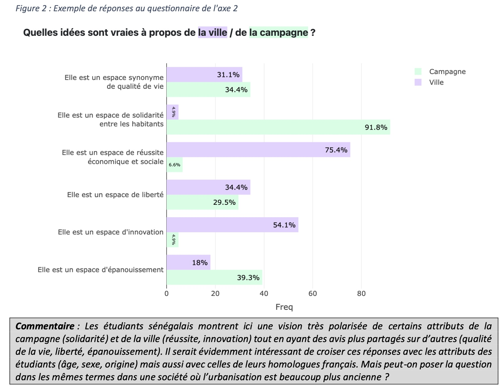
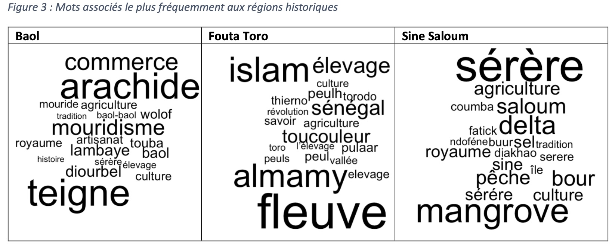
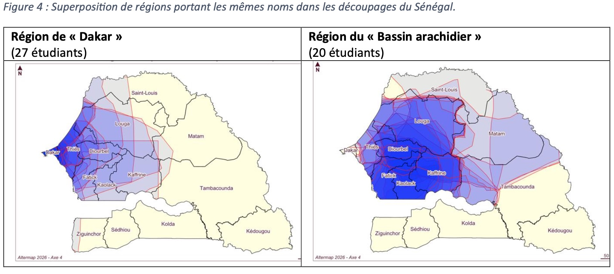
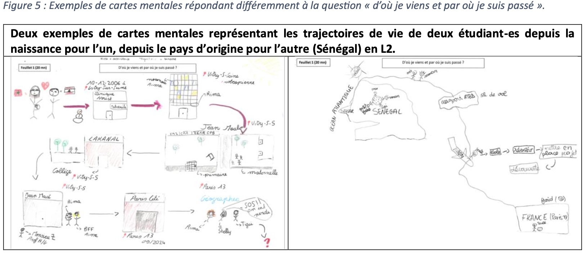
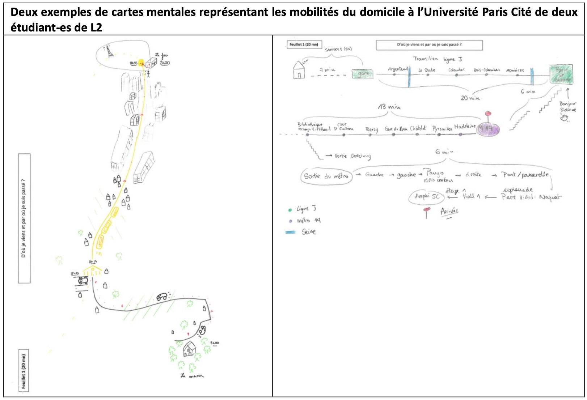
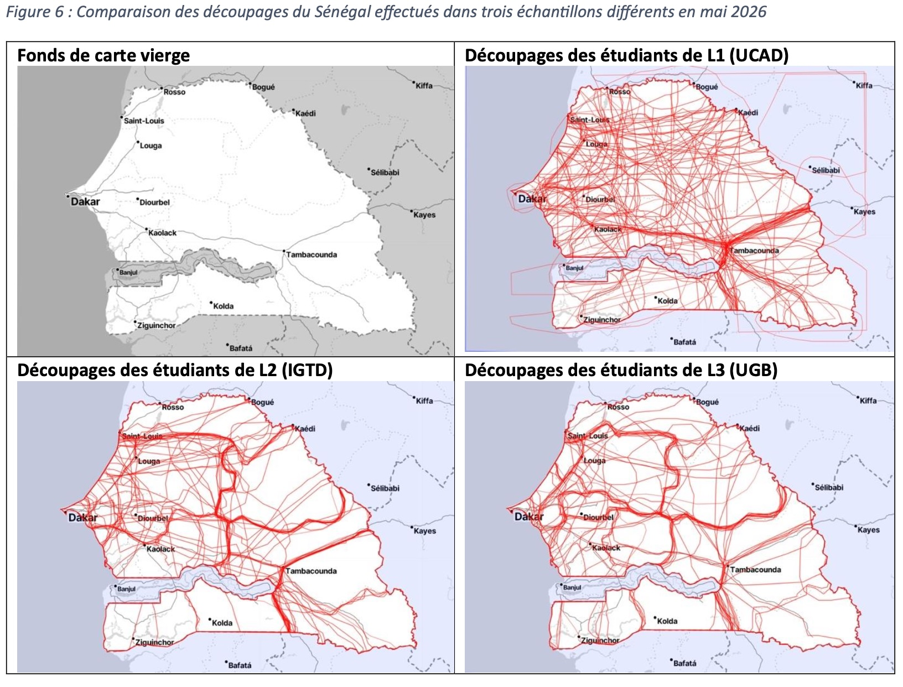
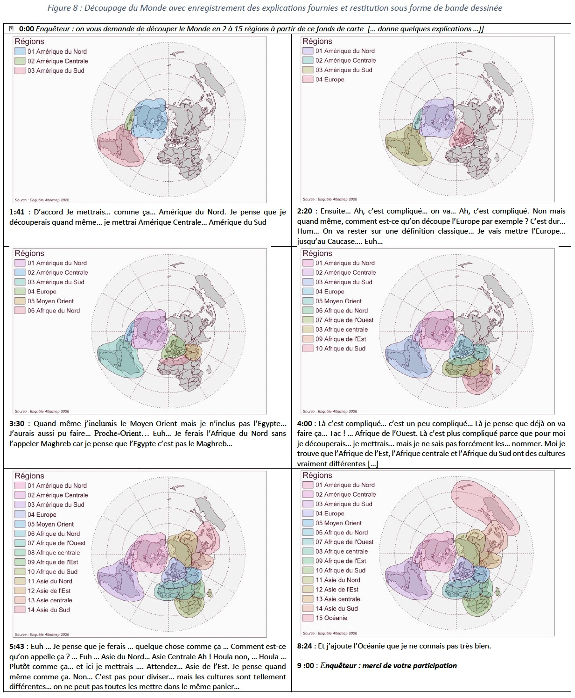
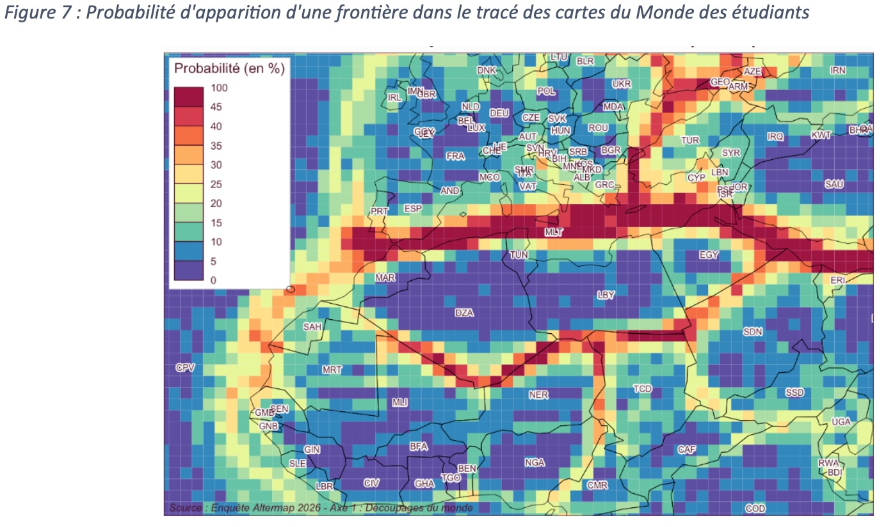

- **L'objectif de ce billet est de présente un bilan de la phase test du projet ALtermap et de montrer les résultats qui ont été présentés lors de la conférence MESSH26 à Paris le 9 juillet 2020**


# INTRODUCTION

Nous proposons pour cette session une présentation encore à l’état de word in progress, qui pose davantage de questions qu'elle n'y répond. Il s’agit d’un retour sur les débuts d’un projet franco-sénégalais qui a été lancé officiellement à Dakar à la toute fin janvier 2026, et dont le déroulement est prévu en deux étapes : le projet « ALTERMAP : Méthodes qualitatives et quantitatives pour l’étude des cartes mentales et des représentations de l’altérité en Europe et en Afrique », associant des enseignants-chercheurs de l’Université Paris Cité en France et des Universités Cheikh Anta Diop, Université du Sine Saloum El Hadj Ibrahima (USSEIN) et Gaston Berger au Sénégal, financé par l’Idex innovation pédagogique de l’Université Paris Cité.
Nous terminons actuellement la première phase, qui était pensée comme une phase de test, de tâtonnements méthodologiques, voire de bricolage, avant de proposer des enquêtes plus systématiques pour l'année universitaire prochaine.
Ce petit programme de coopération, labellisé "innovation pédagogique", s'adresse en priorité à nos étudiants, en France et au Sénégal, à travers un panel de cours auxquels les membres de ce programme de recherche participent dans leurs universités respectives.


# A. RACINES ET OBJECTIFS

Ce projet souhaite s’attaquer à la formation des étudiants aux méthodes d’enquête hybrides en combinant les approches dites « qualitatives » et « quantitatives ». En géographie comme dans d’autres disciplines de sciences humaines et sociales (sociologie, histoire, économie, …) les étudiants sont trop souvent sommés de « choisir leur camp » entre des approches également légitimes et qui relèvent toutes des humanités numériques. Ces oppositions sont souvent indurées par des maquettes de formation qui séparent les deux types d’approches ou par l’appartenance des enseignants-chercheurs et des chercheurs à des laboratoires de recherche qui privilégient l’une des familles de méthodes et, bien souvent, rejettent fermement l’autre.
Les porteurs du projet faisaient le constat d'une certaine irréductibilité des méthodologies, que l'on retrouve également dans les usages des cartes mentales et dans la littérature sur la carte mentale en géographie (et sans doute plus largement en SHS) :

1. une partie des travaux repose sur des approches plutôt quantitatives, fondées sur des enquêtes et méthodologies statistiques et cartographiques de représentation de limites floues comme dans les travaux du projet EuroBroadMap (Didelon-Loiseau, Grasland, 2014 ; Didelon-Loiseau et al., 2018) et les recherches américaines de l’école californienne (Battersby, Montello, 2009 ; Kitchin, 1994 ; Montello, Friedman, Phillips, 2014).Ces travaux relient souvent l’analyse des cartes et des textes, par exemple en étudiant les mots associés à « Europe » et en montrant leur variabilité comme on peut le voir sur la figure ci-contre.

2. des approches « qualitatives » développant des méthodologies sensibles se rattachant aux courants de la géographie des émotions et de la cartographie sensible (Bacon et al., 2016 ; Mekdjian et al., 2014 ; Olmedo, 2015) ou critique (Tratnjek, Rekacewicz, 2016) ainsi qu’au courant postcolonial (Renou, Ba, 2022).

L’intérêt des cartes mentales réside dans leur capacité à se situer à l’interface entre les approches thématiques et méthodologique revendiquées par les différentes communautés qui prennent part à ce projet pédagogique. Les deux approches utilisent des protocoles méthodologiques différents mais elles partagent un objectif commun qui est d’extraire des formes de construction du monde et de l'espace en général (à différentes échelles) présentes dans l’esprit des personnes enquêtées et de les comparer en différents lieux ou pour différents groupes de population.

Le projet vise deux objectifs pédagogiques opérationnels :

1. instaurer un dialogue parmi les formateurs entre des méthodologies réputées inconciliables. Côté français, les collègues s'inscrivent plutôt dans des méthodes non mixtes de recherche, comme en témoigne un petit sondage en début de programme qui demandait une auto-évaluation du profil plutôt qualitatif ou quantitatif, sur un gradient de 0 à 10. Cela semble être moins le cas du côté des collègues sénégalais qui, en répondant à ce même sondage, disaient travailler davantage avec méthodes mixtes ;

2. partager les résultats de ce dialogue entre chercheurs et enseignants-chercheurs d’un pays européen et d’un pays africain dans l'idée aussi de renforcer nos partenariats franco-sénégalais.

Le sujet de départ de ce programme portait sur l’analyse des représentations de l’altérité en Europe et en Afrique en mobilisant deux grands types de méthodes :

- La réalisation de questionnaires portant sur les cartes mentales des étudiants et leurs souhaits ou désirs de mobilité ;

- La réalisation d’entretiens portant sur la perception sensible de l’Europe par les Africains et de l’Afrique par les Européens.

Finalement, cette thématique initiale s'est élargie à des échelles différentes, du local au mondial, comme le montrera le deuxième temps de cette présentation, pour répondre aux intérêts des collègues français et sénégalais, tant du côté des enseignements délivrés dans les universités respectives que dans les objets et thématiques de recherche.


Notre contribution propose un premier retour critique sur une expérience préliminaire de cinq mois (février à juin 2026), à la fois méthodologique et pédagogique, de sa construction collaborative à l’identification de ses limites, en passant par d’inévitables tâtonnements. Nos questions étaient concrètes : comment construire des groupes franco-sénégalais, si possibles relevant d’approches distinctes mais sur des objets de représentation communs ? Comment faire émerger, de manière inductive, des méthodes mixtes ? Comment les mettre en pratique ? Peut-on construire des dispositifs méthodologiques parfaitement comparables voire équivalents entre nos universités d'origine, et nos pays d'origine, et est-ce pertinent ? Quels biais, quelles limites, et surtout quelles pistes apparaissent une fois la phase test passée ?

Après avoir présenté les axes d’expérimentation de la phase expérimentale, nous reviendrons sur les limites et les pistes que ces premiers essais ont permis de dessiner.

# B. EXPERIMENTATION DE LA PHASE TEST

La première rencontre en face à face des membres français et sénégalais du projet à Dakar en janvier 2026 a permis de confronter les envies et attentes des participants des deux pays. Elle a confirmé la grande diversité des représentations que les uns et les autres avaient de l’objet « carte mentale » sur le plan scientifique et de ses possibilités d’utilisation pédagogique de la licence au master.

Aussi, plutôt que d’imposer une définition normative et un périmètre a priori du champs, nous avons opté pour une liberté d’expérimentation au cours des six premiers mois du projet en imposant pour seules contraintes (1) de constituer des axes associant des enseignants-chercheurs des deux pays, (2) de tenter autant que possible de procéder à des expériences en miroir sur les étudiants des deux pays et enfin (3) de réfléchir aux apports respectifs de méthodes quantitatives, qualitatives et hybrides.

La présentation rapide des axes du projet qui va suivre montre que la première contrainte a été bien respectée mais que les deux autres recommandations n’ont pas toujours pu l’être.


## Axe 1 : représentations et découpages du Monde[^1]

[^1]:Coordination par L. Touré et C. Grasland, avec la participation de I.F. Diouf, N. Lambert, J.B. Lanne, M. Madelin et M.B. Timera.

Les expériences pédagogiques qui ont été menées dans le cadre de l'axe 1 ont été facilitées par l'expérience acquise dans le projet EuroBroadMap (2007-2012) dont nous nous sommes largement inspirés pour construire le questionnaire Altermap (Beaugitte & al., 2012 ; Didelon-Loiseau & Grasland, 2014). Le fait que ce questionnaire ait été précisément administré à Dakar et Paris en 2008 nous a poussés à reprendre certaines questions à l'identique pour examiner les évolutions temporelles des représentations (e.g. appréciation des Etats-Unis, de la Chine ou de la Russie). Mais nous avons aussi décidé de supprimer certaines questions et d'en ajouter d'autres dans la partie questionnaire, et aussi de tester l'intérêt d'une approche plus qualitative sous la forme d'entretiens ou de captation du tracé des cartes mentales sous forme de film. On peut résumer brièvement quelques enseignements de la phase test, par ailleurs disponibles sur le blog du projet Altermap (Touré L. & Grasland C., 2026).

- **Saillance et polarisation des pays du Monde** : Les réponses à la double question "citez cinq pays où vous aimeriez vivre et cinq pays où vous n'aimeriez pas vivre dans un futur proche" demeurent particulièrement éclairante pour comprendre les représentations du Monde desétudiants. La saillance, définie comme la part des étudiants qui citent un pays, positivement ou négativement peu importe, permet de  repérer les zones d'attention et les "blancs" des cartes mentales. Un pays cité négativement demeure connu voire reconnu, tandis que les pays qui ne sont jamais cités sont placés en quelque sorte "hors du Monde". Quant à la polarisation, définie comme un indice variant entre -1 (tous les avis sont négatifs) et +1 (tous les avis sont positifs), elle permet de repérer des lieux qui font consensus à l'intérieur d'un groupe et ceux qui suscitent au contraire des clivages ou des débats (Figure 1).


{width=800}


- **Liste de mots associés à l'Afrique, la Méditerranée et l'Europe** : Alors que le projet EuroBroadMap se limitait à demander aux étudiants de 18 pays du Monde les cinq mots qu'ils associaient à "Europe", nous avons opté ici pour un dispositif en miroir en demandant aux étudiants français et sénégalais de définir cinq mots qu'ils associaient à "Europe", "Méditerranée" et "Afrique". Nous y reviendrons dans la partie de synthèse.
- **Découpage du Monde en 2 à 15 régions** : Cette activité, qui avait été au fondement du projet EuroBroadMap en 2008, est celle qui a suscité le plus de difficultés et a abouti à un échec partiel lors de son administration auprès des étudiants de Kaolack au Sénégal. Le choix d'une projection polaire semble avoir "désorienté" les étudiants, au propre comme au figuré, au point que seul un tiers des cartes de découpages produites à Kaolack ont pu être numérisées et que, parmi celles-ci, beaucoup comportent des incohérences involontaires dans les dénominations.


## Axe 2 : Représentation des limites urbain-rural[^2]

[^2]: Coordonné par A. Ndao, I.F Diouf, M.L. Diallo avec la participation de M. Diongue, J.B. Lanne, M. Madelin et P. Pistre.

A l’instar de l’axe précédent, celui-ci a opté pour une approche hybride comportant d’une part un questionnaire à questions le plus souvent fermées, d’autre part un exercice de tracé de limites sur un fonds de carte afin d’examiner le caractère consensuel des limites des deux types d’espace à Paris et Dakar. Les expériences ont été menées au Sénégal sur deux sites (Dakar et Saint-Louis) et à deux niveaux (L1 et L3) mais n’ont pu être répliquées à Paris en raison de la fin du semestre universitaire.

{width=800}

## Axe 3 : La perception du changement climatique et des vulnérabilités[^3]

[^3]: Coordonné par A. Mendy et M. Madelin avec la participation de D. Chartier, C. Grasland et L. Touré.

Cet axe propose d'explorer la perception du changement climatique et des vulnérabilités, à différentes échelles spatiales (du quartier autour de son site universitaire à son pays). Plusieurs expérimentations ont été testées cette année et seront améliorées ou abandonnées l'année prochaine, pour la phase principale.

- **Association de mot (ou groupe de mots) relatif au(x) climat(s) du Sénégal**. Un premier test a été réalisé avec des L1 UPC dans le cours de climatologie, lors du tout premier cours magistral (21/1/26). L'objectif était de recueillir les représentations spontanées des étudiants à UPC sur les climats du Sénégal. La question a été posée pendant le cours, via l'application Wooclap (mise à disposition à UPC) : 75 étudiants ont répondu. Les principaux termes mentionnés sont : "tropical" (20,0%), "chaud" (17,3%), "aride" (6,7%).

-  **Questionnaire "La perception du changement climatique et des vulnérabilités"**.Ce questionnaire comme celui des autres axes a été préparé sous KoboToolbox. Il a pour but d’apprécier la compréhension que les étudiants (Sénégal et France) ont sur le climat et les ressources en eau et des vulnérabilités hydro-climatiques. Il comprend plusieurs volets : (1) Perceptions des changements hydroclimatiques ; (2) Impacts du changement climatique ; (3) Solutions pour une meilleure résilience. Deux cartographies participatives sont envisagées en complément : l'une pour représenter les zones les plus touchées/vulnérables au changement climatique à l'échelle du pays et du Monde ; l'autre pour la représentation spatiale des problèmes d’eau au Sénégal.

- **Cartographie participative du confort thermique dans et autour des campus universitaires**. Nous avons invité des étudiants de UPC et de UCAD à partager leur expérience et leur perception du confort thermique autour de leur université à travers une cartographie participative. Dans les 2 cas, très peu d’étudiants ont répondu aux questions associées : est-ce lié à une certaine paresse, à la formulation des questions ou à l'interface sur le téléphone ?

-  **Analyse comparative des questionnaires Afrobarometer et Eurobarometer**. Un travail de comparaison et d’alignement des deux grands questionnaires d’opinion européen et africain a été mené sur les questions autour du changement climatique. Notre objectif est de mobiliser ces données l’année prochaine pour proposer aux étudiants français et sénégalais d’apprendre à exploiter ces données pour des comparaisons entre pays du Nord, entre pays du Sud et entre pays du Nord et du Sud. Idéalement, nous souhaiterions jumeler deux groupes de TD français et sénégalais afin d’échanger sur les résultats et de procéder dans les deux pays à des entretiens semi-directifs autour de certaines des questions présentes dans les questionnaires.

## Axe 4 : Régions, maillages et gouvernance territoriale : décentralisation ou déconcentration[^4]

[^4] Coordonné par C.A.A.M. Ba, avec la participation de M. Diongué, A. Ndao, A. Bouhali et C. Grasland.

Cet axe comporte de nombreuses analogies avec l’axe 1 puisqu’il adopte la même structure (questionnaire + découpage d’un territoire sur carte papier) mais il se situe à une échelle différente et soulève des enjeux plus directement liés aux questions politiques, de décentralisation (réformes territoriales) et de gouvernance territoriale. Il n’a pas pu être administré auprès des étudiants français faute de temps mais aussi faute de trouver des formulations équivalentes aux questions posées au Sénégal. Il a pu bénéficier en revanche d’un échantillonnage sur trois sites (Université Cheikh Anta Diop (département de géographie/FLSH et Institut de Gouvernance territoriale et de Développement local/UCAD et le département de géographie de l’Université Gaston Berger), à trois niveaux d’étude différents (L1, L2, L3).

La technique des mots associés a été mobilisée comme dans les axes précédents, avec cette particularité qu’elle a été appliquée ici non pas à des régions administratives actuelles mais à des territoires historiques présents dans la mémoire collective tels que les anciens royaumes de l’époque précoloniale. La plupart des étudiants ont été en mesure d’associer trois à cinq mots à chacune de ces régions historiques avec des récurrences de terme montrant un certain consensus autour de stéréotypes (Figure 3).

{width=800}

On aurait pu craindre que ces questions historiques produisent un important effet de halo sur le découpage du pays que devaient effectuer les étudiants en 2 à 10 régions sur un document papier. Mais si cet effet a pu exister – on trouve 16 étudiants ayant tracé une région Baol, 20 une région Sine Saloum, etc. –, il existe aussi d’autres formes de dénomination qui ont été largement mobilisées dans les découpages comme la « région de Dakar » ou le « bassin arachidier » (Figure 4).

{width=800}


## Axes 5 et 6  : Trajectoires de vie et mobilité des étudiants[^5]

[^5]:Coordonnée par A. Doron et M.L. Diallo, avec la participation de A. Bouhali, I.F. Diouf, A. Spire et J.B. Lanne.

L’intitulé initial de cet axe, au départ « trajectoires des étudiants », a prêté à confusion, à la fois du côté des enseignants-chercheurs et du côté des étudiants, et a poussé à le reformuler, une fois un petit test de carte mentale passé auprès des L2 géographie de Paris Cité, sous la forme « trajectoires de vie et mobilité des étudiants ».

Cet axe a associé un exercice de réalisation d’une carte mentale à un petit entretien mené en binôme par les étudiants eux-mêmes, dans le cadre d’un cours de formation aux méthodes de l’enquête qualitative. Après une introduction de la part de deux enseignants sur la carte mentale[^6], un premier étudiant était amené à répondre par une carte mentale à une question volontairement très large : « d’où je viens et par où je suis passé ? ». Une fois la carte mentale tracée sur papier libre, l’étudiant dessinateur était appelé à commenter par écrit son propre dessin en répondant à la consigne « ce que j’ai voulu montrer sur la carte ». Dans un deuxième temps, il passait à son binôme la carte mentale. Le ou la collègue devait alors préparer un ensemble de questions appelées par la découverte de cette carte mentale « pour comprendre d’où il/elle vient et par où il/elle est passé-e ». Un dernier temps de l’exercice consistait en un entretien ouvert durant lequel le second étudiant posait ses questions au premier étudiant, et en proposait une synthèse écrite sur un dernier feuillet en répondant à la question de synthèse suivante : « à l’issue de l’expérience, qu’ai-je compris de la trajectoire de mon binôme ? ».

[^6]:Dans le cadre du cours d’enquêtes qualitatives assuré par A. Doron et J.B. Lanne en Licence 2 géographie en 2025/2026.

{width=800}
{width=800}


Ces quatre exemples de cartes mentales montrent deux façons différentes de comprendre la question préliminaire, et donc d’interpréter la notion de trajectoire. Pour les deux premiers cas, c’est la trajectoire biographique qui a été choisie, avec des modes de représentation variés, entre petites vignettes figuratives centrées sur un espace très local, et construction d’une cartographie articulant une expérience migratoire entre le Sénégal et la France. Cette approche a été choisie par 14 étudiants. Une autre partie des cartes mentales (14 sur le total des 32 cartes dessinées) a fait le choix de représenter la mobilité quotidienne et le déplacement domicile-université. Les figurés sont également très différents sur les deux exemples proposés ici : d’un côté l’accent a été mis sur la succession de paysages, du rural vers l’hyper-centre parisien, de l’autre, une cartographie qui reprend finalement la sémiologie des transports en commun franciliens empruntés quotidiennement.

Une proportion importante de ces 32 cartes mentales dessinées au total cartographie également des palettes d’émotions contradictoire – tristesse du départ du domicile/ de la région / du pays d’origine, familiarité et intimité du domicile familial, stress des transports en commun – et des sensations – découverte du froid à l’arrive en France métropolitaine, fatigue du voyage, etc.

Un questionnaire est actuellement en construction pour explorer ces deux aspects de la notion de trajectoire et sera administré dans les deux pays, à associer à un exercice de carte mentale.

# C. BILAN CRITIQUE ET PERSPECTIVES

L’analyse critique des expériences menées dans les différents axes fera l’objet de discussion lors du séminaire du projet qui se tiendra à Paris les 6-8 juillet en présence de l’ensemble des participants français et sénégalais. On ne peut donc pas encore préjuger du résultat des discussions au moment de la remise de cette note préparatoire au colloque MESSH26. Mais on peut d’ores et déjà pointer quelques questions récurrentes.

## Différences de réception d’un même questionnaire

Dans le cas de l'axe 1 (découpage du Monde), nous avons administré le même questionnaire aux étudiants français et sénégalais à l'aide d'un formulaire imprimé sur papier qui a été ensuite saisi et numérisé par les enseignants. La plupart des questions n'ont pas posé de problème dans les deux pays. Mais la question centrale du découpage du monde en région sur un planisphère en projection polaire a révélé une forte divergence : dans le cas français, les abandons ou réponses inutilisables représentent moins de 10% des étudiants ; dans le cas sénégalais, seul un tiers des réponses apparaît exploitable car les étudiants ont été clairement désorientés par celle-ci.

## Biais introduits par les enquêteurs

Le fait que les étudiants saisissent eux-mêmes leurs réponses de façon autonome ou qu'ils soient guidés par un enseignant en mode "entretien" peut sensiblement changer les résultats. Des différences observées dans les réponses des échantillons de l'axe 4 sur la gouvernance pourraient venir de là. A la différence de l’axe 1, tous les étudiants ont certes réussi à proposer des découpages, mais avec une singularité très forte de l’un des groupes par rapport aux deux autres en matière de tracé (Figure 6) S’agit-il d’une « vraie » différence ou d’un biais introduit soit par la qualité des photocopies, soit par les consignes données par l’enquêteur en début de séance ?

{width=800}


## Combiner questionnaire et entretien semi-directif 

A l’exception des axes 5 et 6, nous n'avons pas suffisamment hybridé les approches qualitatives et quantitatives ou, plus précisément, les approches par questionnaire et l’entretien semi-directif. Ce qui est dommage, notamment dans le cas du tracé de cartes mentales où l'on peut apprendre beaucoup de choses en filmant le tracé (ordre, minutage, hésitations, ...) et en écoutant les explications données par l'enquêté.

Une première expérience a été menée auprès d’un étudiant auquel on a demandé de commenter son découpage tout en dessinant, ce qui a permis d’enregistrer les explications et de minuter le temps passé. On a alors pu reconstituer sous forme de bande dessinée les étapes du découpage ce qui a permis d’analyser des moments de certitude ou d’incertitude, des hésitations, des remords (Figure 8).

{width=800}


Cette approche, qui rejoint des expériences menées dans le domaine de la cartographie sensible, nous semble particulièrement prometteuse. Elle n’est pas antinomique avec une approche quantitative plus à même de mettre en valeur des structures pérennes telles que la récurrence des coupures le long de la Méditerranée ou du Sahara (Figure 7).

{width=800}

## Co-construction avec les étudiants

Nécessité de compléter les entretiens semi-directifs à l’aide de grilles plus structurées et d’accompagner les étudiants dans l’administration de ces grilles
Le test réalisé pour l’axe 5 montre toute la richesse des informations que l’on peut récolter à la fois avec la carte mentale, l’interprétation par l’étudiant dessinateur lui-même et l’échange avec l’étudiant observateur. Néanmoins, en l’état, les commentaires de l’un, de l’autre ou des deux ne sont pas toujours très étoffés, ce qui témoigne de la nécessité de davantage construire la grille d’entretien, dans l’idée d’obtenir davantage d’informations, à la fois sur la personne qui dessine la carte mentale, et sur ses intentions, ce qu’elle a voulu représenter. Le fait de mettre en activité les étudiants a par contre montré tout l’intérêt que représente cette méthode dans le cadre de leur formation à l’enquête de terrain (qualitative pour le moment).

# BIBLIOGRAPHIE


- **Bacon L. et al., 2016,** « Cartographier les mouvements migratoires », *Revue européenne des migrations internationales*, vol. 32 - n°3 et 4, 185-214.
- **Battersby, S. E., & Montello, D. R., 2009, ** Area Estimation of World Regions and the Projection of the Global-Scale Cognitive Map. *Annals of the Association of American Geographers*, 99(2), 273–291. https://doi.org/10.1080/00045600802683734
- **Beauguitte, L., Didelon-Loiseau, C., & Grasland, C., 2012, ** Le projet EuroBroadMap: Visions de l'Europe dans le monde. *Politique européenne*, 37(2), 156-167.
- **Didelon-Loiseau, C., & Grasland, C., 2014,** Internal and external perceptions of Europe/the EU in the world through mental maps. In Chaban N. & Holland M., *Communicating Europe in times of crisis: External perceptions of the European Union *(pp. 65-94). London: Palgrave Macmillan UK.
- **Montello, D. R., Friedman, A., & Phillips, D. W., 2014,** Vague cognitive regions in geography and geographic information science. I*nternational Journal of Geographical Information Science*, 28(9), 1802–1820.
- **Olmedo E.,2015,** Cartographie sensible : tracer une géographie du vécu par la recherche-création, *thèse de géographie, Université Panthéon-Sorbonne Paris I*
- **Renou Y., Ba C., 2022**, « Décoloniser les politiques du désastre climatique dans l’estuaire du Sénégal : des pratiques adaptatives entre « passé finissant » et « futur proche » », *Global Africa*,  1 (1), pp.130-151. ⟨10.57832/ga.v1i1.23⟩
- **Touré L., and Grasland C., 2026.** “Altermap : Axe 1 Représentations Et Découpages Du Monde En France Et Au Sénégal.” June 19, 2026. https://worldregio.github.io/altermap/posts/2026-06-19-axe1-test/.
- **Tratnjek B., Rekacewicz Ph., 2016**, « Cartographier les émotions », *Carnets de géographes* [En ligne], 9  URL : http://journals.openedition.org/cdg/687


# ANNEXE 

On reproduit ici le diaporama présenté à la conférences

```{=html}
<embed src="img/MESSH2026_Altermap.pdf" width="800px" height="2100px" />
```
